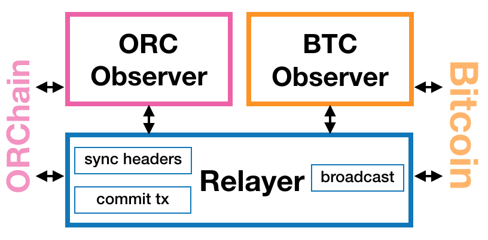

<h1 align="center">How to Join the Bitcoin Cross Chain Ecosystem: Relayer Guide</h1>
<h4 align="center">Version 1.0 </h4>

English | [中文](How_to_Join_the_Bitcoin_Cross-Chain_Ecosystem-Relayer_Guide_CN.md)

## Introduction

Some of the most critical operation on within the cross chain ecosystem is carried out by the relayer. It fowards and cross chain transactions and the block headers, and thus acts as the means of information transfer, a means of communication between the cross chain ecosystem and outside environment. 

Here in this guide we will talk about how to enable one's relayer.

## Framework

<div align=center></div>

The BTC relayer monitors the BTC network for cross chain transactions, and forwards the respective block headers to the to the relay chain if detected, gaining available incentives in the process.
At the same time, it also monitors for cross chain transactions on the relay chain and broadcasts them to the Bitcoin network. Even if there is only one active relayer at any given point of time, the BTC cross chain ecosystem can continue to function normally.

- **Preconditions:** Deploying a relayer first requires a deployed Bitcoin full node. A relayer needs uses the data from the Bitcoin full node. Please synchronize the full node's Bitcoin ledger prior to enabling the relayer.
- **Forward Transactions:** The relayer constantly scans each BTC block for the cross chain transactions. When detected, it fetches the transaction's merkle root from the full node forwards the transaction along with the merkle root to the relay chain. In case of transactions that aren't confirmed, they are recorded and sent to the relay chain later when the necessary block height is reached.
- **Block Header Synchronization:** The relayer sends the block header to the relay chain. It is equipped to process and handle normal forks and operate with relative stability, and continue sending the block headers tp the relay chain.
- **Broadcasting Transactions:** The BTC relayer creates the transactions that are used to send BTC back to the Bitcoin network. The relayer then also broadcasts them to the Bitcoin network.

## Setup

### 1. Create a consortium chain wallet

First create a relay chain wallet. An Ontology wallet can be also be used in it's place if available.

### 2. Register a relayer

Register your address as the **relayer** on the relay chain.

### 3. Enable a Bitcoin full node

It is necessary to first run a Bitcoin full node before enabling the relayer as it uses the RPC function.

## Enabling the Relayer

**Step 1:** Download the relayer executable file and extract it in the desired directory.

**Step 2:** Edit the JSON configuration file. The available settings are:

```json
{
  "btc_ob_conf": {
    "net_type": "test", //BTC network type, such as regtest, test, and main
    "btc_ob_loop_wait_time": 3, //BTC network listening time interval 
    "btc_json_rpc_address": "http://localhost:18443", //BTC full node RPC address*
    "user": "", //BTC RPC username*
    "pwd": "", //BTC RPC password*
    "start_height": 0 //Starting block height for monitoring
  },
  "allia_ob_conf": {
    "alliance_json_rpc_address": "http://ip:40336", //Relay chain address*
    "allia_ob_loop_wait_time": 3, //Relay chain listening time interval
    "watching_key": "btcTxToRelay", //Keyword to be monitored on the relay chain
    "wallet_file": "relayer_btc/wallet.dat", //Relay chain wallet path*
    "wallet_pwd": "", //Wallet password, can be passed in the command line using the flag*
    "net_type": "testnet", //Network type
    "waiting_cycle": 300 //Block interval to record block height, start monitoring from this height the next time relayer is enabled
  },
  "retry_duration": 1, //Transaction broadcast retry time interval
  "retry_times": 0, //No. of retries to be attempted, 0 represents no upper bound
  "retry_db_path": "relayer_btc/db", //DB path*
  "log_level": 0, //Log level, 0: TRACE, 1: DEBUG, 2: INFO, 3: WARN, 4: Eroor
  "sleep_time": 10, //Connection attempt time interval in case of network anomaly
  "max_read_size": 5000000, //Max. bytes to be fetched from DB in a single read operation
  "retry_cci_dura": 5, //Time interval to retry confirmation for unconfirmed transactions
  "send_headers_dura": 5 //Time interval for sending block headers
}
```

> You can use the default settings by modifying the fields marked with an asterisk* at the end

**Step 3:** Run the `start-btcrelayer.sh` script in the `bin` directory to start the BTC relayer. The same can be achieved by using the `bin/run_btc_relayer` executable file. The command is as follows:

```shell
bin/run_btc_relayer -wallet-pwd="pwd" -conf-file=conf.json
```

