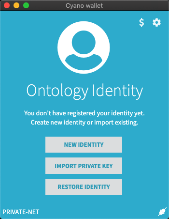
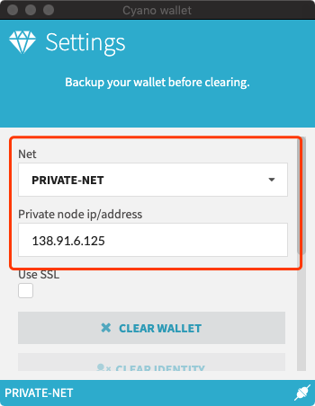
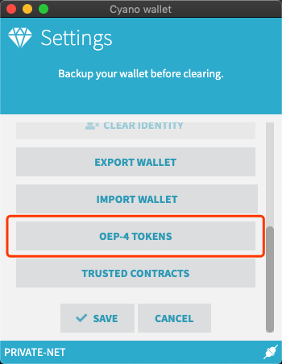
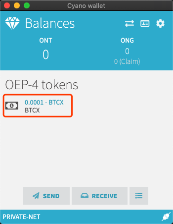

<h1 align="center">How to Join the Bitcoin Cross Chain: User Guide</h1>

<h4 align="center">Version 1.0 </h4>

English | [中文](./How_to_Join_the_Bitcoin_Cross-Chain_Ecosystem-Users_Guide_CN.md)

## Introduction

The term user is used for anyone who wants to transfer their BTC from the Bitcoin network to another chain. They need to find a vendor who provides such a cross chain transfer service. The user will be sending their BTC tokens to the multi-signature address provided to them by the vendor, and so they must first check whether the vendor is reliable. This also encourages vendors to become more trustworthy.

In this document, we will be looking at the cross chain ecosystem from a user's perspective. This is a guide for users that can help understand how to transfer BTC on a cross chain system. There are some things that need to be setup and the following procedure needs to be followed send BTC to another chain.

## Initial Setup

Let's say you found a vendor and you are interested in using their services. At this point you need to get their multi-signature BTC address and the contract address of the token deployed on the target chain. Next, you need to use the **btctool** to create a transaction. You can create a transaction using other methods as well, as long as it follows the defined protocol. You also need to create an address on the target chain that will be used to receive the cross chain BTC.

## Example Operation

Let us take a look at an example where we send BTC from the Bitcoin test net to Ethereum.

Fill in the necessary information to the transaction construction tool. Please refer to [this](https://github.com/ontio/cross-chain/blob/master/btc/cross-chain_transaction_construction_tool_user_manual.md) guide for more details on how to use the construction tool. Next, use any method of broadcasting transactions to broadcast the transaction created and displayed in the tool. You can use this [website](https://tbtc.bitaps.com/broadcast). Next, you need to wait for the transaction to be confirmed on the Bitcoin network. The transferred BTC amount will be displayed in the receiving address on the target chain.

A list of certain verified and trusted vendors is shared below. Their address and other details are available and can be used for testing.

|       Information       | Address                                                                                                   |
| :---------------------: | --------------------------------------------------------------------------------------------------------- |
| Multi-signature address | `2NB3HZzhqntJz5cHJcViiR7rkXUUdqhLYkD` or `tb1qy94qnjuwu5w6r2g74z2z25khjdkgs6ssk5rjnyqrvcvpds8f7x9shrfspn` |
|  Ethereum BTC contract  | `0xa389c761307bde552e0329ae0915ee998da61095`                                                              |
|  Ontology BTC contract  | N/A                                                                                                       |

### Bitcoin to Ethereum

#### 1. BTC transferred to Ethereum chain

##### 1.1. Cross chain setup

1. **Fetching test net BTC:** Create a Bitcoin test net address and ensure that you have sufficient test net tokens before starting the process. This test net [faucet](https://testnet-faucet.mempool.co/) can be used to get test net BTC tokens;
2. **Fetching test net ETH:** Create an Ethereum test net address and ensure that you have sufficient Gas for contract invocation before starting the process. We use [Ropsten](https://teth.bitaps.com/) in this case;

##### 1.2. Creating and sending a transaction

Please refer to this [guide](https://github.com/ontio/cross-chain/blob/master/btc/cross-chain_transaction_construction_tool_user_manual.md) for detailed instructions on how to use the tool send a transaction. After sending the transaction, use an [Ethereum explorer](https://ropsten.etherscan.io/) to confirm the amount of BTC tokens sent to the contract address specified in the transaction.

#### 2. BTC transferred back to the Bitcoin network

Please refer to [this](https://github.com/ontio/cross-chain/blob/master/eth/how_to_cross_on_ethereum.md) document for details.

### Bitcoin to Ontology

#### 1. BTC transferred to the Ontology chain

##### 1.1. Initial Setup

  1. **Fetch test net BTC:** Create a Bitcoin test net address and ensure that you have sufficient test net tokens before starting the process. This test net [faucet](https://testnet-faucet.mempool.co/) can be used to get test net BTC tokens;

  2. **Create an Ontology address:** The process requires an [Ontology](https://ont.io/) address. The BTC transferred to the Ontology chain will be maintained one to one in the form of a [OEP-4](https://github.com/ontio/OEPs/blob/master/OEPS/OEP-4.mediawiki) token;
   
  3. **Fetch contract address:** Here we take the [OBTC](https://github.com/zouxyan/btc_crosschain_demo) contract hash as described in the table above.

  4. **Setup:** To ensure the cross chain transaction is carried out successfully, we recommend using the [Cyano Wallet](https://chrome.google.com/webstore/detail/cyano-wallet/dkdedlpgdmmkkfjabffeganieamfklkm) Chrome plugin. Next, follow these steps to login to the wallet using the Ontology account and to switch to Ontology test net:

   - First, import an existing wallet or create a new one. For details on how to use the wallet please refer to this [guide](https://dev-docs.ont.io/#/docs-cn/cyano/01-chrome-wallet) or this [video](https://www.youtube.com/watch?v=S2qk-Gkrs9s);

   <div align=center></div>

   - Click on the cog in the top right corner of the wallet window and modify the settings as shown in the picture below. Save these settings to connect to the test net;
     
   <div align=center></div>

   - After configuring the wallet, the OBTC token contract needs to be added to the wallet. Click on the cog and select the **OEP-4 TOKENS** option. Click on the **ADD** button and enter the contract address to the script hash. Click **CONFIRM** and the OBTC contract will be displayed in the wallet. Go back and save the settings;

   <div align=center></div>

##### 1.2. Sending a transaction

Use the transaction construction [tool](https://github.com/ontio/cross-chain/blob/master/btc/cross-chain_transaction_construction_tool_user_manual.md) to create and send the cross chain transaction. After the transaction is sent and confirmed on the Bitcoin network, the updated OBTC (mapped BTC) balance will be displayed in the Cyano wallet.

You can now proceed to use these cross chain BTC tokens to carry out transaction on the Ontology chain. Since Ontology supports smart contract and offers very quick transaction times, it is perfectly suited to carry out complex and frequent BTC related transactions. You can also, at any point of time, choose to transfer the BTC back to the Bitcoin network.

<div align=center></div>

#### 2. BTC transferred back to the Bitcoin network

You can use the `lock` method of the OBTC contract to transfer the BTC back by providing the necessary parameters.

In case of the Ontology chain being the target chain, the user can use [SmartX](https://smartx.ont.io/) to invoke the OBTC contract and transfer the BTC back to the Bitcoin network. Copy and paste the OBTC contract [code](https://github.com/zouxyan/btc_crosschain_demo) in the editor pane. For detailed instructions on how to use SmartX to compile and invoke a contract, please refer to this [tutorial](https://ontio.github.io/documentation/).

You may also use Ontology's Golang [SDK](https://github.com/ontio/ontology-go-sdk) to carry out the above contract operations. Here's the sample code:

```go
  package main
  
  import (
  	"fmt"
  	sdk "github.com/ontio/ontology-go-sdk"
  	"github.com/ontio/ontology-go-sdk/utils"
  )
  
  var (
  	btcxCode      = "your avm code"
  	yourBtcAddr   = "your btc address"
  	yourBtcAmount = 8000
  	ontRpcAddr    = "http://ip:20336"
  	walletPath    = "path to your wallet.dat"
  	walletPwd     = "password of your wallet"
  )
  
  func main() {
  	ontSdk := sdk.NewOntologySdk()
  	ontSdk.NewRpcClient().SetAddress(ontRpcAddr)
  	wallet, err := ontSdk.OpenWallet(walletPath)
  	if err != nil {
  		fmt.Printf("failed to open wallet: %v", err)
  		return
  	}
  
  	acc, err := wallet.GetDefaultAccount([]byte(walletPwd))
  	if err != nil {
  		fmt.Printf("failed to get account: %v", err)
  		return
  	}
  
  	contractAddr, err := utils.GetContractAddress(btcxCode)
  	if err != nil {
  		fmt.Printf("failed to parse address from bytes: %v", err)
  		return
  	}
  
  	_, err = ontSdk.NeoVM.InvokeNeoVMContract(0, 21600000, acc, contractAddr,
  		[]interface{}{"lock", []interface{}{1, acc.Address[:], yourBtcAddr, yourBtcAmount}})
  	if err != nil {
  		fmt.Printf("failed to invoke contract: %v", err)
  		return
  	}
  	fmt.Printf("successful to transfer %d btc back to bitcoin-net", yourBtcAmount)
  }
```

There are certain fields of information that the user needs to provide for themselves:

- The smart contract AVM code. The smart contract AVM code can be obtained by compiling the contract code in SmartX, or using the [Neptune](https://github.com/ontio/ontology-python-compiler) compiler;

- The address used to receive the BTC;

- RPC address of the Ontology node. IP can be set to `138.91.6.125` when using the test net;

- Ontology wallet file path and password;


Once the transaction is successful, the updated BTC balance will be displayed in the specified BTC address on the Bitcoin network.
