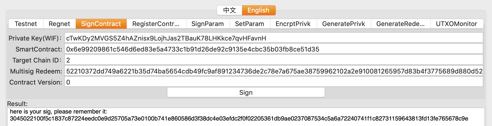
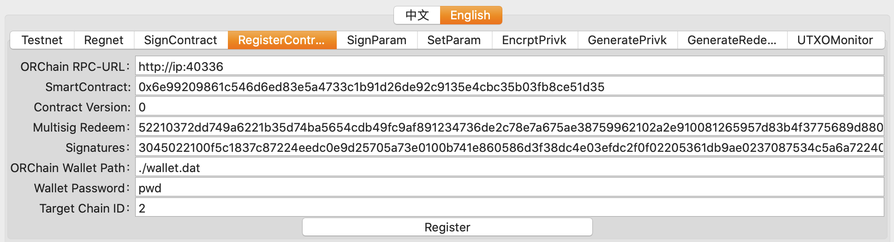
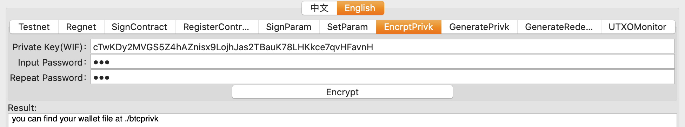

<h1 align="center">How to Join the Bitcoin Cross Chain Ecosystem: Vendor Guide</h1>
<h4 align="center">Version 1.0 </h4>

English | [中文](./How_to_Join_the_Bitcoin_Cross-Chain_Ecosystem-Vendor_Guide_CN.md)

## Introduction

The term vendors refers to the parties, both individuals and institutions, interested in providing cross chain transfer services. They do so by first registering a multi-signature account on the Bitcoin network. Customers simply send their cross chain transfer amount to this address, and the cross chain ecosystem carries out the actual transfer process. The vendor needs relayers that monitor the relay chain, and sign transactions.

The BTC that are transferred cross chain are locked in the multi-signature address. The customers thus need to trust vendors along with vendors having to ensure that they are trustworthy and take care of all the asset risks involved.

Say there are three business collaborators named Alice, Bob, and Carl. Bitcoin interests them, and so does the associated decentralized technology. Now they want to start a BTC business with a high level of complexity. But they are facing issues due the many limitations of the Bitcoin platform. So they want to make their business work in a cross chain ecosystem. As cross chain vendors they transfer BTC to other chains, such as Ethereum, and use the smart contract technology to provide their intended cross chain services. Let us take a closer look at how they go about becoming cross chain vendors.

## Tasks performed by the vendor

- **Locking BTC:** The amount of BTC that the user wants to transfer to the target chain is sent to the multi-signature address by the user, where it is "locked". After the BTC is locked, the cross chain ecosystem generates and sends the cross chain tokens to the specified receiving address on the target chain, thus completing the cross chain transfer. This process does not require any operations on the vendor's end.
- **Releasing BTC:** When BTC is transferred back to the Bitcoin network the relay chain helps the vendor create a transaction that releases the locked BTC in the multi-signature account and return it back to the user. The transaction fee is paid by the user themselves, and it deducted from the transfer amount. When the transaction is created by the relay chain, it is picked up by the signing tool. All the collaborators need to sign the transaction, which is then transferred to the BTC network. In the end, the relay chain combines the signatures and the transaction, and broadcasts it to the BTC network. The vendor does not need to maintain the UTXO of the multi-chain address as the relay chain takes care of that.

## Starting a New Cross Chain Service

### Cross Chain Setup

1. **Bitcoin Network:** Alice, Bob, and Carl all individually prepare their respective **BTC private keys**. They use their private keys to generate a multi-signature redeem script that requires at least two of three collaborators to sign a transaction. The `P2WSH` and `P2SH` multi-signature address is generated by this redeem script. The main purpose served by the multi-signature addresses is to lock the transferred BTC. Carrying out this action requires the majority approval from the collaborators. Operation such as generating private keys, the redeem script and address, etc. can be carried out using the [tool](https://github.com/ontio/cross-chain/blob/master/btc/redeem_tool_guide.md) provided.
2. **Ethereum Network:** Vendors need to develop a **smart contract** based on the ERC20 [template]() available for reference (here referred to as EBTC). This contract needs to be deployed on the Ethereum network. This contract will be used to receive the BTC transferred cross chain from the BTC network.
3. **Relay Chain:** Each collaborator needs to create a relay chain ecosystem **wallet**, and then register it on the relay chain to gain the ability to send and sign transactions. After completing the registration, everyone needs to use their bitcoin private keys and sign the contract hash, contract version, and the redeem script, and then link to the relay chain. After this, the vendors also need to register the fee rate (sat/byte) charged for the transaction that releases the locked BTC and a parameter to handle the change. The process is similar to contract registration; everyone signs and sends it to the relay chain. The process can be carried out using the [btctool](https://github.com/ontio/cross-chain/blob/master/btc/cross-chain_transaction_construction_tool_user_manual.md).
4. **Signing Tool:** Next, every collaborator needs to download the [signing tool](https://github.com/ontio/cross-chain/blob/master/btc/redeem_tool_guide.md). This tool is used to monitor the transactions on the consortium chain. When there is an amount of BTC transferred back to the BTC network from Ethereum, Alice, Bob and Carl all use their respective private keys to sign the transaction to release the locked BTC in the multi-signature contract. Finally, a multi-signature transaction is created on the relay chain and sent to the Bitcoin network.


### Vendor Starts a New Service

#### Step 1: Deploying a contract on Ethereum

The EBTC contract is deployed on the Ethereum chain. This contract is used to receive the transferred BTC. A contract template is available for reference [here](). Vendors can modify the template's redeem script and use the rest of the template as it is.

#### Step 2: Enabling the signing tool

Please follow the instructions described in the [tool guide](https://github.com/ontio/cross-chain/blob/master/btc/redeem_tool_guide.md) and import the encrypted private key into the tool to enable it and monitor the consortium chain transactions and carry out the signature process.

#### Step 3: Transferring from BTC to Ethereum

The user creates a transaction in the specified format and sends the BTC to the multi-signature address. An active relayer in the cross chain ecosystem will pick up this transaction and transmit it to the consortium chain. And in the end this equivalent amount will be transferred to the specified EBTC contract address on the Ethereum chain based on the chain ID when the six block confirmation is established in the Bitcoin network. Say 1 BTC is transferred to the Ethereum chain. 1 EBTC will be transferred to the Ethereum chain and the 1 BTC will be locked in the multi-signature address on the BTC network.

#### Step 4: BTC transferred back to the Bitcoin network

When the user wants to transfer their BTC back to the Bitcoin network they can directly invoke the EBTC contract's API, provide the information regarding how much amount is to be transferred back, the receiving address, BTC chain ID, etc. Next the signature tool will get the signatures of all the collaborators as per the redeem script and the transaction for releasing the locked BTC assets will be transmitted to the relay chain. An active BTC relayer will broadcast this transaction to the BTC network, and the amount will thus be transferred to the user's BTC account. The user needs to bear a nominal amount of transaction fee for this cross chain transfer. It will be deducted from the transfer amount. The amount is very minimal.

After completing a certain amount of testing, vendors can proceed to provide BTC related services to users by implementing complex logic in the form of smart contracts on Ethereum, which can be made possible using the cross chain ecosystem.

Similarly, cross chain services for other chains such as Ontology can also be implemented in the same way. The contract for a cross chain token deployed on the Ontology chain, say OBTC, maintains a one to one equivalence with BTC. This can also be implemented by modifying and personalizing the redeem script of the sample contract [template](). The contract can be deployed using Ontology's [SmartX](https://smartx.ont.io/). The rest of the process is the same as that on Ethereum, as described above.

## Example

### Step1: Generating multi-sign script

It's easy to generate private keys by [btctool](https://github.com/ontio/cross-chain/blob/master/btc/cross-chain_transaction_construction_tool_user_manual.md):

```
your private key is cTwKDy2MVGS5Z4hAZnisx9LojhJas2TBauK78LHKkce7qvHFavnH
your compressed public key is 0372dd749a6221b35d74ba5654cdb49fc9af891234736de2c78e7a675ae3875996
your legacy address is mzCyx1SyLJMdJQ9qXg7vizZNGXUVB7gpH7

your private key is cQ62wvJPewSwhYymmQ42JgjrbF27TaPxhuG8R4BtLktmoPqvzLfx
your compressed public key is 02a2e910081265957d83b4f3775689d880d52e6b84d6f0c508616fd46efa1678f7
your legacy address is mgd191rA9LawKeJMnSUa1JzGRUBaz3RRpn

your private key is cRWP4i2o25BSNSfQSZkeH4HBL1MFV7vq3EH1GUSK94ALrQCnemXF
your compressed public key is 0257398e1bf56b25771f5a3f30356d2e7b492b45ab853e1f4d897391f27375e015
your legacy address is muHFSWRGNCZYP8yapWaxiZkrdYsztsGVwG
```

Generating the multisig script, called Redeem, by the public keys:

```
your redeem is 52210372dd749a6221b35d74ba5654cdb49fc9af891234736de2c78e7a675ae38759962102a2e910081265957d83b4f3775689d880d52e6b84d6f0c508616fd46efa1678f7210257398e1bf56b25771f5a3f30356d2e7b492b45ab853e1f4d897391f27375e01553ae
your P2SH address is 2Mw7fBAm6kzdbbbsN4Q3TFoEHhdiMKpeonx
your P2WSH address is tb1q99g2a3fp6zpueygfypweevz9pzz92rxy54qy3xydlny2keq5azcq0gsqa2
your multisig redeem hash is 2a723378355e3583417eabc3d4a863c526c00b6e
```

### Step2: Get Polygon Wallet

Acquisition method to be determined.

### Step3: Deploying SmartContract on Target Chain 

Take Ethereum as an example, smartcontract [BTCX]()  is used as the BTC mapping on Ethereum.

After deploying smartcontract, you need to invoke interface `bindContractAddrWithChainId` of BTCX to bind redeem's hash with contract address. When BTC arrived on ethereum, BTCX would know that BTC is transfer to your multisig address. So your BTCX would issue the BTC on ethereum to the address of user.

Then you need to set the minimum amount, and user's cross-chain BTC amount has to be bigger than your minimum amount value when user want to transfer their BTC back to bitcoin net. 

### Step4: Binding Multi-sign Script and SmartContract

<div align=center></div>

Each member of the vendor uses his own BTC private key to sign the **(BTCX contract, version number, and multi-sign script)** through the "sign contract" function of the btctool, and obtains the signature. Note that the contract version number should start from 0. And each time the contract address is updated, it should be increased by 1. The version number is added to prevent the signature from being replayed. Finally, three signatures are collected:

```
3045022100f5c1837c87224eedc0e9d25705a73e0100b741e860586d3f38dc4e03efdc2f0f02205361db9ae0237087534c5a6a72240741f1c82731159643813fd13fe765678c9e,304402200736f05d23825a7bece2e42de97eb60c61150ba11161a5b50a218227fa0171f4022068070209f098c4a3ad253692b55b23d1b1de61745ee4226fe608b210ff836228,3045022100cf287afaecc4c2539a9bb4dcff391353e5d950ca5fd7d5cdac5d629497c1b31a022031590ba8917ae48e70d665ea5b32f8b6fe05fb288b7e8f6b3db4ae5e958edae7
```

As shown in the figure, using btctool to send a transaction which will bind smartcontract address and multi-sign script to the Polygon, so that vendor's contract which reparents BTC on ethereum is settled, and all BTC that transferred to ethereum using vendor's cross-chain service will be transferred to this BTCX contract.

<div align=center></div>

### Step5: Set Unlocking Transaction Parameters

Set the unlocking transaction parameters on Polygon which using to construct a transaction for transferring BTC back to bitcoin net. To return to the Bitcoin chain, BTC must be unlock from the vendor's multisig address. The smartcontract on Polygon would contruct a unsigned bitcoin transaction for vendor to transfer BTC back to user's address. And every member need to sign this transaction. Then the BTC cross back to user. To contruct this transaction, Polygon need to know some parameters, like fee rate, etc. Vendor need to set these parameters on Polygon for their cross-chain service. 

First, each member sign the parameters serialized with their bitcoin private key:

<div align=center></div>

Then, vendor sends a transaction with parameters and signatures to Polygon.

### Step6: Starting Signing-Tool

Each vendor member needs to start a [signing-tool](https://github.com/ontio/cross-chain/blob/master/btc/redeem_tool_guide.md) to obtain the unsigned transaction constructed by the Polygon, and then sign the transaction with his own bitcoin private key, and send the signature to the Polygon. Polygon's contract will collect the signature and return a complete transaction.

Before starting, you need to prepare a Polygon wallet and a Bitcoin private key encryption wallet. Use a btctool to encrypt the bitcoin private key. After that, you can find the encrypted wallet file in the specified path.

<div align=center></div>

Put the wallet in the designated path of the signing-tool, configure the signing-tool, and start it.

After completing the above steps, you can officially start cross-chain business.

The last thing to note is **the fee rate, minimum change and the minimum return value in the BTCX contract**. The recommended settings are:
$$
min\_val=(400+160m+80n)*fee\_rate
$$

$$
min\_change=(50+80m+40n)*fee\_rate
$$

`min_change` is the minimum change amount for get change for vendor's multisig address when contructing unlocking transaction. If change amount less than `min_change`, then no transaction contructed for this unlock request. `min_val` is the minimum return value which limit the minimum BTC amount cross-transfer back to bitcoin net, and m/n refers to the multi-sign parameter.