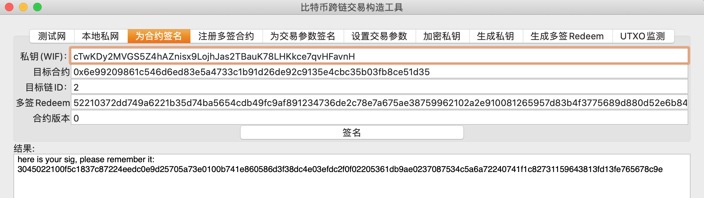
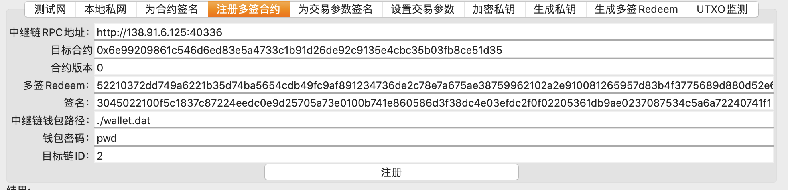
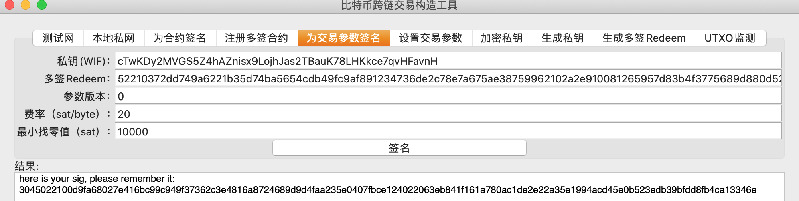
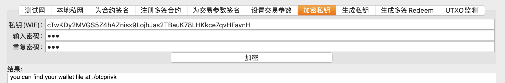

<h1 align="center">如何加入比特币跨链生态：供应商篇</h1>
<h4 align="center">Version 1.0 </h4>

[English](./How_to_Join_the_Bitcoin_Cross-Chain_Ecosystem-Vendor_Guide.md) | 中文

供应商指的是为用户提供跨链业务的个人或组织，是跨链服务的供应商，他们在比特币网络上以多签地址的形式提供服务，用户只需要把BTC发送到供应商的多签地址，跨链生态会完成BTC的“搬运”，整个过程中供应商仅需要监听Polygon并完成签名工作。跨链的BTC会锁定在供应商的多签地址，这意味着用户需要信任供应商，供应商需要证明自己可信，同时意识到内部资产安全的重要性。

Alice、Bob和Carl是合作伙伴，他们热爱比特币与去中心化技术，希望在比特币上开展更加复杂的业务，但是碍于比特币链的诸多不便，于是他们决定利用Polygon的跨链生态，成为跨链供应商，将比特币转移到以太坊上，然后基于以太坊的合约开发自己的业务。下面就介绍他们三个人是如何成为供应商的。

## 供应商的工作

- **BTC的锁定**：用户将比特币发送到供应商的多签，称之为“锁定”，在锁定之后，跨链生态会在目标链上供应商的合约中为用户发放BTC，经过这个过程，BTC相当于从比特币链转移到了目标链。这一步并不需要供应商进行操作，跨链生态会搞定一切。
- **BTC的解锁**：当BTC从其他链回到比特币链的时候，Polygon会帮助供应商构造解锁交易，将供应商多签中的BTC退回给用户，这中间产生的手续费由用户承担，供应商的多签不会有财产的损失。构造完的交易将会被签名工具监听到，然后多签中的每个人会分开对该交易签名，然后通过调用Polygon合约的形式，将签名提交到Polygon上，最终Polygon会将交易和签名合并，完整的交易会被广播到比特币网络，所以供应商不需要维护多签的UTXO，Polygon将会代替供应商维护这些信息，通过[工具](https://github.com/ontio/cross-chain/blob/master/btc/cross-chain_transaction_construction_tool_user_manual.md)可以获取UTXO的信息。

## 开启跨链业务

### 跨链的准备工作

1. **比特币部分**：Alice、Bob和Carl分别准备了自己的**比特币私钥**，并用这些私钥构成了2/3多签脚本，以此脚本作为赎回脚本（Redeem脚本）生成P2WSH或者P2SH形式的多签地址，多签地址的作用主要是锁住比特币，使用这些锁住的比特币需要供应商的大多数参与者同意。生成私钥、脚本和地址等操作可以通过[工具](https://github.com/ontio/cross-chain/blob/master/btc/redeem_tool_guide.md)完成。
2. **以太坊部分**：他们需要按照[模板]()开发一个特殊的ERC20代币**合约**（以下称为EBTC），部署在以太坊上，用来接收跨链的比特币。
3. **Polygon部分**：每人都要创建一个联盟链跨链生态的**钱包**，并向Polygon[注册]()自己的钱包来获取发送交易的权限，向联盟链提交自己的签名。
   - 注册完毕后，每个人都用自己的比特币私钥对合约哈希、合约版本和Redeem脚本进行签名，然后向Polygon绑定。
   - 然后，需要向Polygon注册多钱解锁交易的费率（sat/byte）和最小找零等参数，和注册合约类似，每个人签名并向Polygon提交。这些可以使用[工具](https://github.com/ontio/cross-chain/blob/master/btc/cross-chain_transaction_construction_tool_user_manual.md)实现。
4. **签名工具**：接下来，下载多签的[签名工具](https://github.com/ontio/cross-chain/blob/master/btc/redeem_tool_guide.md)，它可以监听联盟链，当有比特币从以太坊合约返回的时候，Alice、Bob和Carl各自使用自己的私钥对解锁BTC的交易签名，最终在Polygon构造一个多签解锁交易，这样比特币就回到了客户自己的手里。

### 供应商启动业务

- **第一步，部署以太坊合约**：将准备好的EBTC合约部署到以太坊上，准备接收比特币，合约模板请见[此]()，修改合约内的Redeem脚本为供应商自己的多签脚本即可。
- **第二步，启动签名工具**：按照[说明](https://github.com/ontio/cross-chain/blob/master/btc/redeem_tool_guide.md)，把自己的私钥加密后导入工具，启动工具监听联盟链并提交自己的签名。
- **第三步，BTC到以太坊**：按照特定的格式[构造交易](https://github.com/ontio/cross-chain/blob/master/btc/cross-chain_transaction_construction_tool_user_manual.md)，发送比特币到多签地址，活跃在跨链生态中的Relayer就会把这些跨链交易转发到联盟链，最终比特币会准确地发送到EBTC指定的账户中了。比如Alice在交易中写入了EBTC合约的地址、自己以太坊的地址和以太坊的chain id，并发送了1BTC到多签地址，在这笔交易拥有6个确认之后，Alice发现自己多了1个EBTC，而发送到多签地址的1BTC则被锁住。
- **第四步，BTC回比特币**：Alice想把自己的1EBTC转回比特币链，于是直接调用EBTC合约的接口，填入要转回的金额、比特币地址、比特币chain id等信息，一段时间后，发现签名工具对一笔交易进行了签名，这笔交易就是多签用来释放Alice比特币的，同时另外两人的签名工具也会签名，最终这笔交易会被Relayer成功广播到比特币网络中，这时候Alice会看到这笔交易，但是她发现转回来的比特币不足1BTC，因为这笔多签交易的手续费需要Alice支付，这是跨链生态所要求的，不过手续费并不多，Alice表示完全能接受。

经过测试（上述第三、四步供应商可以不做），三人开始基于EBTC开发自己的比特币业务合约，他们终于能在以太坊智能合约上实现自己天马行空的想法了，这多亏了跨链生态！

同样地，按照协议开发一本本体或者其他链的合约，它将作为BTC在本体上的映射，与比特币保持一比一的关系，也可以通过修改[模板]()的Redeem脚本后使用，这里称作OBTC。将准备好的OBTC合约部署到本体网络上，可以通过[smartx](https://smartx.ont.io/)其余步骤和以太坊类似。

## 实例

### 1. 生成多签脚本

使用工具可以轻易生成私钥：

```
your private key is cTwKDy2MVGS5Z4hAZnisx9LojhJas2TBauK78LHKkce7qvHFavnH
your compressed public key is 0372dd749a6221b35d74ba5654cdb49fc9af891234736de2c78e7a675ae3875996
your legacy address is mzCyx1SyLJMdJQ9qXg7vizZNGXUVB7gpH7

your private key is cQ62wvJPewSwhYymmQ42JgjrbF27TaPxhuG8R4BtLktmoPqvzLfx
your compressed public key is 02a2e910081265957d83b4f3775689d880d52e6b84d6f0c508616fd46efa1678f7
your legacy address is mgd191rA9LawKeJMnSUa1JzGRUBaz3RRpn

your private key is cRWP4i2o25BSNSfQSZkeH4HBL1MFV7vq3EH1GUSK94ALrQCnemXF
your compressed public key is 0257398e1bf56b25771f5a3f30356d2e7b492b45ab853e1f4d897391f27375e015
your legacy address is muHFSWRGNCZYP8yapWaxiZkrdYsztsGVwG
```

用这些私钥对应的公钥，生成多签Redeem脚本：

```
your redeem is 52210372dd749a6221b35d74ba5654cdb49fc9af891234736de2c78e7a675ae38759962102a2e910081265957d83b4f3775689d880d52e6b84d6f0c508616fd46efa1678f7210257398e1bf56b25771f5a3f30356d2e7b492b45ab853e1f4d897391f27375e01553ae
your P2SH address is 2Mw7fBAm6kzdbbbsN4Q3TFoEHhdiMKpeonx
your P2WSH address is tb1q99g2a3fp6zpueygfypweevz9pzz92rxy54qy3xydlny2keq5azcq0gsqa2
your multisig redeem hash is 2a723378355e3583417eabc3d4a863c526c00b6e
```

### 2. 获取Polygon钱包

获取方式待定

### 3. 部署目标链合约

用以太坊举例，多签部署了[BTCX]()`0x6e99209861c546d6ed83e5a4733c1b91d26de92c9135e4cbc35b03fb8ce51d35`作为BTC在以太坊上的映射。

部署完合约，需要调用bindContractAddrWithChainId绑定多签的redeem hash，这样从BTC到以太的时候，BTCX合约就知道这笔钱确实锁定到了正确的多签地址，就可以准确地给用户增发BTC。

然后设置最小返回金额，限制BTC从以太返回比特币的最低金额，只有高于这个金额才可以成功返回比特币网络。

### 4. 绑定多签与合约

<div align=center></div>

多签中的每个成员，使用自己的BTC私钥，通过工具btctool的“为合约签名”功能，为BTCX合约、版本号、多签脚本签名，获得签名，注意合约版本号应该从0开始，并且每次更新合约地址的时候加1，版本号的加入主要是为了防止签名的重放，最后收集得到三个签名：

```
3045022100f5c1837c87224eedc0e9d25705a73e0100b741e860586d3f38dc4e03efdc2f0f02205361db9ae0237087534c5a6a72240741f1c82731159643813fd13fe765678c9e,304402200736f05d23825a7bece2e42de97eb60c61150ba11161a5b50a218227fa0171f4022068070209f098c4a3ad253692b55b23d1b1de61745ee4226fe608b210ff836228,3045022100cf287afaecc4c2539a9bb4dcff391353e5d950ca5fd7d5cdac5d629497c1b31a022031590ba8917ae48e70d665ea5b32f8b6fe05fb288b7e8f6b3db4ae5e958edae7
```

如图，使用工具朝Polygon发送交易绑定合约和多签，这样多签在以太上的合约就被绑定了，所有使用该多签跨链到以太的BTC都会被转到这个合约。

<div align=center></div>

### 5. 设置交易参数

在Polygon上设置BTC返程的交易参数，BTC要返回比特币链，必须要多签通过交易解锁BTC给用户，交易的构造有Polygon上的合约负责，多签只需要为这笔交易签名即可，而构造交易需要设置的费率等参数，需要每个多签自己设置。

首先，为参数签名，将参数信息序列化，然后各自用比特币私钥对其签名：

<div align=center></div>

然后，类似于多签合约绑定，用btctool向Polygon发送交易注册参数。

### 6. 启动签名工具

每个多签成员需要启动一个签名工具，获取Polygon构造的未签名交易，然后用自己的比特币私钥对该交易签名，将签名发送到Polygon，Polygon合约会将签名收集并组装成完整的交易。

在启动之前需要准备好Polygon钱包以及比特币私钥加密钱包，利用工具加密比特币私钥，完成后可以在指定路径找到加密的钱包文件。

<div align=center></div>

把钱包放到签名工具的指定路径，配置好工具，就可以启动了。

完成如上步骤之后，就可以正式开启跨链业务。

最后需要注意的是费率和最小找零，以及BTCX合约中的最小返回值，推荐设置：
$$
min\_val=(400+160m+80n)*fee\_rate
$$

$$
min\_change=(50+80m+40n)*fee\_rate
$$

min_change是最小找零，min_val是最小返回值，m/n指的是多签的参数。