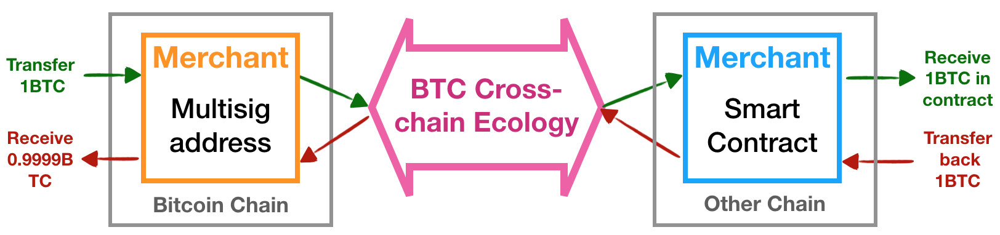
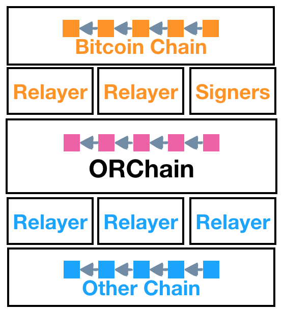
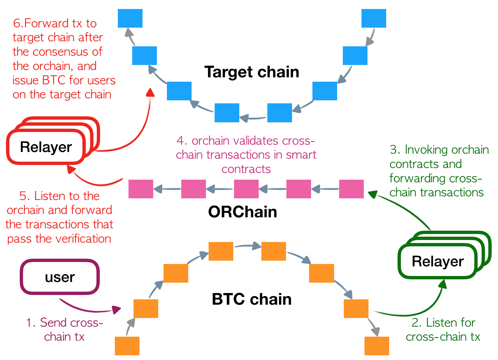
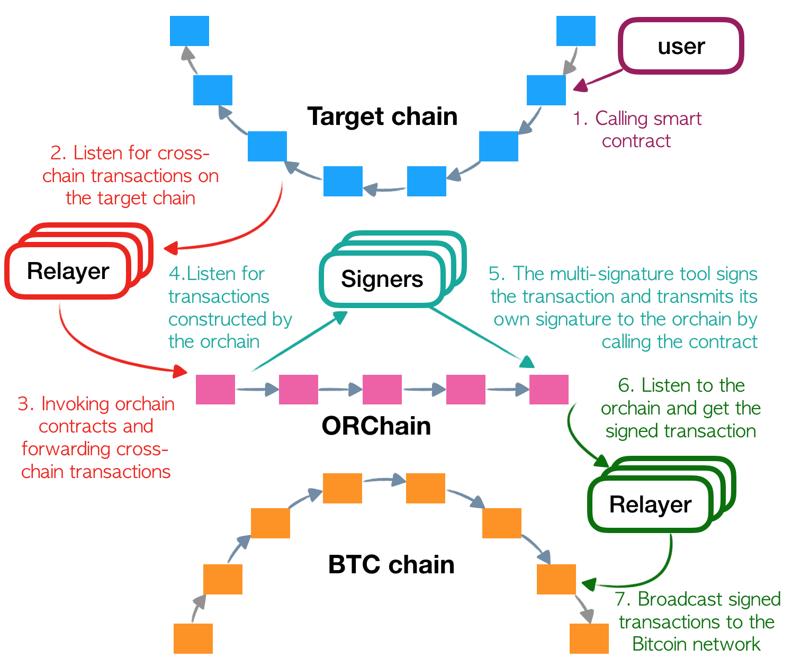

<h1 align="center">Bitcoin Cross Chain Ecosystem</h1>
<h4 align="center">Version 1.0 </h4>

English | [中文](./README_CN.md)

## Introduction

Alice, Bob and Carl plan to start a new BTC cross chain service that can be used to transfer Bitcoin to Ethereum, and you are interested in using their service. Now to be able to use their services you first need to know their **multi-signature address** and create an **Ethereum address**. Once you have both you can proceed to transferring the Bitcoin to the multi-signature address provided by them, and the cross chain system will help you transfer the Bitcoin to the Ethereum network.

How exactly are the BTC tokens transferred to Ethereum? We provide a brief description of the cross chain ecosystem workflow.

It is advisable that the users first confirm the reliability of the cross chain vendor whose services they intend to use. A cross chain transfer basically locks the BTC on the Bitcoin network, and an equivalent amount of tokens that maintain a one to one rate with BTC are delivered to the user's account on the target chain. An example of a token protocol used for this purpose would be ERC20.

Let's say you want to transfer 1 BTC to the Ethereum network. First, you need to send this 1 BTC to the vendor's multi-signature address. This 1 BTC will be locked. Now before doing this, you need to ensure that the vendor is legitimate and reliable. Once you confirm the legitimacy of the vendor, you can transfer 1 BTC to the address that they provide. The transaction your sent will be captured by the cross chain ecosystem, and the ecosystem will then create a message, wherein details such what the target chain is and the recipient address on the target chain will be specified. This message will then be read and transmitted to the target chain by a component of the cross chain ecosystem that is referred to as a relayer. This event will generate an equivalent of 1 BTC in the smart contract deployed on the target chain by the vendor. At this point you can already start using the 1 BTC you transferred.

Now if you wanted to send this BTC back to the Bitcoin network, you just need to invoke the vendor's smart contract. The contract will then create a transaction in the cross chain ecosystem that will release the locked BTC on the Bitcoin chain, and the vendor will return the tokens to you. However, you as the user need to pay a small transaction fee for this transfer, and for that reason that amount will be deducted from the 1 BTC deposit and you will receive a slightly lesser amount than 1 BTC.

For a details on how a user would operate in the cross chain ecosystem, please refer to the cross chain ecosystem [user guide](https://github.com/ontio/cross-chain/blob/master/btc/How_to_Join_the_Bitcoin_Cross-Chain_Ecosystem-Users_Guide.md). A detailed description of how to become a vendor and start your own BTC cross contract service is also avaialble in the [vendor guide](https://github.com/ontio/cross-chain/blob/master/btc/How_to_Join_the_Bitcoin_Cross-Chain_Ecosystem-Vendor_Guide.md).

Let us take a closer look at how the cross chain system operates.

## Framework

As illustrated in the above figure, the cross chain framework consists of the Bitcoin chain, the Bitcoin relayer, the vendor's BTC signature and transaction creation tool, other relayers, and the target chain they are linked to. To put it simply, the user's BTC are first transferred to Polygon by the relayer, and then transferred to a target chain by their respective relayer.

The parties involved in the ecosystem are:

- [**Polygon - Relay Chain**](../polygon/How_to_join_cross_chain.md): The relay chain is one of the crucial components of the cross chain ecosystem. Every type of node is deployed and maintained by different individuals or organizations and has its unique governance and trust mechanism. The relay chain is responsible for connecting them and transferring the tokens from BTC network to other chains. 
- [**Relayer**](./How_to_Join_the_Bitcoin_Cross-Chain_Ecosystem-Relayer_Guide.md): Every chain has a relayer linked to them which monitors the transactions taking place in the corresponding network. They basically transmit the transaction information to the relay chain, thus connecting the relay chain with the outside world. Relayers collect small incentives for carrying out this task. 
- [**Cross Chain Vendors**](./How_to_Join_the_Bitcoin_Cross-Chain_Ecosystem-Vendor_Guide.md): A vendor could be an individual, a group of individuals, or an institution that provides cross chain services. Anybody can become a vendor. The steps involved are pretty simple. All that is needed is a multi-signature BTC address, deploying smart contracts that lock and generate the tokens in the BTC network and the target chain respectively, and finally registering the multi-signature `Redeem` and the contracts on the relay chain. Everything is under the vendor's control. With the aforementioned components in place the vendor can enable the multi-signature tool and customers can start using their services.
- [**Users**](./How_to_Join_the_Bitcoin_Cross-Chain_Ecosystem-Users_Guide.md): Users includes anyone interested in transferring their BTC to other target chains such as Ethereum and use them in dApps and such. 

## Process Flow

### Bitcoin to other target chains

The figure above illustrates the process through which BTC can be transferred other target chains. The destination where the BTC tokens are to be transferred is labelled as the target chain, for instance Ethereum.
The red relayer particularly focuses on the communication between the target chain and the Polygon.
The green relayer is responsible for the communication between the Bitcoin network and the Polygon.
The chain at the bottom represents BTC, while the one on the top represents the target chain. The center is marked in pink, which is the Polygon.

The cross chain transfer process can be divided into six main steps, where the user only needs to carry out the first one, which is selecting a vendor you trust and then sending the amount of BTC you want to transfer to their multi-signature address. The rest is taken care of by the cross chain ecosystem. Users can refer to this [user guide](https://github.com/ontio/cross-chain/blob/master/btc/How_to_Join_the_Bitcoin_Cross-Chain_Ecosystem-Users_Guide.md) for reference, while interested vendors can refer to the [vendor's guide](https://github.com/ontio/cross-chain/blob/master/btc/How_to_Join_the_Bitcoin_Cross-Chain_Ecosystem-Vendor_Guide.md).

> The BTC transferred to the multi-signature address will be locked and in control of the vendor. This is the reason why it is necessary that a user needs to trust the vendor. Also, the contract that will generate and issue the cross chain BTC on the target chain will also be deployed by the vendor. For example, ERC20 tokens generated and issued upon BTC transfer to Ethereum.

#### 1.1 Sending Transactions

The only thing in this entire process that the user needs to do is sending a transaction to the Bitcoin chain, and the cross chain ecosystem will carry out the rest of the procedure. This transaction, however, must be of the specified format, i.e. it must contain the necessary details such as target chain information, chain ID, the receiver's address on the target chain, etc. The format of a transaction is illustrated by the figure above.

- **Input:** Just like a regular BTC transaction, the user needs to create the input using their UTXO. The input amount must include the cross chain transfer amount and the transaction fee;

- **Output:** The protocol includes two important points of output, the transfer amount output to the multi-signature address and the `OP_RETURN` information output contained in the cross contract transaction. Both need to be serialized in sequence as first and second elements respectively. For other points of output, can be used for returning change or other kinds of transfer. 

- **OP_RETURN data format:** The one byte of data stored in `OP_RETURN` includes the cross chain label, receiver's target chain account address, chain ID of the target chain, cross chain transaction fee, and the address of the target contract. The target contract represents the token that complements BTC and is deployed on the target chain. For example, an ERC20 contract on Ethereum. The chain ID tells the Polygon (the relay chain) where to transfer the BTC. The transaction fee charged here is the processing fee for using the cross chain ecosystem.

#### 1.2 BTC Relay Transmission

Once the transaction is created and registered on the BTC chain, the BTC relayer monitoring the BTC network picks it up and transmits its corresponding Merkle Proof to the relay chain.

#### 1.3 Relay Chain Consensus

A relay node invoked the contract on the relay chain verifies the transaction and the validity of the merkle proof. The verification process is discussed on a later section. If the verification is successful, that chain transmits the necessary information in the form of an event. This includes the contract and account address on the target chain, cross chain transfer amount, etc. which is then  received by a relay node of the target chain.

#### 1.4 Target Chain Relay Transmission

The relay node of the target chain constantly monitors the relay chain events. Based on the BTC transaction information, the cross chain contract of the relay chain invokes the target chain contract, which would generate and send the cross chain BTC to the receiving address.

#### 1.5 Target Chain Account Transfer

The contract invoked on the target chain will transfer the cross chain BTC to the user's account. Cross chain BTC can be used in various different scenarios and applications such as trade, dApps, etc. This creates great potential for vendors with ideas that they are looking to implement.

### 2. Bitcoin Block Header Synchronization

The relay chain needs to verify the merkle proof of the BTC transaction in order ensure the validity of the transaction information provided by the relayer. That is why it maintains a corresponding block header. The BTC relayer continuously sends block header information to the relay chain, collecting incentives in the process.

- **Initializing the relay chain:** The relay chain is initialized with a BTC block header. The height of this block is not fixed, but it is generally the current block height when the relay chain is initialized. This block header is referred to as the **Genesis block header** of the relay chain.
- **Block header transmission:** The relay chain contract provides an API to transmit the block header. The relayer uses the API to send the block headers after the **Genesis** height.
- **Block header storage:** The smart contract on the relay chain implements a mechanism similar to that of the Bitcoin light client. It can store and verify block headers, maintain the current longest chain, and deal with forks and other abnormal circumstances.
- **Cross chain transaction verification:** Transactions need to be verified before being transmitted to the target chain. Firstly, the relay chain contract confirms the 6 block policy. The block height is measured with respect to the relay chain block height. Next it confirms whether the transaction adheres to the protocol standard. Finally, it verifies the merkle proof by fetching the BTC transaction using block height and cross-checking whether the merkle roots of the BTC transaction and that of the transaction on the relay chain match.

### 3. Target Chain to Bitcoin Network

The picture above illustrates the process of BTC being transferred back to the Bitcoin network. The target chain relayer has been highlighted in red, and that of the vendor is in dark green. The signing tool used by the vendor, represented in light green here, can monitor transactions on the relay chain and sign them. 

1. The user invokes the target chain's contract to release the BTC. The relay node of the target chain listens for this event, and once picked up it sends the necessary information to the relay chain.
2. The relay chain creates an unsigned transaction which is meant to release the BTC locked in the multi-signature address.
3. The signature tool used by the vendor monitors the chain for this transaction. This transaction needs to be signed by the individually by the collaborators of the cross chain project. They use the relay chain contract to sign the transaction and transmit it back to the chain. The contract also ensures that signatures are authentic. Once authorized, the transaction is put together and finally sent out as an event.
4. The Bitcoin relayer monitoring the relay chain's events takes this transaction and broadcasts it to the Bitcoin network.
5. The user finally receives their BTC in their Bitcoin account. The user bears the transaction costs generated in this process, i.e. processing fees. The processing fee is calculated by the relay chain when creating the transaction, based on the size and nature of the transaction.
