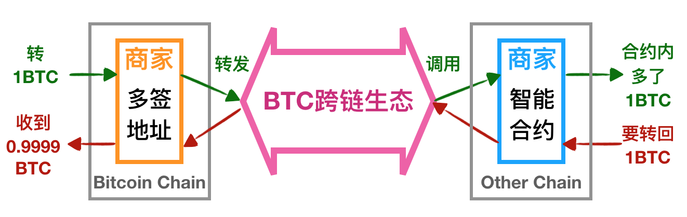
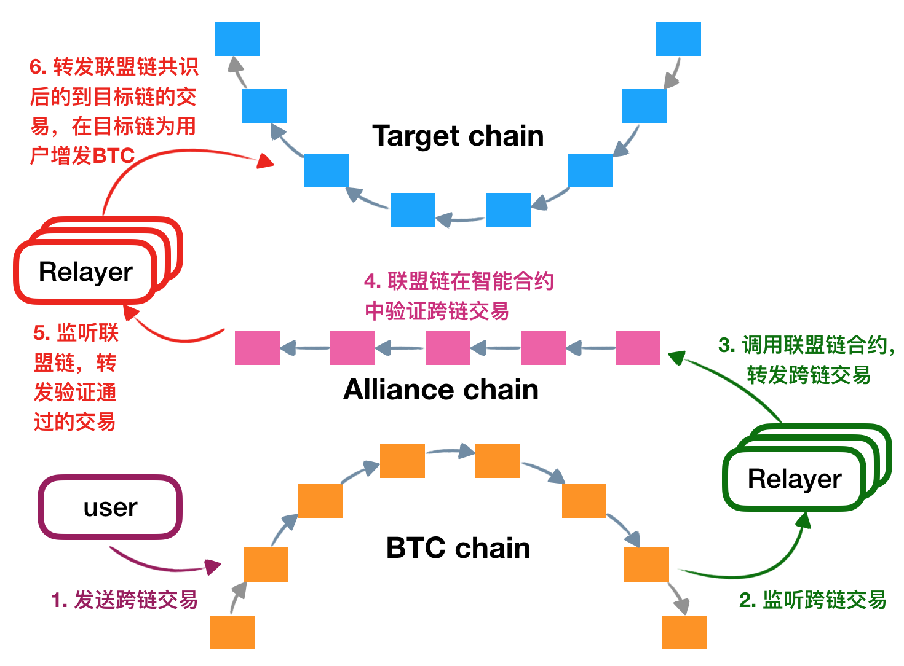
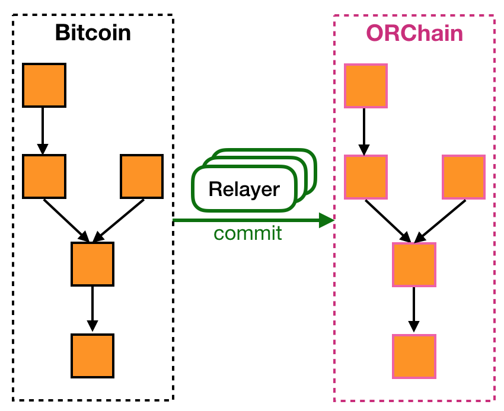
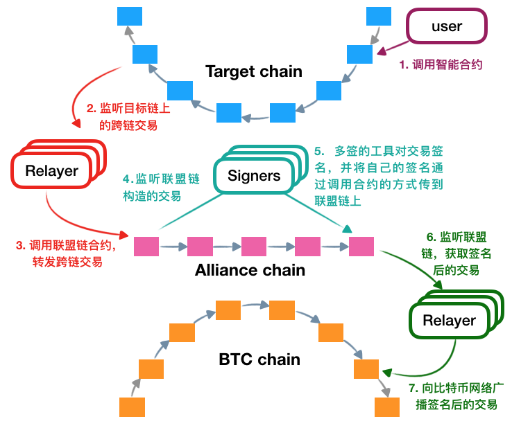

<h1 align="center">比特币跨链生态</h1>
<h4 align="center">Version 1.0 </h4>

[English](./README.md) | 中文

## 引言

Alice、Bob和Carl三个人决定作为供应商开展BTC跨链业务，能将BTC转移到以太坊上去，而你希望成为他们的用户，为此你需要知道他们的**多签地址**，创建一个你的以**太坊地址**，当一切准备就绪，你只需要发送一笔特殊的比特币交易到供应商的多签地址，生态中的其他角色就会帮助你把BTC转移到以太坊！

怎么算是BTC跨链到以太坊呢？下图简单介绍了跨链生态对于用户来说完成的事情。

在跨链之前，你需要确定供应商及其业务是值得信任的。跨链实际上就是将比特币网络中的BTC原封不动地转移到其他链上，在其他链上的BTC具备和跨链前完全一致的属性，具有相同的价值，BTC在目标链上以代币（智能合约）的形式存在，比如ERC20。

你需要先将1BTC发送到供应商的比特币多签地址，锁定1BTC，这需要你信任供应商，这笔交易内需要填入要跨到哪条链和你在那条链的地址等信息，这笔交易会被跨链生态“搬运到”目标链上，进而在供应商在目标链部署的智能合约中生成1BTC，这时候你就可以在目标链上使用BTC了。当你希望自己的BTC回到比特币网络，只需要调用供应商的智能合约，跨链生态就会构造一笔多签解锁交易，供应商会把你的BTC从多签地址退回给你，但你会发现收到的金额不足1BTC，这是因为你需要支付生态中损耗的手续费。

用户的详细操作可见这篇[文档](https://github.com/ontio/cross-chain/blob/master/btc/How_to_Join_the_Bitcoin_Cross-Chain_Ecosystem-Users_Guide.md)。同样地，作为供应商想要开展自己的BTC跨链业务，就要完成注册、签名和智能合约部署等工作，详情可见这篇[文档](https://github.com/ontio/cross-chain/blob/master/btc/How_to_Join_the_Bitcoin_Cross-Chain_Ecosystem-Vendor_Guide.md)。

想知道怎么实现的？接下来就了解一下吧！

## 架构

如上图简单介绍了跨链生态的架构，从上到下分别是比特币链、比特币的Relayer、供应商的比特币交易签名工具、其他链的Relayer和某一条链。简单来说，用户的BTC会经由Relayer传递到Polygon，再由其他链的Relayer传递到目标链，BTC返回与之类似，不过需要供应商对BTC最后回到比特币网络的多签交易进行签名。

生态中的角色如下：

- [**Polygon**](../polygon/How_to_join_cross_chain_cn.md)：Polygon是整个生态中的重要部分，每个节点由不同的个人或组织运行，有自己独特的治理模式和信任机制，它负责将各个链连接到一起，实现BTC到各个链的转移。
- [**Relayer**](https://github.com/ontio/cross-chain/blob/master/btc/How_to_Join_the_Bitcoin_Cross-Chain_Ecosystem-Relayer_Guide.md)：每条链都有自己的Relayer，它们负责把交易等信息搬运到Polygon，是Polygon和外界的通信兵，它们会在这个过程中获取收益。
- [**跨链供应商**](https://github.com/ontio/cross-chain/blob/master/btc/How_to_Join_the_Bitcoin_Cross-Chain_Ecosystem-Vendor_Guide.md)：供应商是指开展跨链业务的人或组织，任何人都可以成为供应商，比如Alice一伙，只要拥有一个比特币多签地址，部署好对应链的智能合约，然后向Polygon注册多签Redeem与合约，注册过程完全由供应商自己掌控，最后启动签名工具（Signers）即可，剩下的就是招揽来信任你的客户啦！
- [**用户**](https://github.com/ontio/cross-chain/blob/master/btc/How_to_Join_the_Bitcoin_Cross-Chain_Ecosystem-Users_Guide.md)：对跨链生态来说，最重要的就是参与者，通过发送带有跨链信息的特殊BTC交易，实现BTC到以太坊等链的转移，让你的BTC参与到以太坊的DApp等业务中，让BTC真正流通起来！

## 流程

### 1 比特币到目标链

上图介绍了BTC跨链到其他链的具体流程。图中的目标链指的是要将BTC转移过去的目的地，比如以太坊。红色的Relayer是为专门为目标链服务的，负责转发目标链和Polygon之间的信息，而绿色的Relayer是为比特币链服务的。图下方为比特币链，上方为目标链，中心则为Polygon。跨链流程大体可分为以上六步，而用户需用做的只有第一步，选择自己信任的供应商的多签地址，朝该地址发送特殊的比特币交易，其余由整个跨链生态系统完成，具体操作请[见](https://github.com/ontio/cross-chain/blob/master/btc/How_to_Join_the_Bitcoin_Cross-Chain_Ecosystem-Users_Guide.md)，如果想成为供应商，则请[见](https://github.com/ontio/cross-chain/blob/master/btc/How_to_Join_the_Bitcoin_Cross-Chain_Ecosystem-Vendor_Guide.md)。

跨链的BTC会锁到供应商的多签地址中，实际上供应商会掌握跨链的BTC，这就是为什么用户需要信任供应商，BTC跨链后会映射到上的一本代币合约，比如ERC20，它会实现协议中要求的接口，这本合约是由供应商开发并部署的，比如Alice他们。

#### 1.1 发送交易

用户所要做的只是向比特币网络发送一笔比特币转账交易，整个跨链系统会完成剩余的工作，当然这个交易需要按照协议规定的格式构造，并且携带目标链的信息，比如链ID、用户在目标链上的地址等，上图中展示了交易的构造格式：

1. **输入部分**：和普通比特币交易一样，用户需要使用自己的UTXO来构造输入，输入的总金额至少要包含跨链金额和手续费；
2. **输出部分**：协议要求必须具有两个关键输出：向多签地址转账的输出和携带跨链信息的OP_RETURN输出，二者必须按顺序排列在输出部分的第一和第二位，除此之外的输出可以用作找零、转账等操作；
3. **OP_RETURN中携带的数据格式**：OP_RETURN中存储的数据为1字节的**跨链标志、目标链账户地址、目标链ID和跨链交易费**。目标合约地址是目标链上BTC的映射，目标链ID告诉Polygon应该将BTC转移到哪条链，交易费则是要付给生态的手续费，合约地址则是目标链上代表BTC的代币，比如Alice部署的以太坊ERC20合约；

#### 1.2 比特币中继转发

1.1节中发送的交易在比特币网络上链并确认之后，跨链生态中的BTC Relayer节点会持续监听比特币网络，将符合标准的交易以及交易对应的Merkle Proof转发给Polygon。

#### 1.3 Polygon共识

中继节点调用Polygon智能合约，转发BTC交易以及Merkle Proof，Polygon的合约会验证Merkle Proof，确认BTC交易的合法性，验证方法将会在下文介绍。通过检验后，Polygon会通过事件的方式将必要的信息传递出来，即目标链合约和账户地址、跨链金额等，这些信息将被目标链的中继节点发现，进入下一个流程。

#### 1.4 目标链中继转发

目标链的中继节点会持续监听Polygon网络中的事件，进而依据Polygon的BTC跨链信息调用对应的目标链合约，在目标账户增发BTC代币，该代币与BTC是一一对应的。

#### 1.5 目标链落账

此时，用户可以在代币合约的账户余额中发现BTC了，目标链上的BTC可以用来在参与供应商相关业务，可能是游戏、交易所等等，对供应商来说，这就是发挥想象力与创造力的时刻。

### 2. 比特币区块头同步

Polygon为了验证Relayer提交的交易，需要验证对应的Merkle Proof，所以Polygon需要维护对应的区块头，这需要比特币的Relayer不停地向Polygon提交区块头，提交区块头的Relayer可以获取奖励。如上图，左侧为比特币链，右侧为Polygon中维护的比特币链副本，Relayer不停地向Polygon提交最新的比特币区块头，Relayer和Polygon能应对各种比特币的常见问题，比如分叉、难度周期变换等，确保Polygon维护了当前比特币的最长链。区块头同步的内容主要包含以下四点：

- **Polygon初始化**：Polygon开始同步比特币区块头之前，会初始化一个比特币区块头，这个区块头的高度是不确定的，但它必须是难度周期的第一个区块，该区块头称为Polygon上的比特币“创世区块头”。
- **区块头提交**：Polygon的智能合约提供了区块头提交接口，Relayer调用接口提交“创世”高度之后的区块头，Relayer每次提交新高度的区块头之前，会检查Polygon的区块头是否最长链，不是的话会从分叉点开始提交区块头，因此只要有一个Relayer启动，就可以确保Polygon中比特币区块头的合法性。
- **区块头存储**：Polygon在合约中实现了一套类似于比特币轻客户端的机制，能够验证并存储比特币区块头，维护当前最长链，并且应对分叉等异常情况。
- **跨链交易验证**：上文提到要验证跨链交易：首先会验证该交易是否满足6个比特币区块确认，确认数是以Polygon上的高度来计算的；然后验证交易结构和内容是否符合协议要求；最后会验证Merkle Proof，合约中会通过高度获取对应的比特币区块头，对比Merkle Proof求出来的Merkle Root和区块头中的是否相等。

### 3. 目标链到比特币

上图中展示了BTC从目标链回到比特币需要经过的流程。红色的是目标链Relayer，青色的是供应商（Alice他们）启动的签名工具，能监听Polygon并对交易进行签名，绿色的是比特币的Relayer。

1. 用户调用目标链的智能合约释放BTC，目标链的中继节点会监听到这个事件，将必要的信息通过调用智能合约传递到Polygon；
2. Polygon会在合约执行过程中构造出未签名的比特币交易，这些交易会释放用户锁在多签中的BTC；
3. 供应商启动的签名工具监听Polygon，从而获得这些待签名的交易，他们分别对交易进行签名，通过调用Polygon合约将自己的签名传递上去，合约会验证签名是多签中的一个，并在最后一个符合要求的签名到达后，将签名和交易组装起来，然后通过事件发布出去；
4. 比特币的Relayer监听Polygon的事件，会将这笔交易广播出去；
5. 用户将会看到自己的BTC又回到了比特币网络中，当然这过程中消耗的手续费由用户自己承担，Polygon构造交易时会按照交易大小动态设置手续费，费率由供应商设定。