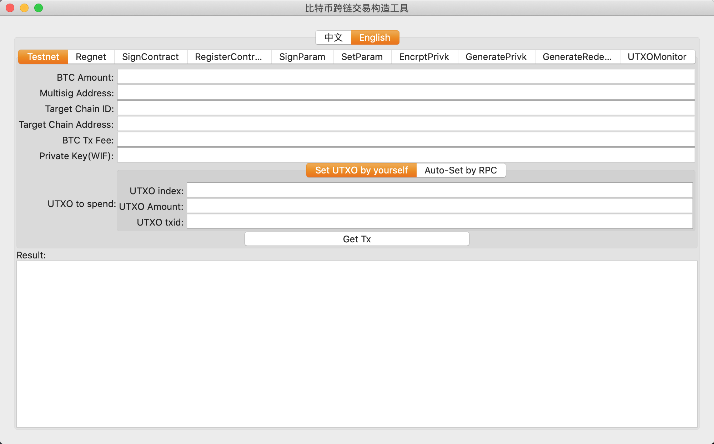
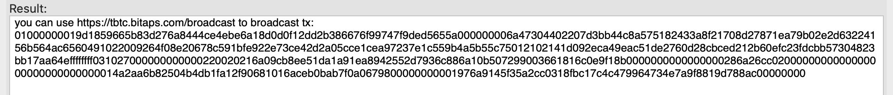
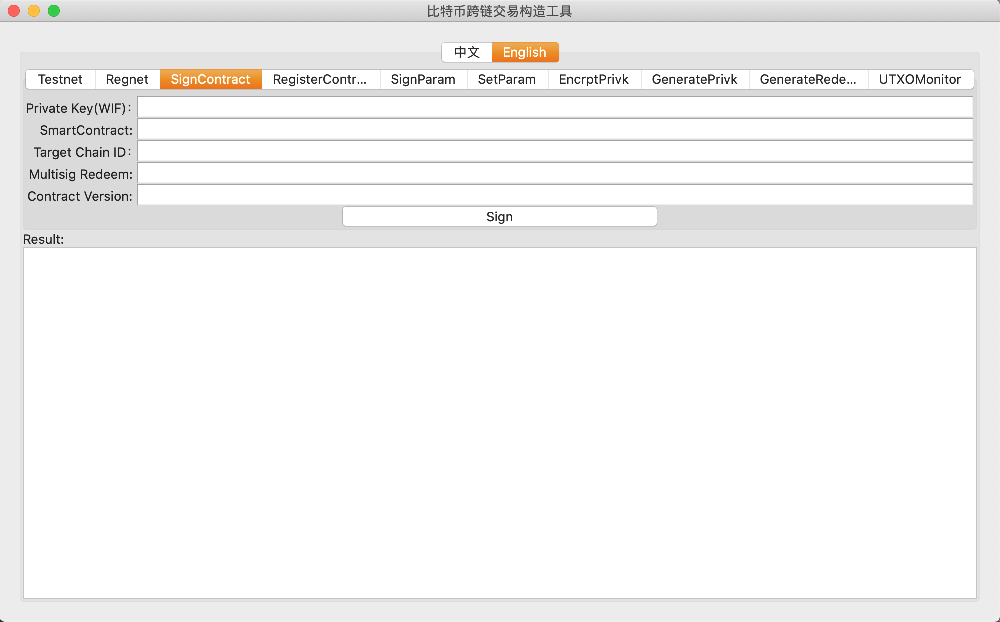
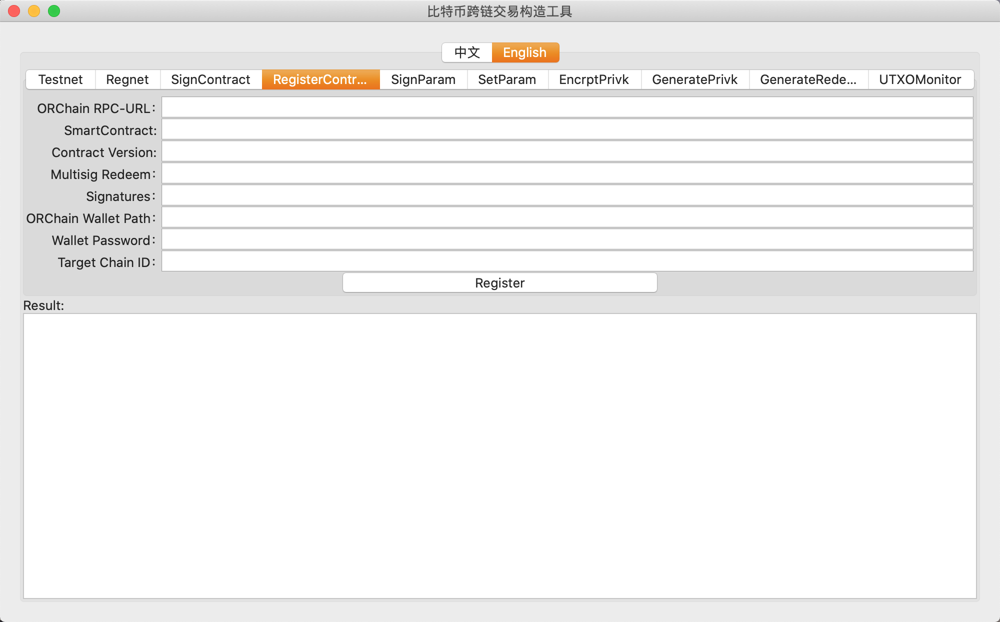
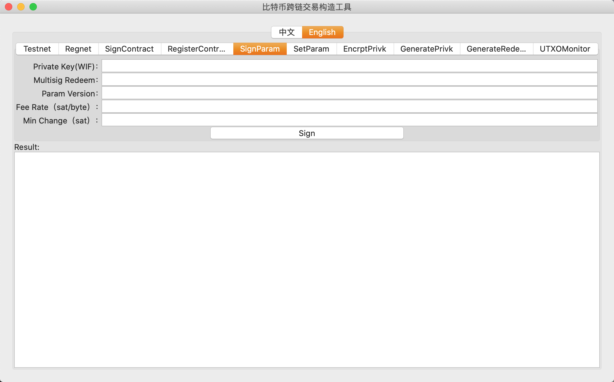
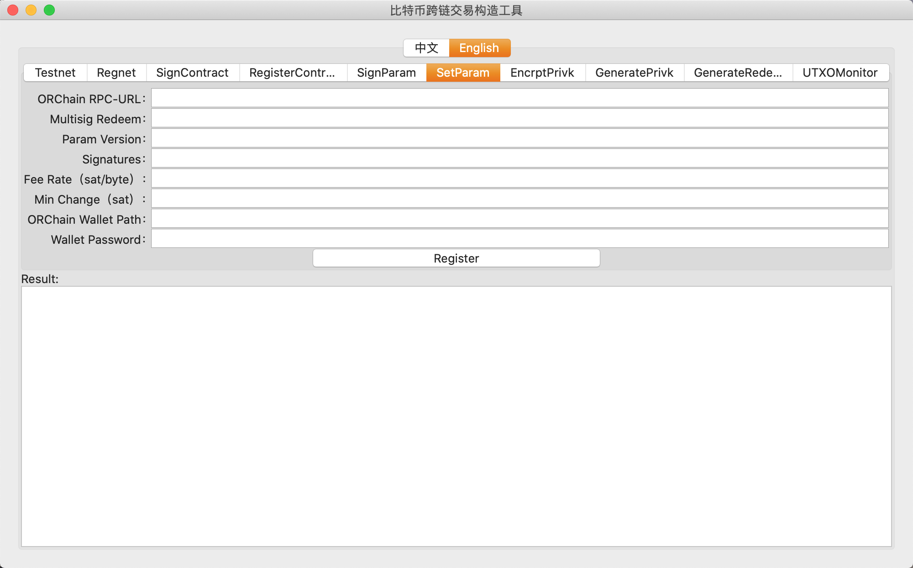
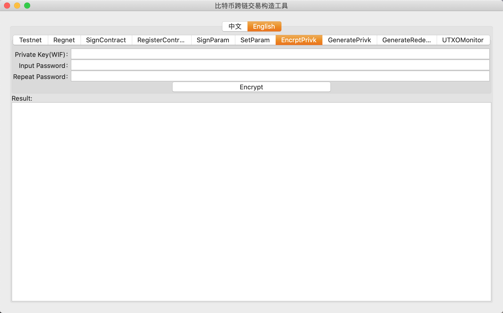
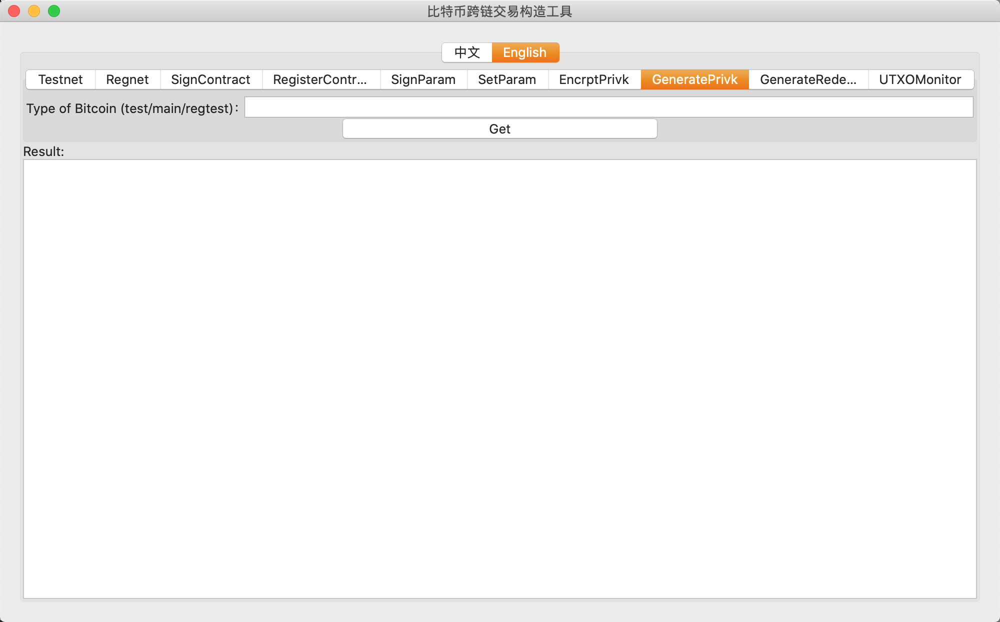
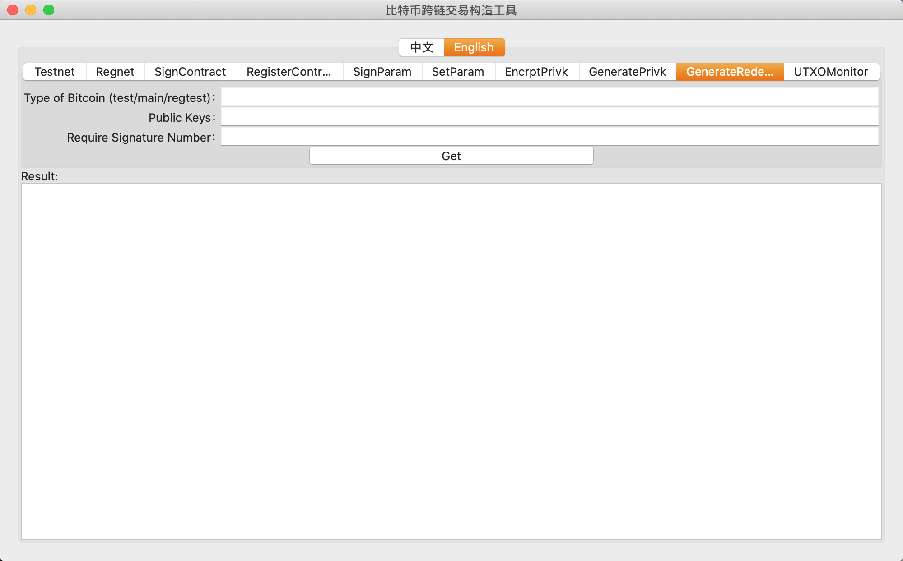
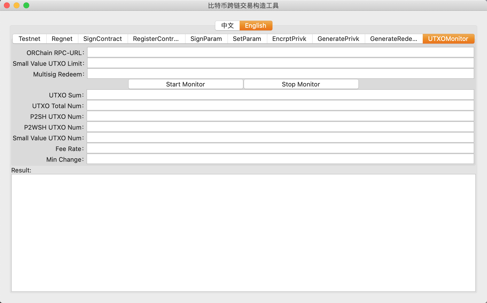

<h1 align="center">BTC Cross Chain Transaction Construction Tool</h1>
<h4 align="center">Version 1.0 </h4>

English| [中文](./cross-chain_transaction_construction_tool_user_manual_CN.md)

## Introduction

The **btctool** has been built to serve multiple functions which include creating BTC transactions that have been customized for a cross chain environment, while also allowing potential vendors to register their multi-signature **redeem** and their smart contracts on the relay chain.

## Compilation

After installing the necessary Golang dependencies, please execute the following command under the `cmd` directory.

```go
go build -o btctool main.go
```

## Running the GUI

The GUI supported version of the tool is available for download. Please follow [this](https://github.com/zouxyan/btctool/releases/download/0.0.1/btctool-macos) link.

The main window of the GUI version of the tool is as displayed in the picture below. The tabs on the top are used to select a particular function and provide the respective parameters to implement the corresponding function and send a cross chain transaction.

<div align=center></div>

All the functions in the top tab of the **btctool** have been described below:

|               Function                | Description                                                                                                                                                                                                                                   |
| :-----------------------------------: | --------------------------------------------------------------------------------------------------------------------------------------------------------------------------------------------------------------------------------------------- |
|               Test net                | Used to create cross chain transactions for BTC test net environment. Fill in the parameters to create a transaction. A BTC full node can be used to broadcast the transaction if available, else transaction needs to be broadcast  manually |
|              Private net              | Used to create cross chain transactions for the private net (regtest). Same as test net function in terms of usage                                                                                                                            |
|          Contract signature           | Used by vendors to sign their deployed contracts and sign multi-signature `redeem` transactions                                                                                                                                               |
|  Register a multi-signature contract  | Used to register the `redeem` script and the target contract on the relay chain                                                                                                                                                               |
|          Encrypt private key          | Used to encrypt a plaintext private key. Used by vendors to enable their signing tool                                                                                                                                                         |
|         Generate private key          | Used to generate a new private key. Displays the corresponding address and the public key                                                                                                                                                     |
| Generate mult-signature redeem script | Used to generate the redeem script by providing the public key. Displays the multi-signature wallet address                                                                                                                                   |

### Creating a Cross Chain BTC Transaction

The **btctool** currently supports cross chain transactions on the test net and the private net. Creating and sending a transaction to the BTC test net will transfer the amount to the target chain's test net account. 
In case working with a private net configuration, you first need to setup a chain consortium environment and define a target chain, etc. This can be used to carry out testing. Please take note of the changes that need to be made when a network configuration changes. 

A sample cross chain transaction on the test net would involve the following steps:

1.  First provide the necessary information in the form of parameters. Now since the tool does not support complex functionalities such as a built-in wallet, you need to fill in the UTXO information manually. The transactions sent out can be viewed by looking up your address in an [explorer](https://tbtc.bitaps.com/). You don't need to specify the UTXO information manually if working with a private chain environment, or if a BTC full node is available. But for these cases, you just need to specify the RPC details of the node. 

|             Parameter              | Description                                                                                                                                                               |
| :--------------------------------: | :------------------------------------------------------------------------------------------------------------------------------------------------------------------------ |
| BTC cross chain transaction amount | Amount to be transferred to the target chain, for e.g. 0.01                                                                                                               |
|    BTC multi-signature address     | Multi-signature address provided by the cross chain service vendor                                                                                                        |
|  Target chain token contract hash  | Contract hash of the token that complements BTC on the target chain. Generally an OEP4 or ERC20 contract, for e.g. [BTCX](https://github.com/zouxyan/btc_crosschain_demo) |
|          Target chain ID           | ID of the target chain in the cross chain ecosystem, for e.g. BTC is 0, ONT is 2                                                                                          |
|        Target chain address        | Address of the user's account on the target chain                                                                                                                         |
|        BTC transaction fee         | Transaction fee for sending the cross chain BTC transaction, for e.g. 0.00001                                                                                             |
|          WIF private key           | WIF private key used to sign the transaction                                                                                                                              |
|             UTXO Index             | The UTXO to be used by the user w.r.t the last transaction, multiple values separated using commas, for e.g. 0,2,2                                                        |
|            UTXO Amount             | UTXO amount to be used, multiple values separated using commas, for e.g. 0.01,0.02,0.1                                                                                    |
|        UTXO Transaction ID         | Source transaction ID of the UTXO, multiple values separated using commas                                                                                                 |
|         BTC full node URL          | RPC address of the test net BTC full node                                                                                                                                 |
|           RPC user name            | BTC full node RPC user name                                                                                                                                               |
|            RPC password            | BTC full node RPC password                                                                                                                                                |

The picture below illustrates a transaction that transfers **0.0001 BTC** to the Ethereum test net. The transaction fee is set to 0.00001 BTC. The target chain token contract hash, the receiving address on the target chain, and Ethereum's chain ID is also specified. And then then the UTXO details are provided which can also be fetched directly using the BTC full node's RPC. 

<div align=center></div>

2. Click the button to the see the result. The tool will display the transaction hash. This transaction hash can be copied and broadcasted. In a private net, the transaction will be transferred to the node using the RPC, which will then automatically broadcast it. For example:

<div align=center></div>

The transaction hash, as displayed in the picture above can be copied and broadcasted using this [tool](https://tbtc.bitaps.com/broadcast). A transaction ID will be obtained, such as "[de4eaa98252b24a1cd658f847c0a05083b6d03b4d5ad188f7cb62a808091ba8a](https://tbtc.bitaps.com/de4eaa98252b24a1cd658f847c0a05083b6d03b4d5ad188f7cb62a808091ba8a)"

### Contract Signature

The vendors looking to start cross chain businesses need to register their contracts and multi-signature `Redeem` scripts on the target chain before becoming a part of the cross chain ecosystem. The relay chain will verify the signatures of each transaction and their link to the contract.

The vendors looking to start cross chain businesses need to register their contracts and multi-signature `Redeem` scripts on the target chain before becoming a part of the cross chain ecosystem. The relay chain will verify the signatures of each transaction and their link to the contract.

<div align=center></div>

Fill in the WIF private as shown above and click the **sign** button to link the target chain contract and the multi-signature **redeem** script. The result will be displayed at the bottom. The vendor needs to record their signature, and all the signatures are consolidated, they can be registered on the relay chain.

### Registering Multi-Signature Contract

The multi-signature scripts and contracts that have been registered on the relay chain are the only ones that can carry out cross chain transactions. Fill in the parameters as displayed in the following picture and click on register. The result pane will display the relay chain transaction hash.

<div align=center></div>

|        Parameter        | Description                                                                                               |
| :---------------------: | --------------------------------------------------------------------------------------------------------- |
| Relay chain RPC address | RPC address of the relay chain                                                                            |
|     Target contract     | Contract address of the cross chain BTC token on the target chain                                         |
| Multi-signature redeem  | Multi-signature script to be used by the cross chain ecosystem                                            |
|        Signature        | Signature of each individual in the multi-signature redeem script, multiple values separated using commas |
| Relay chain wallet path | Wallet account that sends the transaction to the relay chain                                              |
|     Wallet password     | Relay chain wallet password                                                                               |
|     Target chain ID     | ID of the target chain                                                                                    |

### Signing Parameters

After the vendor links the multi-signature tool to the contract they can set the parameters required to create the transaction that releases the locked BTC. First the parameters need to be fixed, and then all the collaborators use their respective private keys to sign them after filling them in.

<div align=center></div>

The parameters have been described below:

| Parameter                | Description                                                                                                                              |
| ------------------------ | ---------------------------------------------------------------------------------------------------------------------------------------- |
| WIF private key          | WIF format BTC private key                                                                                                               |
| Multi-signature Redeem   | Vendor's redeem script                                                                                                                   |
| Paramter version         | Version no. of the parameters, can be updated, but the version no. can only increase with each change                                    |
| Fee rate（sat/byte）     | Fee rate for creating the BTC release BTC, fixed in satoshi per byte, for e.g. 10 sat/byte, deducted from the user's transfer amount BTC |
| Min. change value（sat） | Sets min. change amount for the BTC release transaction from the multi-signature address, prevents generation of dust UTXO               |

### Setting Transaction Parameters

Once the min. no. of necessary signatures are collected for signing the parameters are collected on the relay chain, the transaction parameter setting will be carrid out. The signatures can be sent individually or accumulated and then sent in a group. Fill in the required parameters as shown in the picture below:

<div align=center></div>

The parameters have been described below.

| Parameter                | Description                                                                                                                              |
| ------------------------ | ---------------------------------------------------------------------------------------------------------------------------------------- |
| Relay chain RPC address  | RPC address of the relay chain                                                                                                           |
| Multi-signature redeem   | The redeem script to be used to carry out the cross chain transaction                                                                    |
| Parameter version        | Version no. for the BTC release transaction parameters                                                                                   |
| Signature                | Signatures of the collaborators in the multi-signature redeem, multiple values separated using commas                                    |
| Fee rate (sat/byte)      | Fee rate for creating the BTC release BTC, fixed in satoshi per byte, for e.g. 10 sat/byte, deducted from the user's transfer amount BTC |
| Min. change value（sat） | Sets min. change amount for the BTC release transaction from the multi-signature address, prevents generation of dust UTXO               |
| Relay chain wallet path  | Relay chain wallet, used to register the transaction on the relay chain                                                                  |
| Wallet password          | Password of the relay chain wallet                                                                                                       |

### Encrypting Private Key

A Bitcoin private key file needs to be generated before running the multi-signature contract. The relay chain's encryption method is used here. As illustrated in the picture below, fill in the parameters to generate the encrypted wallet file.

<div align=center></div>

### Generating Private Key

The tool can be used to generate a BTC private key, and display the public key and the address associated. The network type field can be assigned the values `test`, `regtest` and `main`, which respectively correspond to the test net, private net, and main net.

<div align=center></div>


### Generating the Multi-Signature Redeem Script

Fill in the network type, the public keys of all the collaborators (separated using commas), and the no. of signatures required for authentication. Click on the **fetch** button to get the redeem script. The various types of multi-signature addresses are all generated using the redeem script. It is recommended that you use `P2WSH` addresses in order to minimize transaction fees.

Fill in the network type, the public keys of all the collaborators (separated using commas), and the no. of signatures required for authentication. Click on the **fetch** button to get the redeem script. The various types of multi-signature addresses are all generated using the redeem script. It is recommended that you use `P2WSH` addresses in order to minimize transaction fees.

<div align=center></div>

### UTXO Monitoring

This feature of the **btctool** allows the vendor to dynamically monitor the relay chain UTXO thereby making it more convenient for them to carry out cross chain transactions. Fill in the relay chain RPC address, a min. amount and the redeem script. The UTXO information will be displayed at the bottom and added to the corresponding file.

<div align=center></div>

The parameters are described below.

| Parameter                     | Description                                                                   |
| ----------------------------- | ----------------------------------------------------------------------------- |
| Relay chain RPC address       | RPC address of the relay chain                                                |
| Min. amount limit             | A min. amount set in satoshis, smaller UTXO amounts are cumulatively added up |
| Multi-signature redeem script | Redeem script used to generate the multi-signature address                    |

Resultant paramters are as follows:

| Parameter               | Description                                                                                                                              |
| ----------------------- | ---------------------------------------------------------------------------------------------------------------------------------------- |
| UTXO transfer amount    | BTC amount locked in the multi-signature address, transferred to the target chain                                                        |
| UTXO number             | Current no. of UTXO that can be used                                                                                                     |
| P2SH format UTXO        | No. of P2SH format UTXO locked by the script, high transaction fee                                                                       |
| P2WSH format UTXO       | No. of P2WSH format UTXO locked by the script, relatively low transaction fee                                                            |
| No. of min. amount UTXO | No. of UTXO with amount lesser than the set min. amount                                                                                  |
| Fee rate                | Fee rate for creating the BTC release BTC, fixed in satoshi per byte, for e.g. 10 sat/byte, deducted from the user's transfer amount BTC |
| Min. change value       | Sets min. change amount for the BTC release transaction from the multi-signature address, prevents generation of dust UTXO               |

Fill in the network type, the public keys of all the collaborators (separated using commas), and the no. of signatures required for authentication. Click on the **fetch** button to get the redeem script. The various types of multi-signature addresses are all generated using the redeem script. It is recommended that you use `P2WSH` addresses in order to minimize transaction fees.


## Command Line Execution

The **btctool** can work in test net and simulated network environments. If you're using the test net environment that is provided by the cross chain ecosystem, select test net. And if you're using a local private network, select the simulated network.

### 1. Test Net

```shell
./btctool -tool=cctx -idxes=1 -utxovals=0.01 -txids=c09d7d7a321d025ac0cad75855b1b0313e55660a5a77b9d038bb7f606be6a744 -value=0.008 -fee=0.00001 -targetaddr=AdzZ2VKufdJWeB8t9a8biXoHbbMe2kZeyH -privkb58=cRRMYvoHPN*************************MVwyqZVrAcX -contract=b6bf9abf29ee6b8c9828a48b499ad667da1ad003 -multiaddr=tb1qy94qnjuwu5w6r2g74z2z25khjdkgs6ssk5rjnyqrvcvpds8f7x9shrfspn
```

|  Parameter  | Usage                                                                                                                                                                                        |
| :---------: | -------------------------------------------------------------------------------------------------------------------------------------------------------------------------------------------- |
|    -gui     | Whether run in the GUI, `1` indicates true, `0` indicates false                                                                                                                              |
|    -tool    | Select the required tool, `cctx` is the test net tool, `regauto` is the emulated network tool                                                                                                |
|   -idxes    | UTXO position in the transaction and output sequence, multiple values separated using commas                                                                                                 |
|  -utxovals  | Amount in each UTXO, multiple values separated using commas                                                                                                                                  |
|  -privkb58  | `base58` private key used to sign a transaction, unsigned transaction is returned if left empty, user can choose to sign by themselves                                                       |
|   -value    | Cross chain transfer amount, the amount locked to the multi-signature address on the consortium chain, amount of BTC transferred to the target chain account, default value `10000` satoshis |
|    -fee     | Transaction fee charged for the transaction, default value `1000` satoshis                                                                                                                   |
| -targetaddr | User's target address                                                                                                                                                                        |
|  -contract  | Contract address of the target chain                                                                                                                                                         |
|  -tochain   | ID of the target chain, used in the consortium to determine the BTC cross chain destination                                                                                                  |
| -multiaddr  | Multi-signature address of the organization providing the cross chain service                                                                                                                |

**Sample execution:**

```shell
./btctool -gui=0 -tool=cctx -idxes=1 -utxovals=0.01 -txids=c09d7d7a321d025ac0cad75855b1b0313e55660a5a77b9d038bb7f606be6a744 -value=0.008 -fee=0.00001  -targetaddr=AdzZ2VKufdJWeB8t9a8biXoHbbMe2kZeyH -privkb58=cRRMYvoHPN*************************MVwyqZVrAcX -contract=56faac6081cd320fab3347c62faea86344a8aece -multiaddr=tb1qy94qnjuwu5w6r2g74z2z25khjdkgs6ssk5rjnyqrvcvpds8f7x9shrfspn
2019/11/04 14:34:10.220569 [INFO ] GID 1, Signed cross chain transaction with your private key
2019/11/04 14:34:10.220716 [INFO ] GID 1, ------------------------Your signed cross chain transaction------------------------
010000000144a7e66b607fbb38d0b9775a0a66553e31b0b15558d7cac05a021d327a7d9dc0010000006a473044022061723a7ba8d6c07cd2cf53ea6211ead6eea300cb4ea6bfb8e7ea6160f0424700022016e264422798e1efe5d2a5d54e21aee9aae42d9d41d6976d2760363d7c846779012103128a2c4525179e47f38cf3fefca37a61548ca4610255b3fb4ee86de2d3e80c0fffffffff0300350c000000000017a91487a9652e9b396545598c0fc72cb5a98848bf93d38700000000000000003d6a3b660200000000000000000000000000000014ceaea84463a8ae2fc64733ab0f32cd8160acfa5614f3b8a17f1f957f60c88f105e32ebff3f022e56a458090300000000001976a91428d2e8cee08857f569e5a1b147c5d5e87339e08188ac00000000

2019/11/04 14:34:10.220742 [INFO ] GID 1, you need to broadcast tx by yourself
```

The transaction hash obtained, as shown in the sample code above, can be broadcasted using the `sendrawtransaction` RPC method with a BTC full node, or other [tools](https://tbtc.bitaps.com/broadcast).

### 2. Simulated Network

```shell
./btctool  -gui=0 -tool=regauto -fee=0.001 -privkb58=cRRMYvoHPN*************************MVwyqZVrAcX -pwd=test -user=test -targetaddr=AdzZ2VKufdJWeB8t9a8biXoHbbMe2kZeyH -url=http://172.168.3.77:18443 -value=0.01 -contract=b6bf9abf29ee6b8c9828a48b499ad667da1ad003 -tochain=2 -multiaddr=tb1qy94qnjuwu5w6r2g74z2z25khjdkgs6ssk5rjnyqrvcvpds8f7x9shrfspn
```

|  Parameter  | Usage                                                                                                                                                                                        |
| :---------: | -------------------------------------------------------------------------------------------------------------------------------------------------------------------------------------------- |
|    -gui     | Whether run in the GUI, `1` indicates true, `0` indicates false                                                                                                                              |
|    -tool    | Select the required tool, `cctx` is the test net tool, `regauto` is the emulated network tool                                                                                                |
|  -privkb58  | `base58` private key used to sign a transaction, unsigned transaction is returned if left empty, user can choose to sign by themselves                                                       |
|    -pwd     | RPC password of the BTC client                                                                                                                                                               |
|    -user    | RPC user name of the BTC client                                                                                                                                                              |
| -targetaddr | User's target address                                                                                                                                                                        |
|    -url     | RPC address of the BTC client                                                                                                                                                                |
|   -value    | Cross chain transfer amount, the amount locked to the multi-signature address on the consortium chain, amount of BTC transferred to the target chain account, default value `10000` satoshis |
|  -contract  | Contract address of the target chain                                                                                                                                                         |
|  -tochain   | ID of the target chain, used in the consortium to determine the BTC cross chain destination                                                                                                  |
| -multiaddr  | Multi-signature address of the organization providing the cross chain service                                                                                                                |

### 3. Contract Signing


|    Flag     | Usage                                                                                                                                                                                        |
| :---------: | -------------------------------------------------------------------------------------------------------------------------------------------------------------------------------------------- |
|    -gui     | Whether run in the GUI, `1` indicates true, `0` indicates false                                                                                                                              |
|    -tool    | Select the required tool, `cctx` is the test net tool, `regauto` is the emulated network tool                                                                                                |
|  -privkb58  | `base58` private key used to sign a transaction, unsigned transaction is returned if left empty, user can choose to sign by themselves                                                       |
|    -pwd     | BTC client RPC password                                                                                                                                                                      |
|    -user    | BTC client RPC username                                                                                                                                                                      |
| -targetaddr | User's receiving address on the target chain                                                                                                                                                 |
|    -url     | BTC client RPC address                                                                                                                                                                       |
|   -value    | Cross chain transfer amount, the amount locked to the multi-signature address on the consortium chain, amount of BTC transferred to the target chain account, default value `10000` satoshis |
|  -contract  | Contract address of the target chain                                                                                                                                                         |
|  -tochain   | ID of the target chain, used in the consortium to determine the BTC cross chain destination                                                                                                  |
| -multiaddr  | Multi-signature address of the organization providing the cross chain service                                                                                                                |

### 4. Signing the parameters

```shell
./btctool -gui=0 -tool=sign_tx_param -fee_rate=30 -min_change=10000 -param_ver=0 -redeem=552102dec9a415b6384ec0a9331d0cdf02020f0f1e5731c327b86e2b5a92455a289748210365b1066bcfa21987c3e207b92e309b95ca6bee5f1133cf04d6ed4ed265eafdbc21031104e387cd1a103c27fdc8a52d5c68dec25ddfb2f574fbdca405edfd8c5187de21031fdb4b44a9f20883aff505009ebc18702774c105cb04b1eecebcb294d404b1cb210387cda955196cc2b2fc0adbbbac1776f8de77b563c6d2a06a77d96457dc3d0d1f2102dd7767b6a7cc83693343ba721e0f5f4c7b4b8d85eeb7aec20d227625ec0f59d321034ad129efdab75061e8d4def08f5911495af2dae6d3e9a4b6e7aeb5186fa432fc57ae -privkb58=cRRMYvoHPN*************************MVwyqZVrAcX
```

### 5. Setting the transaction parameters

```shell
./btctool -gui=0 -tool=set_tx_param -poly-rpc=http://ip:40336 -redeem=552102dec9a415b6384ec0a9331d0cdf02020f0f1e5731c327b86e2b5a92455a289748210365b1066bcfa21987c3e207b92e309b95ca6bee5f1133cf04d6ed4ed265eafdbc21031104e387cd1a103c27fdc8a52d5c68dec25ddfb2f574fbdca405edfd8c5187de21031fdb4b44a9f20883aff505009ebc18702774c105cb04b1eecebcb294d404b1cb210387cda955196cc2b2fc0adbbbac1776f8de77b563c6d2a06a77d96457dc3d0d1f2102dd7767b6a7cc83693343ba721e0f5f4c7b4b8d85eeb7aec20d227625ec0f59d321034ad129efdab75061e8d4def08f5911495af2dae6d3e9a4b6e7aeb5186fa432fc57ae -wallet=./wallet.dat -wallet-pwd=pwd -fee_rate=30 -min_change=10000 -param_ver=0
```

### 6. Contract signing

```shell
./btctool -tool=sign_redeem_contract -contract=0x9702640a6b971CA18EFC20AD73CA4e8bA390C910 -redeem=552102dec9a415b6384ec0a9331d0cdf02020f0f1e5731c327b86e2b5a92455a289748210365b1066bcfa21987c3e207b92e309b95ca6bee5f1133cf04d6ed4ed265eafdbc21031104e387cd1a103c27fdc8a52d5c68dec25ddfb2f574fbdca405edfd8c5187de21031fdb4b44a9f20883aff505009ebc18702774c105cb04b1eecebcb294d404b1cb210387cda955196cc2b2fc0adbbbac1776f8de77b563c6d2a06a77d96457dc3d0d1f2102dd7767b6a7cc83693343ba721e0f5f4c7b4b8d85eeb7aec20d227625ec0f59d321034ad129efdab75061e8d4def08f5911495af2dae6d3e9a4b6e7aeb5186fa432fc57ae -privkb58=cRRMYvoHPN*************************MVwyqZVrAcX -gui=0
```

The options used are the same as the parameters passed using the GUI. After execution, the corresponding signature will be displayed.

### 7. Register a Multi-Signature Contract

```shell
./btctool -tool=register_redeem  -poly-rpc=http://Polygon:40336  -redeem=552102dec9a415b6384ec0a9331d0cdf02020f0f1e5731c327b86e2b5a92455a289748210365b1066bcfa21987c3e207b92e309b95ca6bee5f1133cf04d6ed4ed265eafdbc21031104e387cd1a103c27fdc8a52d5c68dec25ddfb2f574fbdca405edfd8c5187de21031fdb4b44a9f20883aff505009ebc18702774c105cb04b1eecebcb294d404b1cb210387cda955196cc2b2fc0adbbbac1776f8de77b563c6d2a06a77d96457dc3d0d1f2102dd7767b6a7cc83693343ba721e0f5f4c7b4b8d85eeb7aec20d227625ec0f59d321034ad129efdab75061e8d4def08f5911495af2dae6d3e9a4b6e7aeb5186fa432fc57ae  -sigs=304402207cf1b8bf2d7234c77a84250a79d07a87b9fb09378096d34a5459b79afa414c57022015308108b6ec07df3b286c0fe20fe10b23e77377959d7160c339508ec1759da8,3045022100d6731dd8a0ee9e32423a25ed4638882d9ffcb259cdb03a3f75b8f1e3cd23540c02204d2511f9b748d5e356a9dfe20cfdda49a2de631637cc980ac7416cc7b6954466,3045022100a1e43664faafe50e429ad5c246266122dbc7df835f3758603c390a75019bb581022023d34b4c8bed500ea67ef5e9cbe259d7406487cc06a7da8d0661e9e58a0bbd52,3045022100e9716af38afd49fae2951c87ceec8add41d2915befee4962f3babb4e9b88897302207b870953ca1bde8edf1417ec7cb3e07d9c7862583aae92c9b8c408b746e14987,304402201bf226994026d060ddae579108bd5b1b06aeba4a313be6875b7ccf5482618ba602200ee71faa98c49f6d5120b6e8dc73663838be546cf47ca9c7a7c6bf2e672c8cfa  -wallet=./wallet.dat  -wallet-pwd=pwd  -contractId=2  -gui=0
```

The `poly-rpc` option specifies the RPC address of the relay chain. `wallet` is the relay chain wallet address. The rest of the parameters are the same as the GUI version.

### 8. Encrypt Private Key

```shell
./btctool -tool=encrypt_privk -privkb58=cRRMYvoHPN*************************MVwyqZVrAcX -btcpwd=pwd -gui=0
```

This command is used to encrypt the private key which is specified using the `privkb58` parameter. The `btcpwd` specifies the password with which the encrypted key can be used.

### 9. Generate Private Key

```shell
./btctool -gui=0 -tool=getprivk -net=test 
```

Specify the tool type and the network type using the command above to generate a private key.


### 10. Generate Multi-Signature Redeem Script

```shell
./btctool -gui=0 -tool=getredeem -net=test -require=2 -pubks=037927b594d277b6b178c1c958112bcfcb1d06747dc0d8662253334e6b91735054,037927b594d277b6b178c1c958112bcfcb1d06747dc0d8662253334e6b91735054
2020/02/24 19:17:21.387310 [INFO ] GID 1, your redeem is 5221037927b594d277b6b178c1c958112bcfcb1d06747dc0d8662253334e6b9173505421037927b594d277b6b178c1c958112bcfcb1d06747dc0d8662253334e6b9173505452ae
your P2SH address is 2NDMFTruE6Y5rKkFNzG7ERQnEVGfvJwFx1m
your P2WSH address is tb1q3frdrpmh7tlejtc8a0s9pg2tnvp2qm09gnapx2k5rs5m6j2cy8rsa2kwv4
```

Specify all the public key after consolidating all the public keys required to for the multi-signature script (separated using commas) using the `pubks` parameter. `required` specifies the minimum number of signatures required to use the redeem script. The tool will return the redeem script's hex value and the corresponding `P2SH` and `P2WSH` addresses.