<h1 align="center">BTC跨链交易构造工具</h1>
<h4 align="center">Version 1.0 </h4>

[English](./cross-chain_transaction_construction_tool_user_manual.md)| 中文

## 引言

btctool用于构造跨链用的BTC特定格式的交易，同时实现了向Polygon注册多签和合约等功能。

## 编译

进入到项目的cmd目录下，运行下列命令，需要安装golang和相关依赖

```go
go build -o btctool main.go
```

## 运行GUI

现在已经提供GUI版本的工具，请点击[下载](https://github.com/zouxyan/btctool/releases/download/0.0.1/btctool-macos)。

下载GUI版本的工具后，双击之后显示如下。在最上方选择功能，填入对应的信息，则可实现相应功能，发送跨链交易。

<div align=center>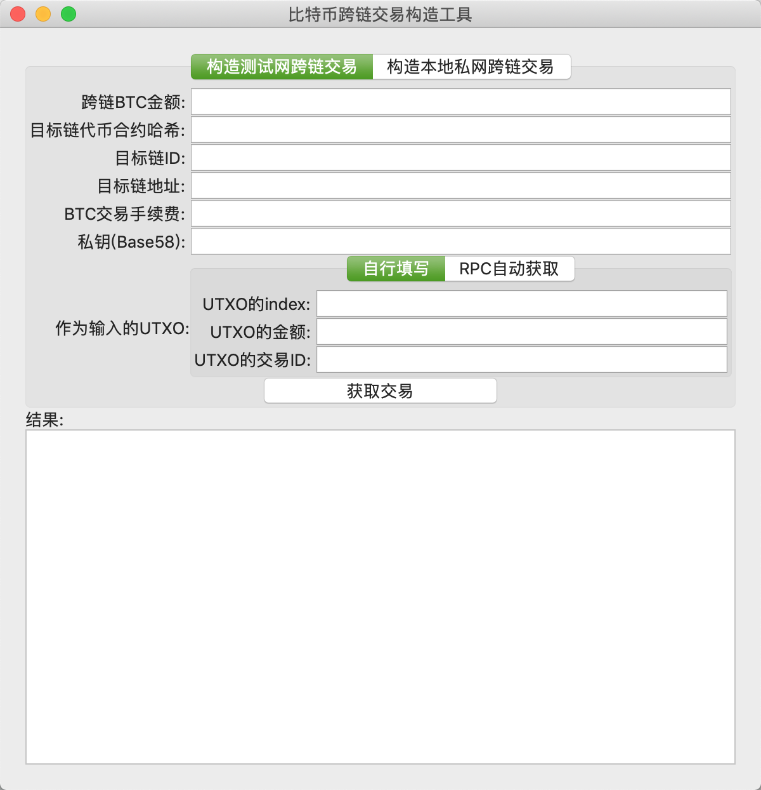</div>

界面最上方包含了几个功能，单击选择即可，功能如下：

| 功能             | 介绍                                                         |
| ---------------- | ------------------------------------------------------------ |
| 测试网           | 测试网指的是对测试网构造BTC跨链交易，填入参数即可，如果拥有测试网全节点，则可以直接让全节点广播，否则需要手动广播交易。 |
| 本地私网         | 针对本地私网（regtest）构造比特币跨链交易，使用方法类似。    |
| 为合约签名       | 供应商使用多签中自己的比特币私钥对合约和Redeem签名，用于注册Redeem和合约。 |
| 注册多签合约     | 向Polygon注册Redeem和目标链合约。                            |
| 加密私钥         | 将自己的明文私钥加密，用于供应商启动自己的签名工具。         |
| 生成私钥         | 生成一个全新的私钥，会显示对应的公钥和地址                   |
| 生成多签赎回脚本 | 输入公钥等参数，生成多签的赎回脚本，并显示多签钱包的地址     |
| UTXO监测         | 帮助多签监测Polygon上的UTXO状态                              |

### 1. 构造BTC跨链交易

首先选择工具。现在支持比特币测试网和本地私网，比特币测试网包含在当前跨链生态测试中，发送交易后，可以在目标链测试网看到余额变化，如果是本地私网，则需要自行搭建联盟链、目标链等环境，可用作开发测试。选择后，参数会有变化，以下以测试网为例。

1. 然后填写对应参数。如下表，测试网对应需要填入的参数，因为本工具没有实现钱包等复杂功能，所以UTXO的信息需要用户自行填入，可以使用测试网[浏览器](https://tbtc.bitaps.com/)查找自己地址的相关交易，找到未使用的输出即可。如果是拥有测试网全节点或者是私网，不需要指定UTXO，但需要配置节点的RPC信息。

   | 参数               | 含义                                                         |
   | :----------------- | :----------------------------------------------------------- |
   | 跨链BTC金额        | 用户想要发送到目标链的BTC金额，如0.01                        |
   | BTC多签地址        | 提供跨链业务的组织提供的地址                                 |
   | 目标链代币合约哈希 | 比特币在目标链的映射合约，一般为OEP4或者ERC20等，如[BTCX](https://github.com/zouxyan/btc_crosschain_demo) |
   | 目标链ID           | 每条链在跨链生态中都有自己的ID，如比特币是0、本体是2         |
   | 目标链地址         | 用户在目标链上用来接收BTC的地址                              |
   | BTC交易手续费      | 构造比特币交易之后，发送交易需要的手续费，如0.00001          |
   | 私钥(WIF)          | WIF形式的比特币私钥，用来对交易签名                          |
   | UTXO的index        | 用户想使用的UTXO是前一笔交易的第几个输出，可以有多个，用逗号","隔开，如“0,2,2” |
   | UTXO的金额         | 用户要使用的UTXO的金额，可以有多个，用逗号","隔开，如“0.01,0.02,0.1” |
   | UTXO的交易ID       | UTXO的来源交易ID，可以有多个，用逗号","隔开                  |
   | 全节点的URL        | 需要填比特币测试网全节点的RPC链接地址                        |
   | RPC用户名          | 比特币全节点RPC用户名                                        |
   | RPC密码            | 比特币全节点RPC密码                                          |

   比如下图，向以太坊测试网转移了0.0001BTC，手续费设置为0.00001BTC，填入以太坊的BTC合约、在以太坊接收BTC的账户地址以及以太坊的ChainID，然后选择UTXO的获取方式，用户可以自行填写，也可以通过比特币全节点的RPC自动获取UTXO和发送交易：

   <div align=center>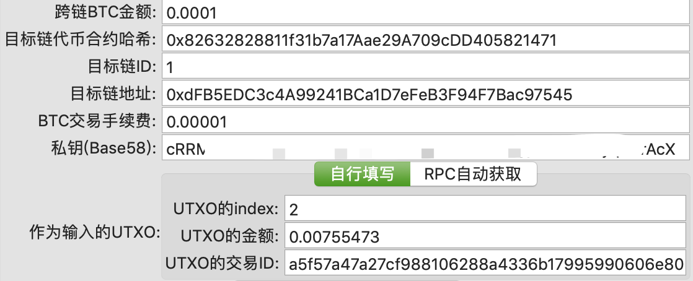</div>

2. 最后点击按钮，获得结果。测试网工具，会显示交易的十六进制字符串，用户只需复制字符串然后广播即可，私网则会通过参数中比特币全节点的RPC接口自动发送交易。比如：

   <div align=center>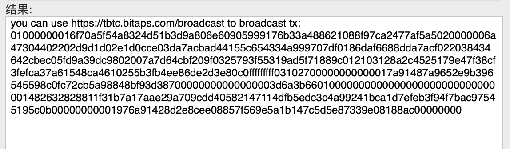</div>

   拷贝上图中十六进制字符串，使用该[工具](https://tbtc.bitaps.com/broadcast)广播交易，获得交易ID“[de4eaa98252b24a1cd658f847c0a05083b6d03b4d5ad188f7cb62a808091ba8a](https://tbtc.bitaps.com/de4eaa98252b24a1cd658f847c0a05083b6d03b4d5ad188f7cb62a808091ba8a)”.

### 2. 为合约签名

对于准备开展跨链业务的供应商来说，他们需要先把自己在目标链上的合约和多签Redeem脚本进行注册，然后才算是加入跨链生态，因为Polygon会验证每笔交易的多签和合约之间的绑定关系。

<div align=center>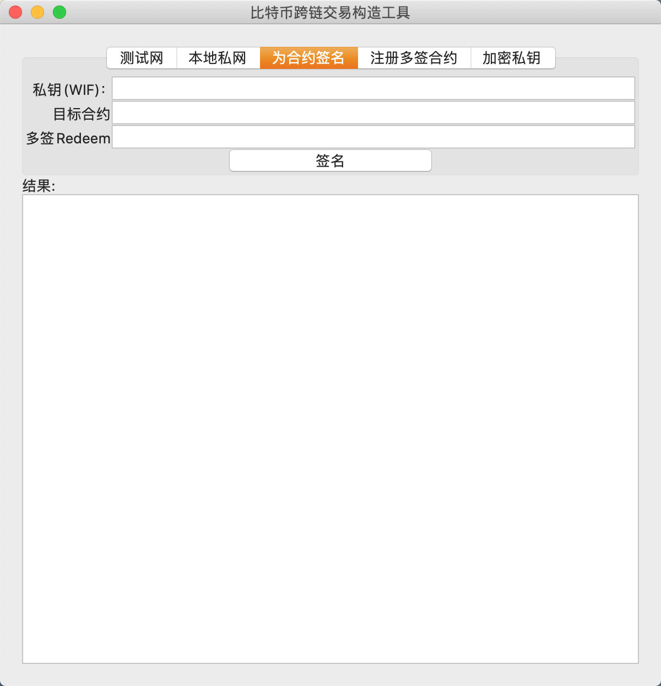</div>

如上填入WIF格式的私钥，需要绑定的目标合约和多签Redeem脚本，点击“签名”即可，结果会在下面显示，供应商需要记下自己的签名，汇总每个人的签名后，再向Polygon注册。

### 3. 注册多签合约

只有在Polygon注册过的多签脚本和合约才能实现跨链。如下，填入参数，点击注册即可，结果栏会显示Polygon的交易哈希。

<div align=center>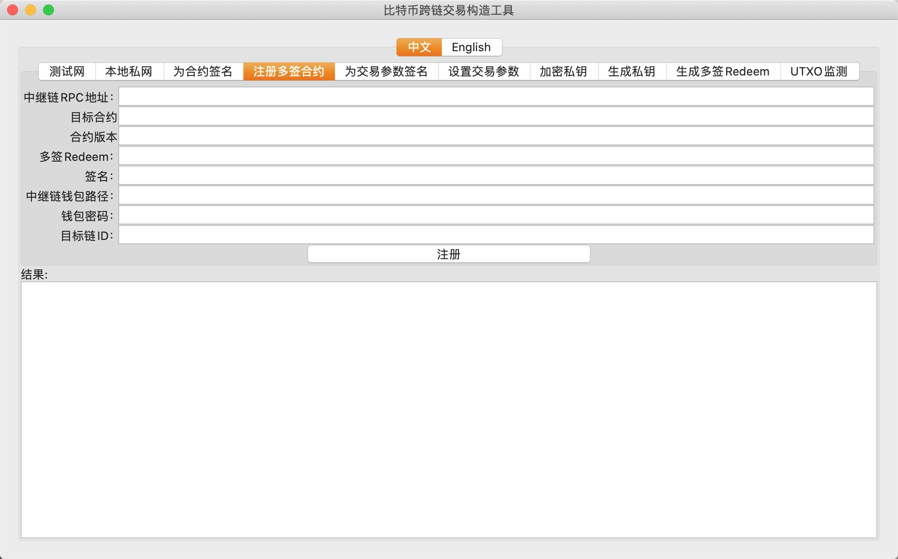</div>

参数的介绍如下：

| 参数            | 介绍                                                         |
| --------------- | ------------------------------------------------------------ |
| PolygonRPC地址  | 获取一个Polygon的RPC地址                                     |
| 目标合约        | 目标链的BTC代币合约地址                                      |
| 多签Redeem      | 跨链要使用的多签脚本                                         |
| 签名            | 多签中每个人的签名，只要满足多签脚本的要求即可，多个签名间以“,”分隔 |
| Polygon钱包路径 | 向Polygon发送交易注册的账户                                  |
| 钱包密码        | Polygon钱包的密码                                            |
| 目标链ID        | 目标链的chain-id                                             |

### 4. 为交易参数签名

在供应商将多重签名工具链接到合约之后，他们可以设置参数，用来创建释放锁定的BTC的交易。 首先需要多签成员协商好参数内容，然后所有成员都使用自己的私钥对它们进行签名。

<div align=center>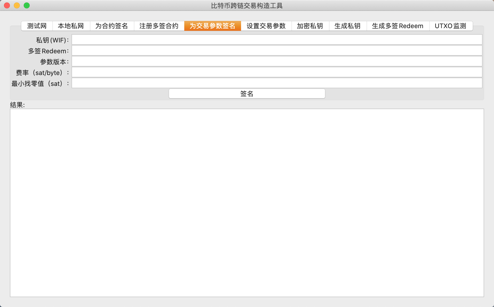</div>

参数介绍如下：

| Parameter        | Description                                              |
| ---------------- | -------------------------------------------------------- |
| 私钥（WIF）      | WIF格式的比特币私钥，某个多签成员的私钥                  |
| 多签Redeem       | Vendor's redeem script                                   |
| Paramter version | 参数可以更新，每次更新版本必须加1，初始为0               |
| 费率（sat/byte） | 构造比特币解锁交易时候，计算手续费的费率                 |
| 最小找零（sat）  | 构造比特币解锁交易，为多签找零的时候，找零值不得小于该值 |

### 5. 设置交易参数

收集好多签成员的签名，只要满足多签要求的签名数目即可，然后使用工具发送交易到Polygon，完成参数注册。

<div align=center>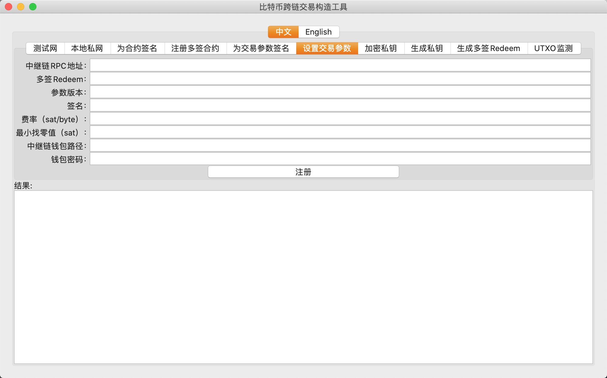</div>

参数介绍如下：

| Parameter               | Description                                                  |
| ----------------------- | ------------------------------------------------------------ |
| Relay chain RPC address | Polygon的RPC地址                                             |
| 多签redeem              | 供应商的多签赎回脚本                                         |
| 参数版本                | 参数可以更新，每次更新版本必须加1，初始为0                   |
| Signature               | Signatures of the collaborators in the multi-signature redeem, multiple values separated using commas |
| 费率(sat/byte)          | 构造比特币解锁交易时候，计算手续费的费率                     |
| 最小找零（sat）         | 构造比特币解锁交易，为多签找零的时候，找零值不得小于该值     |
| Relay chain wallet path | Polygon钱包的文件路径                                        |
| 钱包密码                | Password of the relay chain wallet                           |

### 6. 加密私钥

在启动多签签名工具之前，需要生成加密的比特币私钥文件，这里使用了Polygon的加密方式。如下图，只需要填入对应的参数，即可生成对应的加密钱包文件。

<div align=center>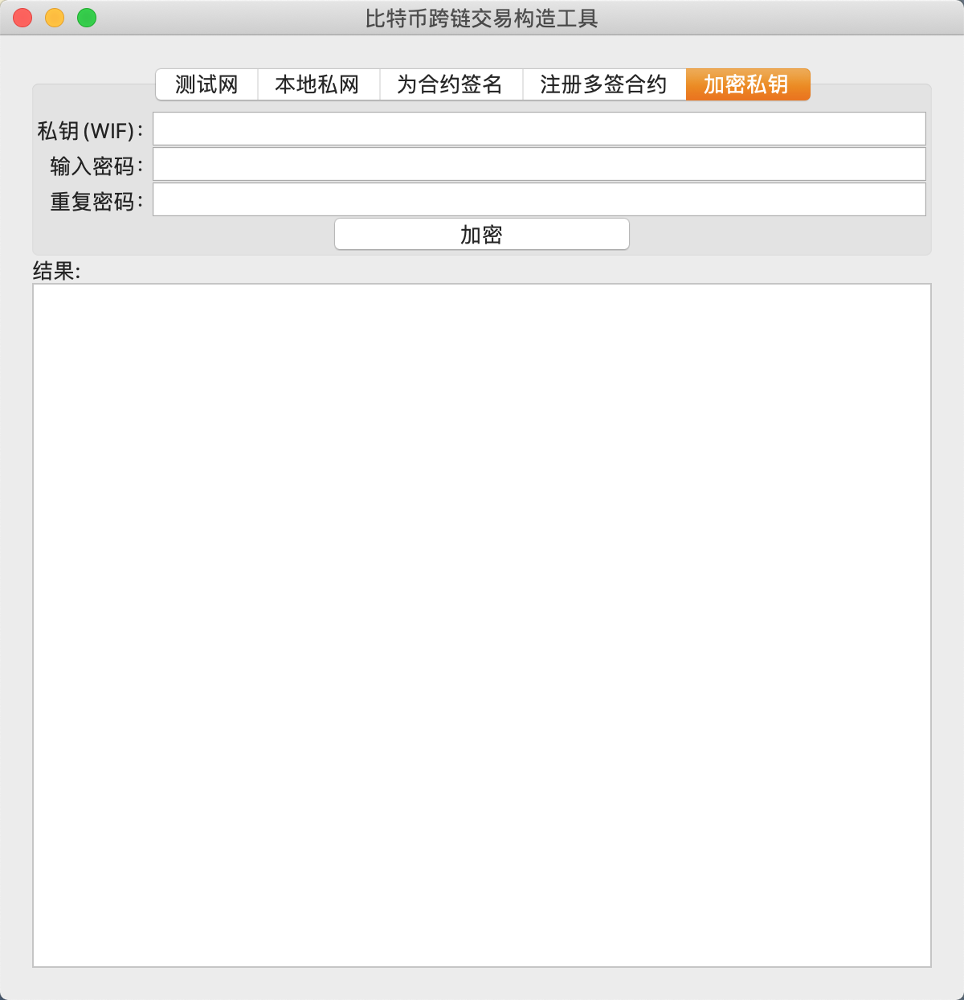</div>

### 7. 生成私钥

通过工具可以生成比特币私钥，并显示公钥以及地址。网络类型可以填test、regtest和main，分别对应测试网、私网和主网。

<div align=center>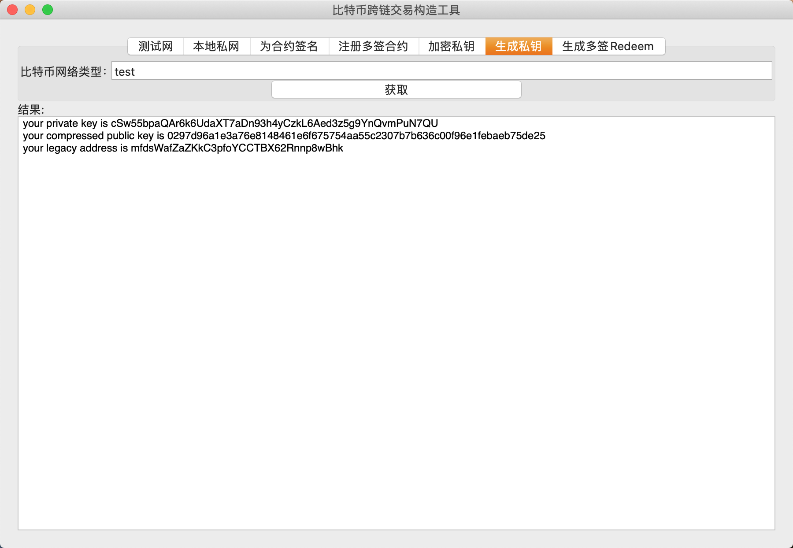</div>

### 8. 生成多签赎回脚本

填入网络类型、参与多签的人的公钥（用“,”隔开）和要求的签名数目，点击获取即可得到Redeem脚本，各种形式的多签地址都是从Redeem脚本生成的。推荐使用P2WSH地址，可以有效降低交易手续费。

<div align=center>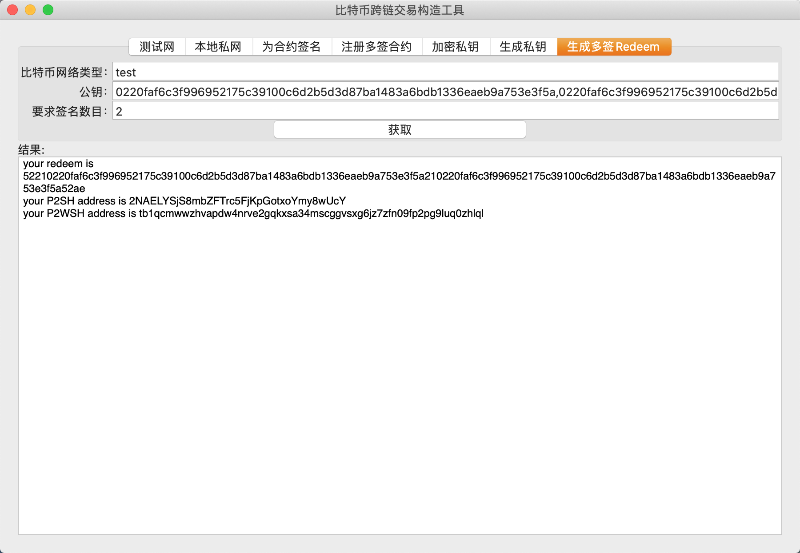</div>

### 9. UTXO监测

UTXO监测功能实现了对Polygon中UTXO的状态监听，方便供应商掌握自己的多签地址状态，操作自己的跨链业务。填写PolygonRPC地址、小额限制和多签赎回脚本，点击启动监听即可。对应的参数会显示在下方，包括UTXO金额总和等，UTXO详细信息会写入对应的文件。

<div align=center>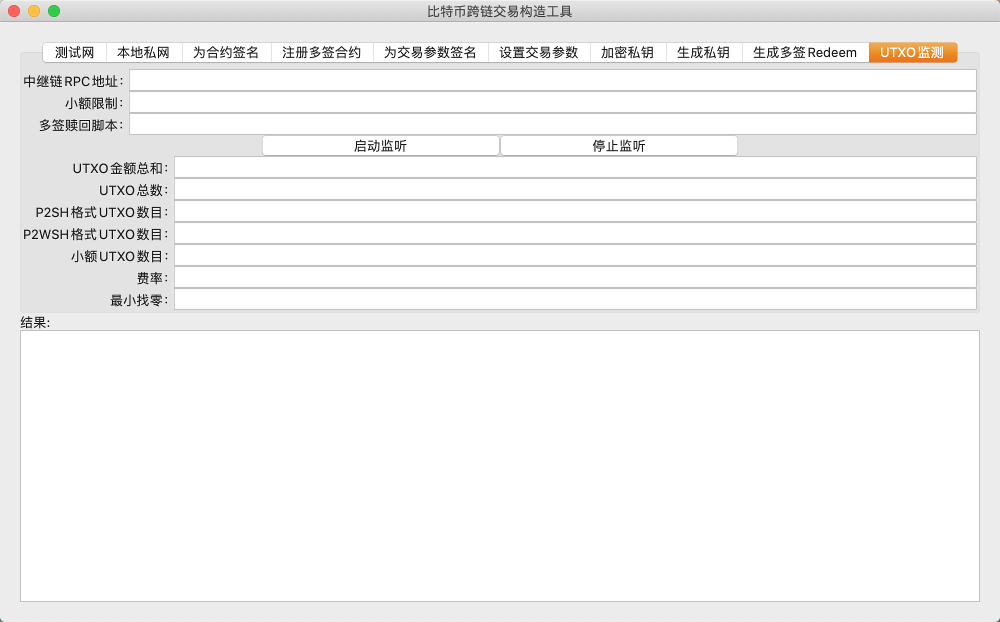</div>

参数介绍如下：

| 参数           | 介绍                                                       |
| -------------- | ---------------------------------------------------------- |
| PolygonRPC地址 | 获取一个Polygon的RPC地址                                   |
| 小额限制       | 设置一个比特币金额（聪），所有小于这个值的UTXO会被统计下来 |
| 多签赎回脚本   | 生成多签地址的多签赎回脚本                                 |

结果参数如下:

| 参数              | 介绍                                                         |
| ----------------- | ------------------------------------------------------------ |
| UTXO金额总和      | 多签锁定的比特币金额，即跨链到其他链的比特币金额             |
| UTXO总数          | 可用的UTXO数目                                               |
| P2SH格式UTXO数目  | 锁定脚本是P2SH格式的UTXO，交易费消耗更高                     |
| P2WSH格式UTXO数目 | 锁定脚本是P2WSH格式的UTXO，隔离见证的交易费低                |
| 小额UTXO数目      | 金额小于小额限制的UTXO数目                                   |
| 费率              | 构造解锁交易的手续费率，即每字节多少聪，比如10sat/byte，那么一笔100字节的交易需要1000聪的手续费，这笔手续费从用户的解锁金额中扣除； |
| 最小找零          | 在构造解锁交易的时候，可能产生对多签地址的找零，最小找零值限制了找零的金额不能小于该值，防止产生过小的UTXO，甚至粉尘UTXO，伤害到跨链解锁的效果； |

## 命令行运行

btctool可以针对比特币测试网和本地仿真网络，如果使用跨链生态提供的测试网，那么btctool选择测试网即可，如果是在本地运行跨链测试网络，则选择仿真网络。

### 1. 测试网络：

```shell
./btctool -tool=cctx -idxes=1 -utxovals=0.01 -txids=c09d7d7a321d025ac0cad75855b1b0313e55660a5a77b9d038bb7f606be6a744 -value=0.008 -fee=0.00001 -targetaddr=AdzZ2VKufdJWeB8t9a8biXoHbbMe2kZeyH -privkb58=cRRMYvoHPN*************************MVwyqZVrAcX -contract=b6bf9abf29ee6b8c9828a48b499ad667da1ad003 -multiaddr=tb1qy94qnjuwu5w6r2g74z2z25khjdkgs6ssk5rjnyqrvcvpds8f7x9shrfspn
```

测试网络

|    FLAGS    |                            USAGE                             |
| :---------: | :----------------------------------------------------------: |
|    -gui     |             是否以GUI的形式运行，1运行，0不运行              |
|    -tool    |   选择对应的工具，cctx是测试网工具，regauto是仿真网络工具    |
|   -idxes    | UTXO在交易中的位置，即第几个输出，例如0、1等，可多个，用","隔开 |
|  -utxovals  |              每个UTXO的金额，可多个，用","隔开               |
|  -privkb58  | 签名用的base58形式私钥，如果不设置，会返回未签名的交易，用户可以自行签名 |
|   -value    | 跨链交易金额，即锁定到联盟链多签地址的金额，将value个BTC转移到目标链，默认1万聪 |
|    -fee     |               该比特币交易的手续费，默认1000聪               |
| -targetaddr |                       用户的目标链地址                       |
|  -contract  |                    目标链代币智能合约地址                    |
|  -tochain   |            目标链ID，联盟链用来确定BTC跨链目的地             |
| -multiaddr  |               提供跨链业务的组织提供的多签地址               |

运行实例：

```shell
./btctool -gui=0 -tool=cctx -idxes=1 -utxovals=0.01 -txids=c09d7d7a321d025ac0cad75855b1b0313e55660a5a77b9d038bb7f606be6a744 -value=0.008 -fee=0.00001  -targetaddr=AdzZ2VKufdJWeB8t9a8biXoHbbMe2kZeyH -privkb58=cRRMYvoHPN*************************MVwyqZVrAcX -contract=56faac6081cd320fab3347c62faea86344a8aece -multiaddr=tb1qy94qnjuwu5w6r2g74z2z25khjdkgs6ssk5rjnyqrvcvpds8f7x9shrfspn
2019/11/04 14:34:10.220569 [INFO ] GID 1, Signed cross chain transaction with your private key
2019/11/04 14:34:10.220716 [INFO ] GID 1, ------------------------Your signed cross chain transaction------------------------
010000000144a7e66b607fbb38d0b9775a0a66553e31b0b15558d7cac05a021d327a7d9dc0010000006a473044022061723a7ba8d6c07cd2cf53ea6211ead6eea300cb4ea6bfb8e7ea6160f0424700022016e264422798e1efe5d2a5d54e21aee9aae42d9d41d6976d2760363d7c846779012103128a2c4525179e47f38cf3fefca37a61548ca4610255b3fb4ee86de2d3e80c0fffffffff0300350c000000000017a91487a9652e9b396545598c0fc72cb5a98848bf93d38700000000000000003d6a3b660200000000000000000000000000000014ceaea84463a8ae2fc64733ab0f32cd8160acfa5614f3b8a17f1f957f60c88f105e32ebff3f022e56a458090300000000001976a91428d2e8cee08857f569e5a1b147c5d5e87339e08188ac00000000

2019/11/04 14:34:10.220742 [INFO ] GID 1, you need to broadcast tx by yourself
```

如上，结果中的十六进制字符串即为签名后的交易，用户可通过其他工具自行广播，例如全节点rpc命令sendrawtransaction或者一些[网站](https://tbtc.bitaps.com/broadcast)。

### 2. 仿真网络：

```shell
./btctool  -gui=0 -tool=regauto -fee=0.001 -privkb58=cRRMYvoHPN*************************MVwyqZVrAcX -pwd=test -user=test -targetaddr=AdzZ2VKufdJWeB8t9a8biXoHbbMe2kZeyH -url=http://172.168.3.77:18443 -value=0.01 -contract=b6bf9abf29ee6b8c9828a48b499ad667da1ad003 -tochain=2 -multiaddr=tb1qy94qnjuwu5w6r2g74z2z25khjdkgs6ssk5rjnyqrvcvpds8f7x9shrfspn
```

仿真网络

|    FLAGS    |                            USAGE                             |
| :---------: | :----------------------------------------------------------: |
|    -gui     |             是否以GUI的形式运行，1运行，0不运行              |
|    -tool    |   选择对应的工具，cctx是测试网工具，regauto是仿真网络工具    |
|  -privkb58  | 签名用的base58形式私钥，如果不设置，会返回未签名的交易，用户可以自行签名 |
|    -pwd     |                     比特币客户端rpc密码                      |
|    -user    |                    比特币客户端rpc用户名                     |
| -targetaddr |                       用户的目标链地址                       |
|    -url     |                     比特币客户端rpc地址                      |
|   -value    | 跨链交易金额，即锁定到联盟链多签地址的金额，将value个BTC转移到目标链，默认1万聪 |
|  -contract  |                    目标链代币智能合约地址                    |
|  -tochain   |            目标链ID，联盟链用来确定BTC跨链目的地             |
| -multiaddr  |               提供跨链业务的组织提供的多签地址               |

### 3. 为参数签名

```
./btctool -gui=0 -tool=sign_tx_param -fee_rate=30 -min_change=10000 -param_ver=0 -redeem=552102dec9a415b6384ec0a9331d0cdf02020f0f1e5731c327b86e2b5a92455a289748210365b1066bcfa21987c3e207b92e309b95ca6bee5f1133cf04d6ed4ed265eafdbc21031104e387cd1a103c27fdc8a52d5c68dec25ddfb2f574fbdca405edfd8c5187de21031fdb4b44a9f20883aff505009ebc18702774c105cb04b1eecebcb294d404b1cb210387cda955196cc2b2fc0adbbbac1776f8de77b563c6d2a06a77d96457dc3d0d1f2102dd7767b6a7cc83693343ba721e0f5f4c7b4b8d85eeb7aec20d227625ec0f59d321034ad129efdab75061e8d4def08f5911495af2dae6d3e9a4b6e7aeb5186fa432fc57ae -privkb58=cRRMYvoHPN*************************MVwyqZVrAcX
```

### 4. 设置交易参数

```
./btctool -gui=0 -tool=set_tx_param -poly-rpc=http://ip:40336 -redeem=552102dec9a415b6384ec0a9331d0cdf02020f0f1e5731c327b86e2b5a92455a289748210365b1066bcfa21987c3e207b92e309b95ca6bee5f1133cf04d6ed4ed265eafdbc21031104e387cd1a103c27fdc8a52d5c68dec25ddfb2f574fbdca405edfd8c5187de21031fdb4b44a9f20883aff505009ebc18702774c105cb04b1eecebcb294d404b1cb210387cda955196cc2b2fc0adbbbac1776f8de77b563c6d2a06a77d96457dc3d0d1f2102dd7767b6a7cc83693343ba721e0f5f4c7b4b8d85eeb7aec20d227625ec0f59d321034ad129efdab75061e8d4def08f5911495af2dae6d3e9a4b6e7aeb5186fa432fc57ae -wallet=./wallet.dat -wallet-pwd=pwd -fee_rate=30 -min_change=10000 -param_ver=0
```

### 5. 为合约签名

```
./btctool -tool=sign_redeem_contract -contract=0x9702640a6b971CA18EFC20AD73CA4e8bA390C910 -redeem=552102dec9a415b6384ec0a9331d0cdf02020f0f1e5731c327b86e2b5a92455a289748210365b1066bcfa21987c3e207b92e309b95ca6bee5f1133cf04d6ed4ed265eafdbc21031104e387cd1a103c27fdc8a52d5c68dec25ddfb2f574fbdca405edfd8c5187de21031fdb4b44a9f20883aff505009ebc18702774c105cb04b1eecebcb294d404b1cb210387cda955196cc2b2fc0adbbbac1776f8de77b563c6d2a06a77d96457dc3d0d1f2102dd7767b6a7cc83693343ba721e0f5f4c7b4b8d85eeb7aec20d227625ec0f59d321034ad129efdab75061e8d4def08f5911495af2dae6d3e9a4b6e7aeb5186fa432fc57ae -privkb58=cRRMYvoHPN*************************MVwyqZVrAcX -gui=0
```

参数与GUI处类似。运行后，会显示对应的签名。

### 6. 注册多签合约

```
./btctool -tool=register_redeem  -poly-rpc=http://Polygon:40336  -redeem=552102dec9a415b6384ec0a9331d0cdf02020f0f1e5731c327b86e2b5a92455a289748210365b1066bcfa21987c3e207b92e309b95ca6bee5f1133cf04d6ed4ed265eafdbc21031104e387cd1a103c27fdc8a52d5c68dec25ddfb2f574fbdca405edfd8c5187de21031fdb4b44a9f20883aff505009ebc18702774c105cb04b1eecebcb294d404b1cb210387cda955196cc2b2fc0adbbbac1776f8de77b563c6d2a06a77d96457dc3d0d1f2102dd7767b6a7cc83693343ba721e0f5f4c7b4b8d85eeb7aec20d227625ec0f59d321034ad129efdab75061e8d4def08f5911495af2dae6d3e9a4b6e7aeb5186fa432fc57ae  -sigs=304402207cf1b8bf2d7234c77a84250a79d07a87b9fb09378096d34a5459b79afa414c57022015308108b6ec07df3b286c0fe20fe10b23e77377959d7160c339508ec1759da8,3045022100d6731dd8a0ee9e32423a25ed4638882d9ffcb259cdb03a3f75b8f1e3cd23540c02204d2511f9b748d5e356a9dfe20cfdda49a2de631637cc980ac7416cc7b6954466,3045022100a1e43664faafe50e429ad5c246266122dbc7df835f3758603c390a75019bb581022023d34b4c8bed500ea67ef5e9cbe259d7406487cc06a7da8d0661e9e58a0bbd52,3045022100e9716af38afd49fae2951c87ceec8add41d2915befee4962f3babb4e9b88897302207b870953ca1bde8edf1417ec7cb3e07d9c7862583aae92c9b8c408b746e14987,304402201bf226994026d060ddae579108bd5b1b06aeba4a313be6875b7ccf5482618ba602200ee71faa98c49f6d5120b6e8dc73663838be546cf47ca9c7a7c6bf2e672c8cfa  -wallet=./wallet.dat  -wallet-pwd=pwd  -contractId=2  -gui=0
```

poly-rpc指的是Polygon的RPC地址；wallet是Polygon的钱包。其他参数和GUI相同。

### 7. 加密私钥

```
./btctool -tool=encrypt_privk -privkb58=cRRMYvoHPN*************************MVwyqZVrAcX -btcpwd=pwd -gui=0
```

填入私钥和用来加密私钥的密码即可。

### 8. 生成私钥

```
./btctool -gui=0 -tool=getprivk -net=test 
```

指定工具和网络类型即可。

### 9. 生成多签赎回脚本

```
./btctool -gui=0 -tool=getredeem -net=test -require=2 -pubks=037927b594d277b6b178c1c958112bcfcb1d06747dc0d8662253334e6b91735054,037927b594d277b6b178c1c958112bcfcb1d06747dc0d8662253334e6b91735054
2020/02/24 19:17:21.387310 [INFO ] GID 1, your redeem is 5221037927b594d277b6b178c1c958112bcfcb1d06747dc0d8662253334e6b9173505421037927b594d277b6b178c1c958112bcfcb1d06747dc0d8662253334e6b9173505452ae
your P2SH address is 2NDMFTruE6Y5rKkFNzG7ERQnEVGfvJwFx1m
your P2WSH address is tb1q3frdrpmh7tlejtc8a0s9pg2tnvp2qm09gnapx2k5rs5m6j2cy8rsa2kwv4
```

收集多签参与者的公钥，填写对应参数，pubks指定公钥，用","分隔，require指定多签脚本要求的最少签名数目。工具会返回redeem的Hex形式，以及对应的多签P2SH和P2WSH地址。