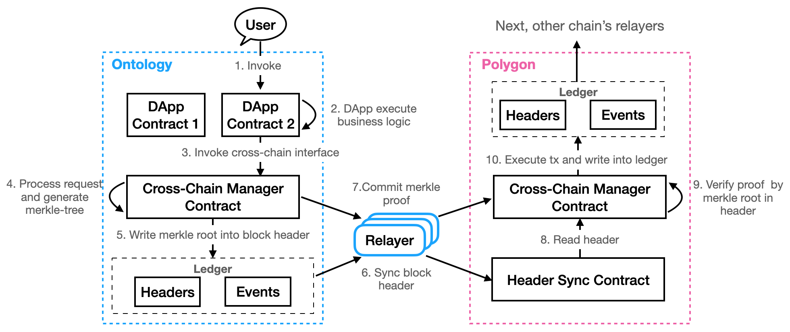

<h1 align="center">Ontology Cross Chain - Ethereum Cross Chain Specifications</h1>
<h4 align="center">Version 1.0 </h4>

English | [中文](ethereum_cross_chain_specification_CN.md)

The cross chain ecosystem operates using a **relay chain** that helps carry out cross chain transactions between Ethereum and other networks. This document particularly focuses on the technical specifications for the interaction between Ethereum and the relay chain, both from Ethereum to the relay chain and vice versa.

## Background

### Light Client and the Merkle Proof

How do we confirm that a certain event or transaction has taken place on the Ethereum chain? Merkle proofs are a solution. When events and transactions are recorded on the Ethereum blockchain, a corresponding merkle proof. By the virtue of having a merkle proof and the correct block header we can prove that a particular transaction or event did occur on the Ethereum chain with certainty.

The relay chain works on the same principle. Using the merkle proof and the correct block header it can be established wheter or not a transaction has occurred on the relay chain.

## The Principle

If the correct block header exists on the relay chain, it can directly use the merkle proof of a particular event or transaction to confirm whether it occurred by sending it to the Ethereum chain. This completes the Ethereum to relay chain transfer. It chiefly involves two steps, i.e. fetching and synchronizing the Ethereum transactions on the relay chain, and the relayer then sending the corresponding merkle proof to the relay chain.

The same process is involved when sending relay chain transactions to Ethereum. Once the correct block headers are recorded on the Etherum chain, Ethereum can confirm whether a transaction or event occur on the relay chain by submitting the merkle proof. And so this process of transferring transactions from the relay chain to Ethereum also involves two steps, i.e. synchronize the relay chain transaction block headers on Ethereum, and then send the respective proofs as well.

Now the component of the cross chain ecosystem that actually carries out this process of synchronizing block headers and merkle proofs is the **relayer**. The relayer monitors the transactions taking place on Ethereum and synchronizes the block headers on the relay chain along with the respective cross chain transactions and events. It also needs to monitor the relay chain and send the block headers and the respective cross chain transactions to Ethereum.

### Synchronizing Ethereum Block Headers on the Relay Chain

To synchronize block headers from Ethereum to the relay chain you first need to specify an initial block header from where the synchronization starts. The initial block header and the consequent block headers will be synchronized on the relay chain.

Ethereum block headers synchronized on relay chain:

Block headers are synchronized one by one to the relay chain. The relay chain relies on the same verification principle that the Ethereum light client uses to ensure the legitimacy of the block headers, including the mining difficulty of the Ethereum chain.

The relay chain system can identify and withstand forks. The synchronization process carries on with the Ethereum main chain.

### Synchronizing Relay Chain Block Headers on Ethereum

Synchronizing relay chain block headers Ethereum also occurs in a similar manner. An initial block header is selected from where the synchronization process begins, and all the subsequent blocks are synchronized, including the initial block header.

Relay chain headers synchronized on Ethereum :

However, in this case not all the blocks headers need to be synced on the Ethereum chain. The only blocks that need to be synced on the Ethereum chain are the cross chain block headers to Ethereum and the block headers wherein any changes occured in the verification nodes of the relay chain. The relay chain, just as a typical blockchain, also has finalty characteristics.

### Transactions from Ethereum to the Relay Chain

In a scenario where let's say an Ethereum to BTC transaction needs to be carried out, first the transaction is created by the user and send to the Ethereum chain. This cross chain transaction triggers the `lock` of the **ETH to BTC** service contract, and simultaneously an event needs to be created and recorded on Ethereum along with its merkle proof which will be generated on the Ethereum chain. Once the block header corresponding to the transaction and its respective merkle proof are synchronized on the relay chain, it can verify the existence of an event on Ethereum. 

A relayer is necessary in this condition that listens for cross chain transactions on ETH and transmits them to the relay chain along with the corresponding merkle proof.

Ethereum to relay chain cross chain transaction:

### Transactions from the Relay Chain to Ethereum  

Sending a transaction from the relay chain to Ethereum is much like the opposite and involves sending the block headers and merkle proof.

- The relayer sends the relay chain block headers to Ethereum's block header synchronization contract. This contract records and maintains the relay chain's block headers;
- The relayer listens to the management contract on the relay chain, fetches the Ethereum cross chain events, and sends the events along with the respective merkle proofs to Ethereum. Finally, the management contract invokes a proxy contract that releases the user's locked ETH. For instance, in a transaction from BTC to ETH, the process of sending the cross chain events and merkle proofs is carried out by the `verifyAndExecuteTx` method of the management contract.

## Ethereum Cross Chain Transaction 

The process flow of cross chain transactions from Ethereum to other chains:

1. The user sends a transaction that, for instance, transfers 1 ETH from account A on Ethereum to account B on the target chain

2. Ethereum locks the 1 ETH transferred from account A, generates the transaction that is sent to the target chain and its merkle proof

3. The ETH relayer constantly synchronizes Ethereum block headers on the relay chain, and monitors the Ethereum chain for cross chain transactions. Relayer transmits the cross chain transaction and the merkle proof generated by Ethereum to the relay chain

4. The Ethereum block headers and the respective merkle proof on the relay chain allow it to verify the legitimacy and validity of a cross chain transaction

5. If the transaction is valid, the relay chain generates a transaction to be sent to the target chain, along with the transaction's merkle proof

6. The target chain relayer monitors the transactions on the relay chain and looks out for the transactions that need to be transferred to the target chain. It syncs the block header to the target chain and sends the transaction and the corresponding merkle proof along with it.

7. When the target chain confirms the transaction's legitimacy, the target chain executes a final transaction that sends the 1 ETH to account B.

## License

The Ontology library is licensed under the GNU Lesser General Public License v3.0. Please refer to the LICENSE file in the root directory of the project for details.
