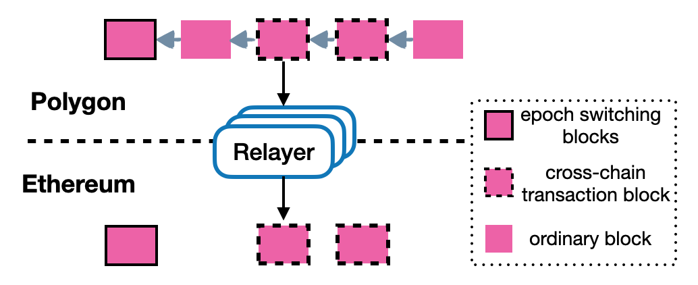

<h1 align="center">Ontology Cross Chain - Ethereum Cross Chain Specifications</h1>
<h4 align="center">Version 1.0 </h4>

English | [中文](ethereum_cross_chain_specification_CN.md)

The cross chain ecosystem operates using a **relay chain** that helps carry out cross chain transactions between Ethereum and other networks. This document particularly focuses on the technical specifications for the interaction between Ethereum and the relay chain, both from Ethereum to the relay chain and vice versa.

## Background

### Light Client and the Merkle Proof

How do we confirm that a certain event or transaction has taken place on the Ethereum chain? Merkle proofs are a solution. When events and transactions are recorded on the Ethereum blockchain, a corresponding merkle proof. By the virtue of having a merkle proof and the correct block header we can prove that a particular transaction or event did occur on the Ethereum chain with certainty.

The relay chain works on the same principle. Using the merkle proof and the correct block header it can be established wheter or not a transaction has occurred on the relay chain.

## The Principle

If the correct block header exists on the relay chain, it can directly use the merkle proof of a particular event or transaction to confirm whether it occurred by sending it to the Ethereum chain. This completes the Ethereum to relay chain transfer. It chiefly involves two steps, i.e. fetching and synchronizing the Ethereum transactions on the relay chain, and the relayer then sending the corresponding merkle proof to the relay chain.

The same process is involved when sending relay chain transactions to Ethereum. Once the correct block headers are recorded on the Etherum chain, Ethereum can confirm whether a transaction or event occur on the relay chain by submitting the merkle proof. And so this process of transferring transactions from the relay chain to Ethereum also involves two steps, i.e. synchronize the relay chain transaction block headers on Ethereum, and then send the respective proofs as well.

Now the component of the cross chain ecosystem that actually carries out this process of synchronizing block headers and merkle proofs is the **relayer**. The relayer monitors the transactions taking place on Ethereum and synchronizes the block headers on the relay chain along with the respective cross chain transactions and events. It also needs to monitor the relay chain and send the block headers and the respective cross chain transactions to Ethereum.

### 以太区块头同步到中继链

以太区块头同步到中继链需要首先指定一个以太同步初始区块头，从这个区块头开始同步后续的以太区块头。所以包括同步初始区块头和同步区块头。

以太同步区块头到中继链：

以太同步区块头到中继链需要一个一个区块头进行，中继链使用了以太的轻客户端原理来验证以太区块头的正确性，包括以太区块头的挖矿难度。

分叉是允许的，只要回到以太主链上的区块头一个一个同步就可以，中继链可以处理以太的分叉。

### 中继链区块头同步到以太链

中继链区块头同步到以太也一样需要首先指定一个中继链初始区块头，从这个区块头开始同步中继链区块头，也包括同步初始区块头和同步区块头。

中继链区块头同步到以太链：

中继链区块头同步到以太有些不一样，并不需要一个一个区块头同步，只有需要区块头才被同步。什么是需要的区块头呢？有发生验证节点变更的区块头和包含跨链到以太交易的区块头，需要同步到以太。因为中继链是具备终局性的区块链。

### 从以太跨链到中继链

从以太跨链到中继链，需要在以太上发起一笔交易，在以太到BTC的跨链中，调用以太跨链BTC的业务合约的lock，同时需要生成事件并且写入到以太的存储中来生成该事件的Merkle proof。有了上面同步到中继链的以太区块头，那么中继链可以验证以太的这个事件。 当然需要relayer监听以太的跨链事件并提交跨链事件的Merkle proof到中继链。

以太跨链到中继链：

### 从中继链跨链到以太

反向与正向类似，依然可以分为区块头和merkle proof提交两部分：

- Relayer会把中继链的区块头提交到以太上的区块头同步合约，该合约维护了联盟链的区块头；
- Relayer监听中继链跨链管理合约，捕捉以太的跨链事件，提交跨链以太事件以及中继链的Merkle proof到以太，然后跨链管理合约会用中继链的区块头验证merkle proof，最后管理合约调用代理合约将ETH解锁给用户 。在BTC到以太的跨链中，提交跨链以太事件以及其Merkle proof到以太的跨链管理合约verifyAndExecuteTx的来完成。

## 以太跨链工作流程

以以太到BTC的跨链为例来介绍以太跨链工作流程：

1. 用户发送跨链交易到以太，如以太账户A转账1个eth给Target Chain的账户B

2. 以太链会锁定账户A的1个eth，生成跨链到Target Chain的跨链交易，会生成该跨链交易的Merkle proof

3. eth relayer会一直同步以太区块头到中继链，同时一直在监听ethereum chain的跨链事件，在以太生成了跨链交易后，relayer会提交该跨链交易以及其Merkle proof到中继链

4. 中继链有以太的区块头信息和以太跨链交易的Merkle proof，可以验证该跨链交易的有效性

5. 如果有效，那么中继链会生成跨链到Target Chain的跨链交易，也会生成该跨链交易的Merkle proof

6. Target Chain的relayer一直监听中继链上需要跨链到Target Chain的跨链交易，一但有，则同步中继链的区块头到Target Chain,同时提交跨链到Target Chain的跨链交易以及其Merkle proof到Target Chain

7. Target Chain验证跨链交易，如果有效，则执行交易，如释放1eth到账户B

## 许可证

Ontology遵守GNU Lesser General Public License, 版本3.0。 详细信息请查看项目根目录下的LICENSE文件。
