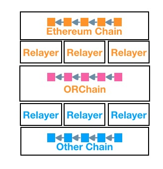
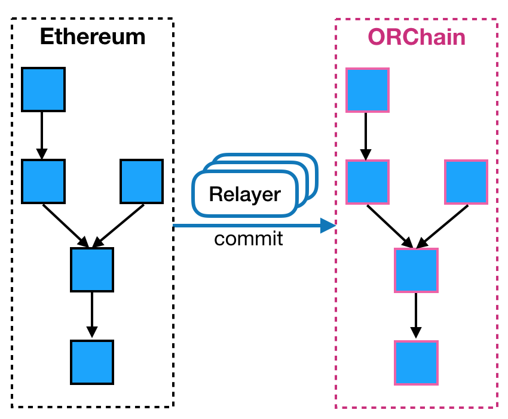
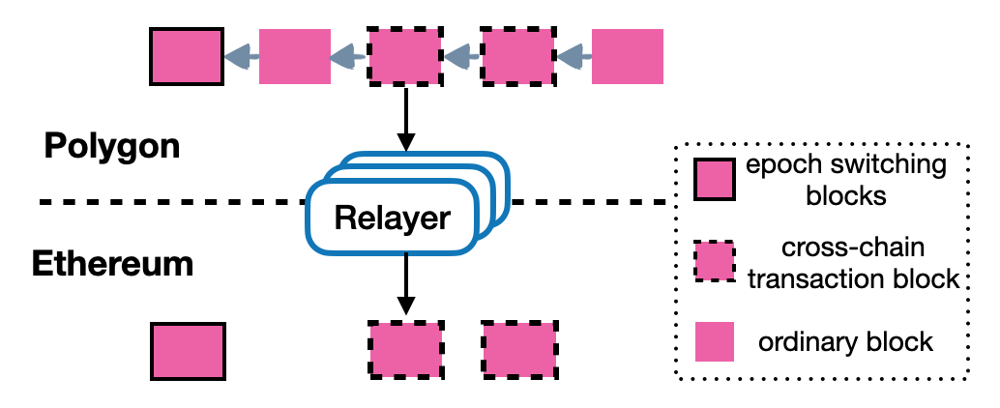
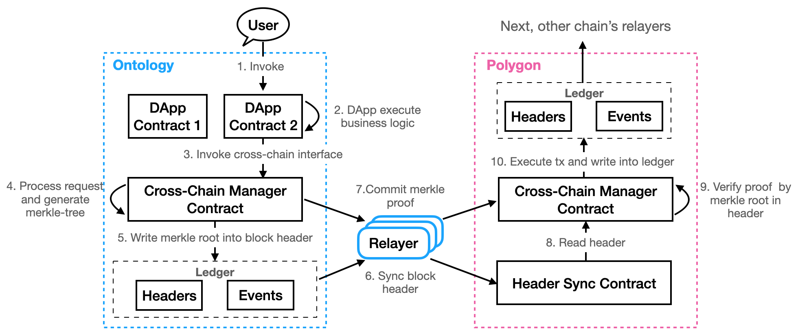

<h1 align="center">以太坊跨链生态</h1>
<h4 align="center">Version 1.0 </h4>

[English](README.md) | 中文

## 引言
以太坊是首个将智能合约应用到区块链系统中的公有链，在以太坊发布智能合约后，区块链系统的可扩展性得到了极大的提升，许多的项目方开始借助智能合约发布他们自己的链上应用，区块链系统的可落地性也随之得到了极大的提升。
但随着区块链应用的发展，链与链之间的交互成为了一个亟需解决的问题，一方面，不同的区块链生态之间由于数据和价值无法自由的流通，形成了数据和价值孤岛；另一方面，单条链由于自身架构、性能、功能等影响，无法将所有的优势集中在单条链上，用户体验存在一定的瓶颈；
因此，使用跨链技术将以太坊链和其他链打通成为了一件有意义和必要的事情。

由于以太坊是支持图灵完备的智能合约体系，因此，当前的以太坊系统可支持任意智能合约编写，若将以太坊与其他区块链系统打通，需要考虑是任意信息跨链的场景。
那么，如何实现以太坊与其他链的跨链呢？接下来我们就一起了解一下吧！

## 架构

如上图所示的以太坊跨链生态架构，从上到下依次为以太坊链、以太坊Relayer、中继链、目标链Relayer、目标链。简单来说，用户通过调用以太坊上的跨链dApp产生执行结果经过以太坊Relayer传递到中继链，再由目标链Relayer将跨链信息传递到目标链，目标链执行跨链信息即可完成整个跨链交互流程。

生态中的角色：
- [**中继链**](https://github.com/ontio/cross-chain/blob/master/polygon/How_to_join_cross_chain_cn.md)：中继链是整个生态中的重要部分，每个节点由不同的个人或组织运行，有自己独特的治理模式和信任机制，它负责将各个链连接到一起，实现了跨链信息统一、跨链接口标准化、跨链信息合法性验证等功能；
- [**Relayer**](https://github.com/ontio/cross-chain/blob/master/eth/ethereum_relayer_manual_CN.md)：每条链都有自己的Relayer，它们负责搬运中继链和以太坊链之间的跨链信息，是中继链和以太坊链之间的通信兵，它们会在这个过程中获取收益；
- [**以太坊链**](https://github.com/ontio/cross-chain/blob/master/eth/ethereum_relayer_manual_CN.md)：以太坊链是以太坊跨链生态的源头链，任意dApp开发都可以通过部署跨链智能合约实现以太链到其他链的任意信息跨链功能。

## 背景
### MPT证明和轻客户端
- **MPT证明**，Merkle Patricia Tree是经过改良的、融合了Merkle Tree和前缀树两种树优势的一种更节省存储空间的数据结构，在以太坊上主要用来组织管理账户数据、交易数据等重要数据；而MPT证明是基于MPT树生成的用于证明智能合约中存储状态的一种数据结构，用户可基于MPT证明得出任意某一区块高度的状态是否合法；
- **轻客户端**，轻客户端是仅仅包含少点但关键的区块信息，也就是区块头信息而形成的一种安全、可靠、轻量的区块存储方式。

## 原理

跨链的核心问题之一是解决跨链信息的有效性问题，那么其他链如何知道以太坊上确实发生了某一事件呢？如果我们在中继链有了正确的以太区块头，对于以太坊上发生的事件或者消息，通过提交其MPT证明，中继链就可以知道该事件确实在以太链上发生。所以，中继链证明以太坊跨链信息的有效性应该包括两个主要部分，同步以太区块头到中继链和提交以太坊跨链的MPT证明到中继链。

关于谁同步区块头和谁提交跨链交易，这里需要一个relayer，它监听以太链并同步其区块头到中继链，监听以太链上发生的跨链事件，并提交到中继链。它还需要监听中继链并同步需要的区块头到以太坊链，同时，它也监听中继链上跨链到以太坊链的事件并提交到以太坊链上。

### 以太坊链区块头同步到中继链

以太坊链区块头同步到中继链需要首先指定一个以太坊链同步初始区块头，从这个区块头开始同步后续的以太坊链上的区块头。所以区块头同步逻辑包括同步初始区块头和同步区块头。

以太同步区块头到中继链：

以太同步区块头到中继链需要一个一个区块头进行，中继链使用了以太的轻客户端原理来验证以太区块头的正确性，包括以太区块头的挖矿难度。

分叉是允许的，只要回到以太主链上的区块头一个一个同步就可以，中继链可以处理以太坊链的分叉。

### 中继链区块头同步到以太坊链

中继链区块头同步到以太坊链也一样需要首先指定一个中继链初始区块头，从这个区块头开始同步中继链区块头，也包括同步初始区块头和同步区块头。

中继链区块头同步到以太链：

中继链区块头同步到以太有些不一样，并不需要一个一个区块头同步，只有需要区块头才被同步。什么是需要的区块头呢？有发生验证节点变更的区块头和包含跨链到以太交易的区块头，需要同步到以太。因为中继链是具备终局性的区块链。

### 从以太跨链到中继链

从以太跨链到中继链，需要在以太上发起一笔交易，在以太到BTC的跨链中，调用以太跨链BTC的业务合约的lock，同时需要生成事件并且写入到以太的存储中来生成该事件的Merkle proof。有了上面同步到中继链的以太区块头，那么中继链可以验证以太的这个事件。 当然需要relayer监听以太的跨链事件并提交跨链事件的Merkle proof到中继链。

以太跨链到中继链：

### 从中继链跨链到以太坊链

反向与正向类似，依然可以分为区块头和merkle proof提交两部分：

- Relayer会把中继链的区块头提交到以太坊链上的区块头同步合约，该合约维护了中继链的区块头；
- Relayer监听中继链跨链管理合约，捕捉以太坊链的跨链事件，提交跨链事件以及中继链的Merkle proof到以太坊链，然后跨链管理合约会用中继链的区块头验证Merkle proof，最后管理合约调用代理合约将ETH解锁给用户 。在BTC到以太坊链的跨链中，提交跨链以太事件以及其Merkle proof到以太坊链的跨链管理合约verifyAndExecuteTx的来完成。

## 以太跨链工作流程

以太坊链跨链到目标链的工作流程：

1. 用户发送跨链交易到以太坊链，如以太坊链上的账户A转账1个eth给Target Chain的账户B；

2. 以太坊链会锁定账户A的1个eth，并生成跨链到Target Chain的跨链消息和MPT Proof；

3. eth Relayer会一直同步以太区块头到中继链，同时一直在监听ethereum chain的跨链事件，在以太坊链生成了跨链消息后，Relayer会将该跨链消息构造成发送到中继链的跨链交易并且其中包含了证明该消息有效的MPT Proof发送到中继链；

4. 中继链有以太的区块头信息和以太跨链交易的MPT Proof，可以验证该跨链交易的有效性；

5. 如果验证有效，那么中继链会生成证明该跨链交易有效的Merkle Proof；

6. Target Chain的Relayer一直监听中继链上的跨链消息，一但有，则Relayer会同步中继链的区块头和Merkle Proof到Target Chain；

7. Target Chain验证跨链交易，如果有效，则执行交易，如释放1eth到账户B

通过以上的介绍大家应该已经基本了解了以太坊跨链的流程，接下来，让我们一起动手试试如果实现在以太坊链上的跨链吧！[以太坊跨操作手册](how_to_cross_on_ethereum_CN.md)
## 许可证

Ontology遵守GNU Lesser General Public License, 版本3.0。 详细信息请查看项目根目录下的LICENSE文件。
