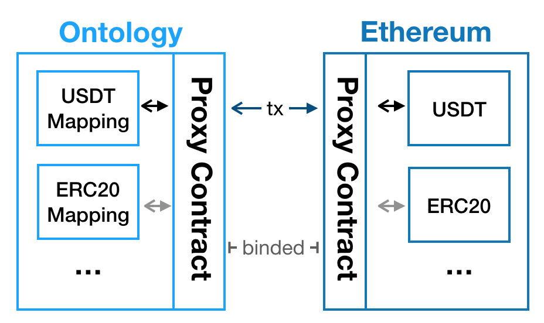

<h1 align="center">How to Deploy Crosschain on Ethereum</h1>
<h4 align="center">Version 1.0 </h4>

[English](how_to_deploy_crosschain_on_ethereum.md) | 中文

本文档介绍如何部署从以太到其他链的跨链。包括如何部署跨链代理合约，已有ERC20的跨链，部署新ERC20跨链的两种方式：通过跨链代理跨链和直接跨链。

## 通过代理合约跨链

### 为什么需要代理合约？

以太坊智能合约已经是一个完整且复杂的生态体系了，其中ERC20代币占据了很大一部分，比如USDT，要实现已有ERC20的跨链，需要额外实现一个代理合约，相当于原先ERC20合约的补充功能，实现了跨链协议中的主要接口，新部署的ERC20也可以使用现有的代理合约，实现跨链，避免重复开发。

如下为代理合约必须实现的接口：

```js
function setManagerProxy(address ethCCMProxyAddr) onlyOperator public

/* @notice                  This function binds the target chain proxy contract.
*                           Only the binded proxy contract request is accept by this contract.
*  @param toChainId         The target chain id
*
*  @param targetProxyHash   The binded proxy contract address
*
*/
function bindProxyHash(uint64 toChainId, bytes memory targetProxyHash) onlyOperator public returns (bool)

function bindAssetHash(address fromAssetHash, uint64 toChainId, bytes memory toAssetHash, uint256 assetLimit, bool isTargetChainAsset) onlyOperator public returns (bool)

/* @notice                  This function is meant to be invoked by the user,
    *                           a certin amount teokens will be locked in the proxy contract the invoker/msg.sender immediately.
    *                           Then the same amount of tokens will be unloked from target chain proxy contract at the target chain with chainId later.
    *  @param fromAssetHash   The asset hash in current chain
    *  @param toChainId         The target chain id
    *                           
    *  @param toAddress         The address in bytes format to receive same amount of tokens in target chain 
    *  @param amount            The amount of tokens to be crossed from ethereum to the chain with chainId
    */
    function lock(address fromAssetHash, uint64 toChainId, bytes memory toAddress, uint256 amount) public payable returns (bool)

    // /* @notice                  This function is meant to be invoked by the ETH crosschain management contract,
    // *                           then mint a certin amount of tokens to the designated address since a certain amount 
    // *                           was burnt from the source chain invoker.
    // *  @param argsBs            The argument bytes recevied by the ethereum lock proxy contract, need to be deserialized.
    // *                           based on the way of serialization in the source chain proxy contract.
    // *  @param fromContractAddr  The source chain contract address
    // *  @param fromChainId       The source chain id
    // */
    function unlock(bytes memory argsBs, bytes memory fromContractAddr, uint64 fromChainId) onlyManagerContract public returns (bool)
```

- 调用`setManagerProxy`设置跨链管理合约地址，代理合约在部署后，需要设置跨链管理合约地址；
- `bindProxyHash`绑定目标链上的代理合约hash，或者实现了跨链接口的合约hash，在ERC20朝其他链跨链的时候会将该目标链代理合约作为中转站，进而将ERC20转到目标链的映射合约，当然在跨链开始前应该预先部署好映射合约；
- `bindAssetHash`绑定ERC20代币合约地址和目标链映射合约，比如USDT地址，并设置金额限制；
- `lock`接口会把ERC20代币锁到代理合约中，然后向管理合约发出跨链请求；
- `unlock`接口会释放原先锁定的ERC20代币，即从其他链返回的ERC20代币，管理合约会调用该接口，为用户释放代币；

所以代理合约主要实现的是ERC20的注册、锁定与解锁，锁定就是用户将ERC20转到合约中，解锁只有跨链管理合约可以调用。代理合约可以自己部署，也可以使用现有的合约，多个ERC20可以使用一本代理合约。

### 实例：已有的ERC20跨链

#### Step1 部署跨链代理合约以及配置

以将USDT从以太跨链到ontology为例：

<div align=center></div>

- 在ontology上部署一个OEP4的USDT映射合约。
- 需要在以太上和ontology上部署跨链代理合约，在两边都调用`bindProxyHash`绑定代理之间的对应关系。

- 在两边的代理合约绑定资产，即在代理合约上绑定ERC20和OEP4跨链关系，调用`bindAssetHash`在代理合约中绑定USDT到ontology的映射合约，以及金额限制。
- 如果使用其他代理服务提供商的代理合约，需要和向其提出请求，由其完成绑定。

#### Step2 跨链转账

用户调用`lock`接口将USDT锁定到代理合约，然后以太的跨链生态就会将USDT搬运到本体，用户可以在本体的USDT上看到余额了；同样地，在本体端调用代理合约的`lock`接口，把USDT转回以太坊。

### 实例：新部署的ERC20通过代理合约跨链

如果新ERC20通过代理合约跨链的话，只需要部署遵循ERC20标准的合约，再按照已有ERC20的跨链进行部署和配置。


## 不通过代理合约跨链

### 开发合约

如果不通过代理合约跨链，那么需要遵循跨链协议和ERC20协议来开发ERC20合约。可以参考其模板。
主要有4个主要的接口需要实现，配置erc20的minter接口`setminter`，绑定目标链的资产合约接口`bindContractAddrWithChainId`，发送到其他链时调用的lock接口，以及从其他链发送回以太时由管理合约调用的`unlock`

`setminter`接口只能被该erc20的管理员调用，用来设置unlock只能被跨链管理合约调用，接口如下：

```js
/* @notice                              Set the ETH cross chain contract as the minter such that the ETH cross chain contract
*                                       will be able to mint tokens to the designated account after a certain amount of tokens
*                                       are locked in the source chain
*  @param ethCrossChainContractAddr     The ETH cross chain management contract address
*/
function setMinter(address ethCrossChainContractAddr) onlyManager
```

代码示例：
```js
function setMinter(address ethCrossChainContractAddr) onlyManager public {
    minter = ethCrossChainContractAddr;
    emit SetMinterEvent(ethCrossChainContractAddr);
}
```

绑定目标链的资产合约接口bindContractAddrWithChainId接口也只能被该erc20的管理员调用，用来设置该erc20合约绑定的目标链上的合约，只有目标链上与该erc20绑定的合约的请求才会被该erc20接受。
接口如下：

```js
/* @notice              Bind the target chain with the target chain id
*  @param chainId       The target chain id
*  @param contractAddr  The specific contract address in bytes format in the target chain
*/
function bindContractAddrWithChainId(uint64 chainId, bytes memory contractAddr) onlyManager
```

实现示例：
```js
function bindContractAddrWithChainId(uint64 chainId, bytes memory contractAddr) onlyManager public {
	require(chainId >= 0, "chainId illegal!");
	contractAddrBindChainId[chainId] = contractAddr;
	emit BindContractAddrWithChainIdEvent(chainId, contractAddr);
}
```

lock接口如下：

```js
/* @notice                  This function is meant to be invoked by the user,
*                           a certin amount teokens will be burnt from the invoker/msg.sender immediately.
*                           Then the same amount of tokens will be mint at the target chain with chainId later.
*  @param toChainId         The target chain id
*
*  @param toUserAddr        The address in bytes format to receive same amount of tokens in target chain
*  @param amount            The amount of tokens to be crossed from ethereum to the chain with chainId
*/
function lock(uint64 toChainId, bytes memory toUserAddr, uint64 amount)
```

以下是一个具体的示例以及注释解释
```js
function lock(uint64 toChainId, bytes memory toUserAddr, uint256 amount) public returns (bool) {
    /*
	1. 构造跨链交易的参数，这个参数最终会发送给该资产合约绑定的目标链的资产合约的unlock
	*/
	TxArgs memory txArgs = TxArgs({
		toAddress: toUserAddr,
		amount: amount
	});
	bytes memory txData = _serializeTxArgs(txArgs);
    /*
	2. 将用户的erc20token锁定在本合约
	*/
	require(transfer(amount), "Burn msg.sender ERC20 tokens failed");
	/*
	3. 调用跨链管理合约，跨链管理合约会生成可以安全发送到目标链的消息
	*/
	bytes memory method = bytes("unlock");
	EthCrossChain ecc = EthCrossChain(minter);
	require(ecc.crossChain(toChainId, contractAddrBindChainId[toChainId], method, txData), "EthCrossChain crossChain executed error!");
	/*
	4. 生成lock的event
	*/
	emit LockEvent(address(this), toChainId, contractAddrBindChainId[toChainId], txData);
	return true;
}
```
unlock接口由跨链管理合约调用，仅仅可以被跨链管理合约调用，接口如下：
```js
/* @notice                  This function is meant to be invoked by the ETH crosschain management contract,
*                           then mint a certin amount of tokens to the designated address since a certain amount
*                           was burnt from the source chain invoker.
*  @param argsBs            The argument bytes recevied by the ethereum business contract, need to be deserialized.
*                           based on the way of serialization in the source chain contract.
*  @param fromContractAddr  The source chain contract address
*  @param fromChainId       The source chain id
*/
function unlock(bytes memory argsBs, bytes memory fromContractAddr, uint64 fromChainId) onlyMinter
```

以下是一个具体的示例，其中有注释解释：
```js
function unlock(bytes memory argsBs, bytes memory fromContractAddr, uint64 fromChainId) onlyMinter public returns (bool) {
    /*
	1. 跨链交易请求方构造的跨链交易参数
	*/
	TxArgs memory args = _deserializTxArgs(argsBs);
    /*
	2. 检查请求是否由该资产合约绑定的目标链的资产合约发起
	*/
	require(Utils.equalStorage(contractAddrBindChainId[fromChainId], fromContractAddr), "From contract address error!");
	/*
	3. 将锁定在本合约的erc20释放到指定的账户
	*/
	require(transfer(Utils.bytesToAddress(args.toAddress), args.amount), "mint ERCT in unlock method failed!");
	/*
	4. 生成unlock的event
	*/
	emit UnlockEvent(fromContractAddr, fromChainId, args.toAddress, args.amount);
	return true;
}
```

同样需要在跨链的目标链上如ontology上开发部署该erc20合约对应oep4资产合约。请参考ontology开发手册中关于oep4合约跨链开发指导部分。

### 配置合约

在部署好erc20合约后，需要部署合约者，也就是erc20合约的管理员首先调用合约的setMinter和bindContractAddrWithChainId来配置合约。


## 许可证

Ontology遵守GNU Lesser General Public License, 版本3.0。 详细信息请查看项目根目录下的LICENSE文件。
