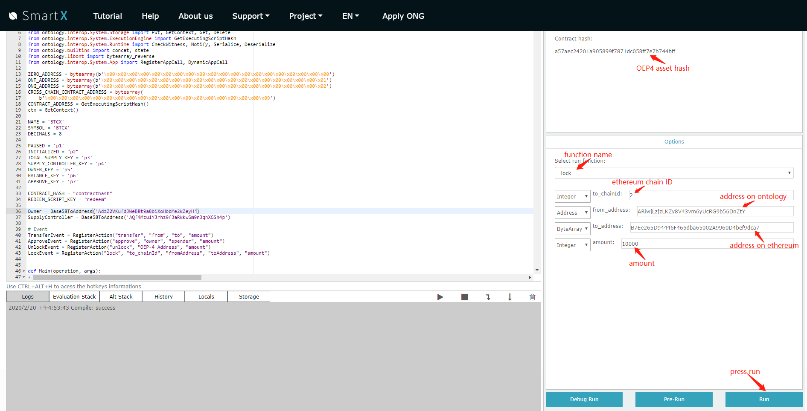
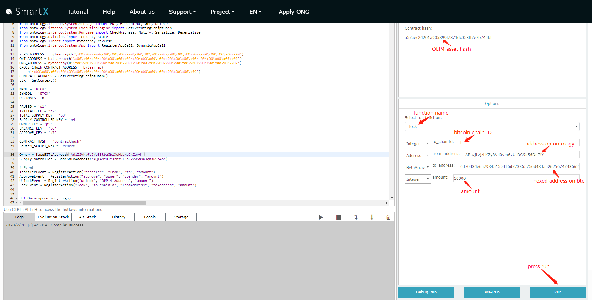
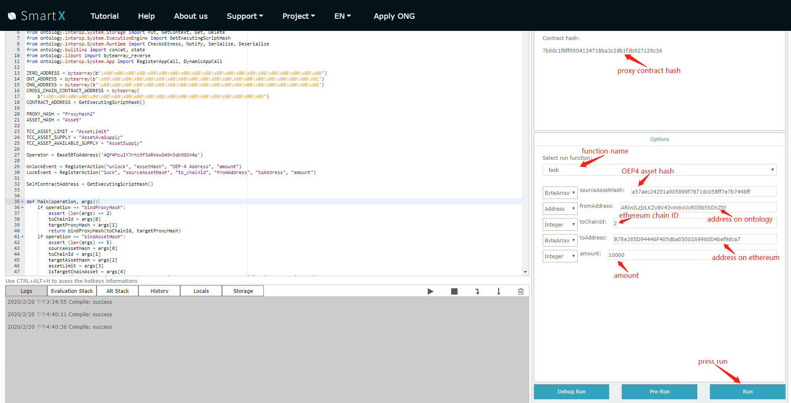
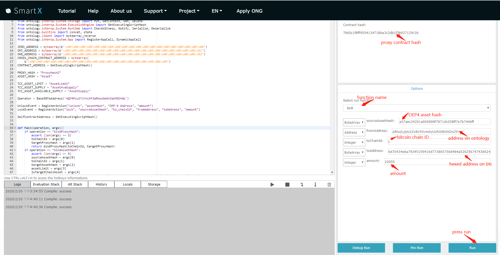

## 如何将OEP4资产跨到其他链上

[English](How_to_cross_OEP4.md) | 中文

### 收集资产在链上对应的合约地址

以某个OEP4资产为例，这种资产在链上的合约地址为：

Ontology链：48fb861f8e6a857db7c977382d745113025a1c37

Ethereum链：0x4e52c69ee08dbf9a29b15abd64b175eaaedaa5be

以Ontology上的Btc资产为例，这种资产在链上的合约地址为：

Ontology链：a57aec24201a905899f7871dc058ff7e7b744bff

Ethereum链：0xffa9cc8aa69fff09d6180dbca187a672a0402b1d

Btc链：c330431496364497d7257839737b5e4596f5ac06

比特币网络不支持智能合约，因此不是真正的合约地址。比特币网络采用信托多签的形式，用户将资金转到信托多签账户来实现资产的锁定。因此在比特币网络上，“合约地址”代表信托多签地址的hash。

### 集成跨链功能的OEP4资产

如果该资产集成了跨链的lock和unlock接口，则可以直接调用该资产的lock接口进行跨链资产转移，目前可以在smartx界面上进行操作：

上图演示了如何将资产跨链到ethereum上和bitcoin上。

### 未集成跨链功能的OEP4资产

如果该资产未集成跨链的lock和unlock接口，则需要调用该资产对应的代理合约的lock和unlock接口，并且用户进行跨链操作之前需要先将资产approve给这本代理合约。

上图演示了如何将资产跨链到ethereum上和bitcoin上。