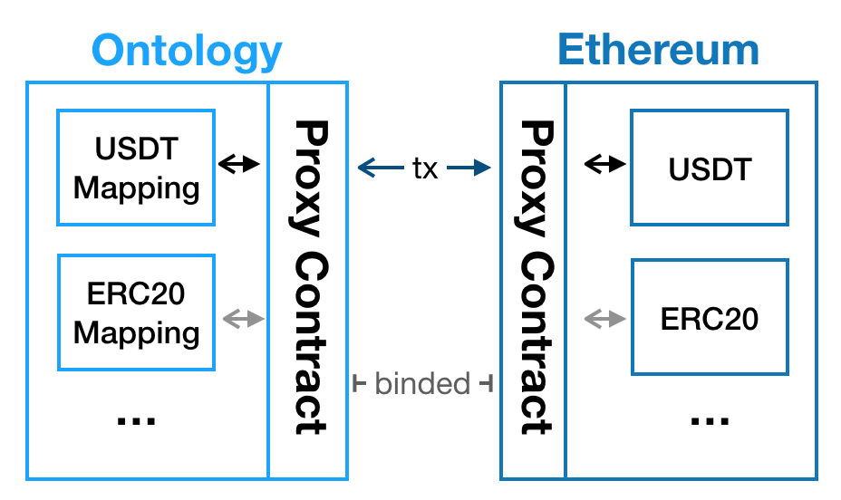

<h1 align=center> Ontology Cross Chain Contract Development </h1>

English | [中文](How_to_new_cross_chain_asset_cn.md)

The Ontology multi-chain ecosystem supports cross chain contracts. A cross chain contract implements functionality that operates by interacting with two or more chains. For e.g. an OEP4 asset contract that can be transferred between Ontology and Ethereum, or a dApp contract wherein a part of the business logic takes place on Ontology and another part is carried out on Ethereum.

### Cross Chain Contract Overview

A cross chain system in fact consists of multiple smart contracts. For a dApp that functions in a cross chain environment, the developer needs to deploy smart contracts separately on the respective chains.

Cross chain contract development is composed of two elements, the business logic of the contract that is implemented on the respective chains, and cross chain logic that actually carries out cross chain transfers and interaction.

The business logic is developed conventionally based on the application, while the cross chain logic involves a sequence in which execution takes place first on the local chain, and then on the respective target chain. 

### Cross Chain Interface

Developers need to concern themselves with only one interface when working with cross chain contracts, that is the `createCrossChainTx` method of the management contract. Let's consider a cross chain scenario in which there are two chains, the local chain A and a target chain B. This interface can be used to store the execution result on chain A in the merkle tree. A miner generates the merkle proof for this transaction and sends it to the cross chain management contract deployed on chain B. The cross chain management contract verifies the merkle proof, and then invokes the respective methods in the smart contract on chain B based on the parameters.

### Sample Cross Chain Contract

A developer intends to deploy a new asset on two chains, chain A and chain B, and wants to ensure that the assets on chain A and chain B are mutually interoperable. That is, the asset they deploy on chain A and chain B can be used and transferred between chains A and B conveniently.

The actual implementation of this interoperability of the asset between chain A and chain B involves adding the `lock` and `unlock` methods to the standard **OEP-4** contract. The user invokes the `lock` method of the contract on chain A to lock the transfer amount in this contract. This method then invokes the cross chain management contract that in turn invokes the `unlock` method of the contract on chain B to release assets and transfer them to the user's account on chain B.

The `lock` method is implemented as follows:

```python
def lock(to_chainId, from_address, to_address, amount):
    """
    lock some amount of tokens of this contract, call cross chain method to release to_amount of tokens of another chain's contract
    :param to_chain_id: chain id of destination chain
    :param address: address of caller
    :param to_amount: amount to lock
    :return:
    """
    assert (amount >= 0)
    assert (CheckWitness(from_address))
    assert (not isPaused())
    # eth address format:0x673dfa9caf9145fdbef98e9d9874f36e63d8a5b4,length is 42
    assert (len(to_address) != 0)

    Put(ctx, concat(BALANCE_KEY, from_address), Sub(balanceOf(from_address), amount))
    Put(ctx, TOTAL_SUPPLY_KEY, Sub(totalSupply(), amount))

    btcRedeemScriptBytes = getBtcRedeemScript()
    argsList = [to_address, amount, btcRedeemScriptBytes]

    input_bytes = _serialzieArgs(argsList)
    to_contract = getContractAddrWithChainId(to_chainId)
    param = state(to_chainId, to_contract, "unlock", input_bytes)
    assert (Invoke(0, CROSS_CHAIN_CONTRACT_ADDRESS, "createCrossChainTx", param))

    LockEvent(to_chainId, from_address, to_address, amount)
    return True
```

`LockEvent` parameters:

| Parameter            | Description                                               |
| -------------------- | --------------------------------------------------------- |
| to_chain_id          | Target chain ID                                           |
| destination_contract | Reversed contract address on the target chain             |
| address              | Invocation address, mining fee deducted from this address |
| amount               | Transfer amount                                           |


This way this method carries out the transfer is by first locking the user's assets on chain A and then invoking the `createCrossChainTx` method of the cross chain management contract. This method takes six parameters:

| Parameter            | Description                                          |
| -------------------- | ---------------------------------------------------- |
| to_chain_id          | Target chain ID                                      |
| destination_contract | Reversed contract address on the target chain        |
| function             | Method to be invoked in the contract on target chain |
| input_bytes          | Serialized parameters                                |


This method invokes the contract on the target chain whose address is passed as a parameter. The inpur parameters are serialized into `input_bytes`.

The `unlock` method is implemented as follows:

```python
def unlock(params, fromContractAddr, fromChainId):
    """
    lock some amount of tokens of this contract, call cross chain method to release to_amount of tokens of another chain's contract
    :param fee: miner fee of this cross chain tx
    :param to_chain_id: chain id of destination chain
    :param address: address of caller
    :param to_amount: amount to lock
    :return:
    """
    res = _deserialzieArgs(params)
    toAddress = res[0]
    value = res[1]
    assert(fromContractAddr == getContractAddrWithChainId(fromChainId))
    assert (value >= 0)
    assert (isAddress(toAddress))
    assert (CheckWitness(CROSS_CHAIN_CONTRACT_ADDRESS))

    Put(ctx, concat(BALANCE_KEY, toAddress), Add(balanceOf(toAddress), value))
    Put(ctx, TOTAL_SUPPLY_KEY, Add(totalSupply(), value))
    UnlockEvent(toAddress, value)
    return True
```

The method first verifies the contract address of chain A, takes the input parameters `input_bytes`, obtains the `input_map` by deserializing it, and then proceeds with the consequent logic to release assets on chain B and transfer them to the user's address.

> Note: Since this method is the destination method of the cross chain transfer, it can only be invoked by the management contract on the relay chain.

## Sample Cross Chain Contract (Existing OEP-4 Asset)

Existent OEP-4 asset contract cannot directly implement the `lock` and `unlock` methods. Considering Ontology to Ethereum asset transfer as an example, a proxy contract that implements the cross chain interface and the relevant methods that augment existing OEP-4 functions. Existing proxy contracts can also be used to carry out the cross chain functionality.

The following interface methods are necessary:

```python
'''
This function binds the target chain proxy contract. Only the binded proxy contract request is accept by this contract.
@param toChainId         		The target chain id

@param targetProxyHash   		The binded proxy contract address
'''
def bindProxyHash(toChainId, targetProxyHash):
    assert (CheckWitness(Operator))
    Put(GetContext(), concat(PROXY_HASH, toChainId), targetProxyHash)
    Notify(["bindProxyHash", toChainId, targetProxyHash])
    return True

def bindAssetHash(fromAssetHash, toChainId, toAssetHash, assetLimit, isTargetChainAsset):
    assert (CheckWitness(Operator))
    Put(GetContext(), concat(ASSET_HASH, concat(fromAssetHash, toChainId)), toAssetHash)
    if isTargetChainAsset:
        currentLimit = getCrossedLimit(fromAssetHash, toChainId)
        assert (assetLimit >= currentLimit)
        increment = assetLimit - currentLimit
        Put(GetContext(), concat(TCC_ASSET_SUPPLY, concat(fromAssetHash, toChainId)),
            getCrossedAmount(fromAssetHash, toChainId) + increment)
    Put(GetContext(), concat(TCC_ASSET_LIMIT, concat(fromAssetHash, toChainId)), assetLimit)
    Notify(["bindAssetHash", fromAssetHash, toChainId, toAssetHash, assetLimit])
    return True

'''
This function is meant to be invoked by the user, a certin amount teokens will be locked in the proxy contract immediately. Then the same amount of tokens will be unloked from target chain proxy contract at the target chain with chainId later.
@param fromAssetHash   				The asset hash in current chain
@param fromAddress 					The invoker address
@param toChainId         			The target chain id
                         
@param toAddress         			The address in bytes format to receive same amount of tokens in 									target chain 
@param amount            			The amount of tokens to be crossed from ethereum to the chain 										with chainId
'''
def lock(fromAssetHash, fromAddress, toChainId, toAddress, amount)

'''
This function is meant to be invoked by the crosschain management contract, then mint a certin amount of tokens to the designated address since a certain amount was burnt from the source chain invoker.
@param params            The argument bytes recevied by the lock proxy contract, need to be 								deserialized.
						based on the way of serialization in the source chain proxy contract.
@param fromContractAddr  The source chain contract address
@param fromChainId       The source chain id
'''
def unlock(params, fromContractAddr, fromChainId)
```

The interface methods carry out the following functionality:

| Method        | Description                                                                                                                                                                                             |
| ------------- | ------------------------------------------------------------------------------------------------------------------------------------------------------------------------------------------------------- |
| bindProxyHash | Links the contract hash of the proxy contract on the target chain, acts as the intermerdiary before OEP-4 assets are transferred to the token contract on the target chain which is deployed in advance |
| bindAssetHash | Links the OEP-4 token contract address to the token contract on target chain, for e.g. a USDT address, and can set the amount limit                                                                     |
| lock          | Locks the OEP-4 cross chain tansfer tokens in the proxy contract, and then sends cross chain transactions to the the management contract                                                                |
| unlock        | Releases OEP-4 assets that were locked initially when tokens are transferred back to the chain, invoked by the management contract                                                                      |

Hence, the proxy contract carries out OEP-4 asset contract registration, locking and unlocking tokens that are transferred to other chains. The unlock method can only be invoked by the management contract. Pre-defined and custom proxy contracts both can be deployed. Multiple OEP-4 asset contracts can use a single proxy contract.

### Existing OEP-4 Asset Cross Transfer 

#### Step 1: Proxy contract deployment and configuration

For instance, transferring USDT from Ontology to Ethereum:

<div align=center></div>

- Deploy OEP-4 standard USDT complementary contract on Ontology
- Deploy proxy contracts on both Ontology and Ethereum, and call the `bindProxyHash` method to link the two proxy contracts
- Link assets to the respective proxy contracts and then link ERC20 and OEP-4 tokens over the cross chain system by invoking the `bindAssetHash` method. A limit on the transaction amount can also be set.
- If you use a third party vendor's proxy contract, you can directly send requests to them to link the asset contracts.

#### Step 2: Cross chain transfer

The user invokes the `lock` interface method and the transfer amount USDT is locked in the proxy contract. The cross chain ecosystem then transfers this USDT to the Ethereum network. Similarly, the `lock` method of the Ethereum proxy contract can be invoked to send this USDT back to the Ontology network.

## Sample Code

OEP-4 asset contract that implments the cross chain interface - [To be added]()

OEP-4 proxy contract - [To be added]()
