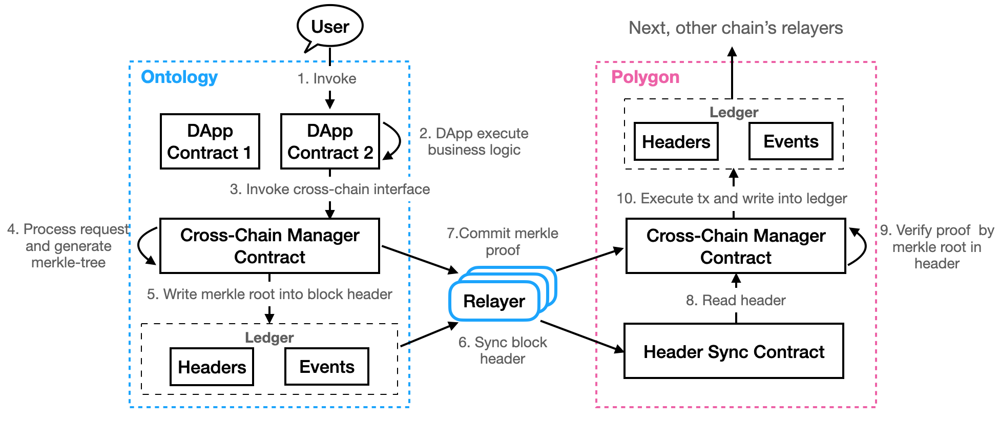

<h1 align="center">Design of Ontology Cross Chain</h1>

English | [中文](README_CN.md)

## Abstract

This document introduces how to transfer ontology asset, include ont, ong and all oep4, to Ethereum network. It also introduces how to transfer btcx asset on ontology back to Bitcoin network. Now there are two ways to achieve cross chain operation, first we can send cross chain transactions through smartx, second we can make and send cross chain transactions through sdk.

## How to achieve cross chain

The definition of asset cross chain is, users lock a number of asset on origin chain, then a number of asset-vouchers on destination chain will be given to the users, and vice versa. To achieve this process, destination chain must can verify the fact occurred on origin chain, it means verify users lock a number of asset on origin chain.

The process of any information cross chain also need destination chain verify the fact of origin chain.

To achieve this verification process, we use merkle proof. We store the facts on origin chain, create a merkle tree for all the facts, put root hash to its block header, and generate merkle proof of the facts. Relayers synchronize block headers and merkle proof of origin chain to destination chain, destination chain verify the headers, parse root hash and verify the proof of the facts.

## Block header synchronization between ontology and relay chain

Ontology and relayer chain use similar governance module, the whole network change its consensus nodes each several blocks, it means in a consensus epoch, the set of validators keep unchanged. So we need not synchronizing all block headers, only block headers contain consensus node changing or cross chain transactions are enough, this design can reduce most header synchronizations.

The synced block headers are stored in header sync contract, any other contract can read these headers.

## Cross chain transactions between ontology and relay chain

Users send cross chain trasactions through business contract, business contract invoke cross chain API of cross chain manager contract. Cross chain manager contract handles cross chain transactions, assign unique ID for each transaction, store transactions and create merkle tree, put root hash into block header, generate merkle proof for the transactions. Relayer synchronize block headers and merkle proof to relayer chain, relayer chain verify headers and merkle proof, store cross chain information and create new merkle tree, put root hash into block header, generate merkle proof of these cross chain information. Relayer will synchronize header and proof to destination chain.

Destination chain verify proof of relaye chain, parse cross chain information, cross chain manager contract will invoke business contract with parameters according to verified cross chain information, execute business logic in business contract.