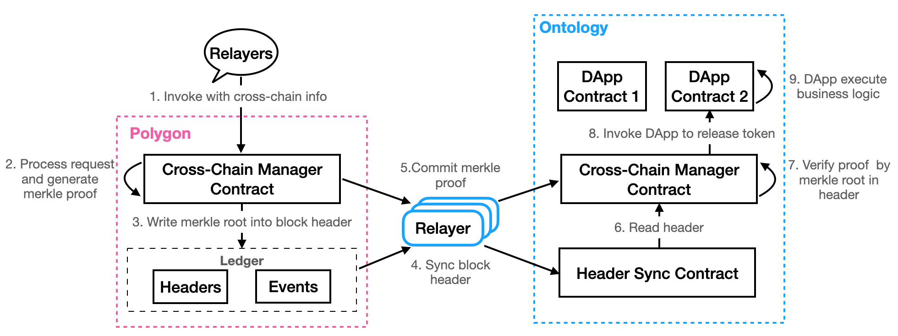

<h1 align="center">Design of Ontology Cross Chain</h1>

English | [中文](README_CN.md)

## Abstract

This document introduces how to transfer Ontology assets, including ONT, ONG, and all other OEP-4 assets, to the Ethereum network. We also talk about how to transfer BTCX asset from Ontology back to the Bitcoin network. 

There are two ways to carry out cross chain operations. We can send cross chain transactions using **SmartX**, or we can use the **SDK** to create and send cross chain transactions.

## How to Implement Cross Chain

A cross chain asset is one where it can be transferred from it's chain of origin to another target chain by locking the transfer amount on the original chain and then releasing the same amount of assets on the target chain and transferring them to the user's address, and vice versa. To carry out such a cross chain transaction, it becomes necessary for the target chain to carry out verification and determine with certainty whether a transaction occurred on the original chain, i.e. whether the transfer amount of the asset in question were locked on the original chain.

Any information that is transferred to the target chain from the original chain must also be verified for legitimacy.

We use merkle proofs to carry out this verification process. All the event related information is stored on the original chain and a merkle tree is generated for this data. The root hashes are added to the respective block headers and merkle proof is generated for the data. Relayers pick up this data and synchronize the block headers and the respective merkle proofs to the relay chain from where the relayers of the target chain  synchronizes them to the destination chain. The destination chain then verifies the headers, parses the root hash and verifies the legitimacy of the transactions.

## Ontology and Relay Chain Block Header Synchronization

Ontology and the relay chain use a similar governance model. The network changes its consensus nodes after a certain no. of blocks. This implies that the set of validators within a single consensus cycle remain unchanged. Thus, we don't need to synchronize all the block headers, rather only the ones that contain a change in the consensus nodes and the blocks that contain cross chain transactions. This design reduces the synchronization overhead significantly.

The synced block headers are stored in the header synchronization contract. Any other contract can read these stored headers.

## Cross Chain Transactions Between Ontology and the Relay Chain

The process of block header and the respective merkle proof transaction from the relay chain to the target chain is as follows:

1. Users send cross chain transactions using a service contract. The service contract invokes the transaction methods of the cross chain management contract. 
2. The cross chain management contract handles cross chain transactions, assigns unique IDs for each transaction, stores transaction data and generates the corresponding merkle tree, puts the root hash into the block header, and then generates the merkle proof for these transactions. 
3. The relayer proceeds to synchronize the block headers and corresponding merkle proofs on the relay chain. The relay chain carries out verification for the block headers and the merkle proofs. It stores the transaction information and generates a new merkle tree. Next it puts the root hash into these block headers of the relay chain and and generates the merkle proof for these cross chain transactions. 
4. The target chain's relayer then synchronizes these block headers and merkle proofs to the target chain.
5. Finally, the target chain verifies the merkle proofs for the cross chain transactions and processes the transaction information. The cross chain management contract invokes the service contract with the parameters that include the verified cross chain transaction information, which then executes the business logic of the service contract on the target chain.