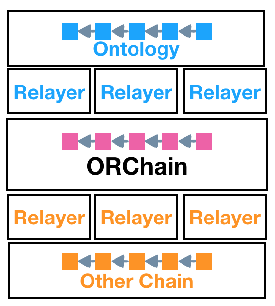
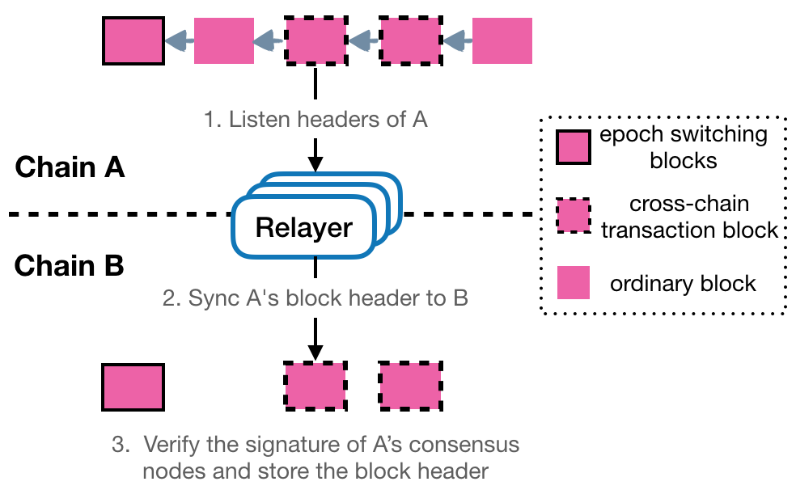
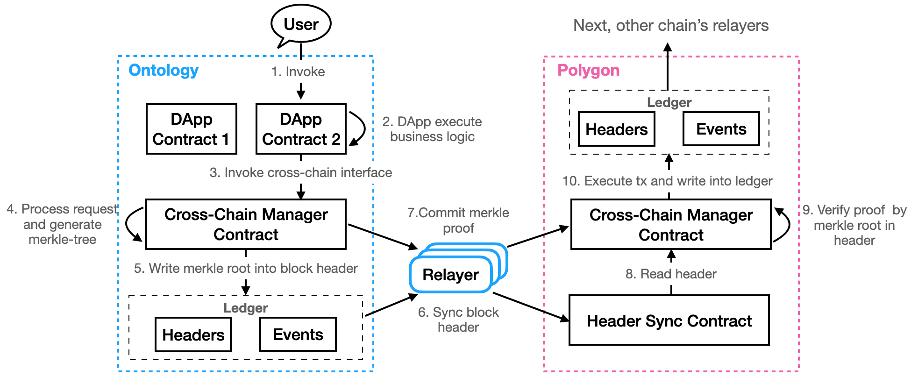
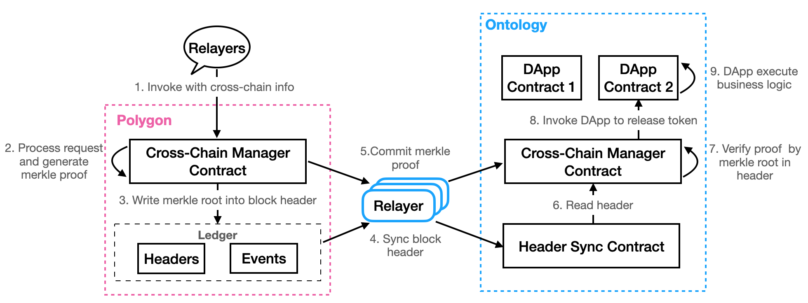

<h1 align="center">本体跨链设计</h1>

[English](README.md) | 中文

## 概述

本指南主要介绍本体链上的资产，包括ont，ong以及所有的oep4资产如何跨链到eth链上，也会介绍btc资产跨链到本体链之后如何再转回到比特币网络。目前有两种方式可以实现跨链操作，一种是通过smartx界面工具进行跨链交易，另一种是通过sdk来进行跨链交易的构造。

## 跨链是如何实现的

资产跨链的含义是，用户把资产在原链上锁定，之后在目标链上发行映射资产，同时可以在目标链上申请提现，最后在原链上解锁的过程。要实现该过程，则需要目标链可以验证原链上发生的行为，即验证原链上确实锁定了一定数量的原资产。

非资产类的信息跨链也是同样的过程，需要目标链验证原链上的信息变化，从而做出相应的变化。

这种验证过程目前都是通过merkle证明的形式实现的，即原链将其上发生的行为存储下来，并构造一颗merkle tree，然后将merkle tree的树根写入区块头，并生成该行为的merkle proof。目标链同步并验证原链的区块头，对于原链上提交的merkle proof，找到其对应的合法区块头，通过merkle root验证proof的合法性，从而确定原链上发生的行为。

## 架构

如上图简单介绍了本体跨链生态的架构，从上到下分别是Ont链、Ont链的Relayer、中继链Polygon，目标链的Relayer和目标链。简单来说，用户的Ont链上资产的交易证明会经由Relayer传递到Polygon，再由目标链的Relayer传递到目标链，目标链验证Ont链上的交易证明并执行相应的交易。

目标链资产跨链到Ont链与之相反。

生态中的角色如下：

- [**中继链 Polygon**](../polygon/How_to_join_cross_chain.md)：中继链是整个生态中的重要部分，每个节点由不同的个人或组织运行，有自己独特的治理模式和信任机制，它负责将各个链连接到一起，实现Ont到各个链的转移。
- [**Relayer**](https://github.com/ontio/cross-chain/blob/master/ont/How_to_become_relayer_cn.md)：每条链都有自己的Relayer，它们负责把交易等信息搬运到中继链，是中继链和外界的通信兵，它们会在这个过程中获取收益。
- [**应用**](https://github.com/ontio/cross-chain/blob/master/ont/How_to_new_cross_chain_asset_cn.md)：应用是指开发跨链业务的人或组织，任何人都可以部署跨链合约来构建跨链应用。然后把你的应用公开出去招揽用户吧！
- [**用户**](https://github.com/ontio/cross-chain/blob/master/ont/How_to_cross_OEP4_cn.md)：对跨链生态来说，最重要的就是用户，通过调用具有跨链功能的应用，实现Ont到以太坊等链的跨链业务。

## 本体和中继链之间的区块头同步

本体链和中继链采用了相似的共识治理模型，网络每隔一定数量的区块更换一次共识节点，即在一个共识周期内，验证者集合保持不变。因此，区块头同步过程不需要同步所有区块，只需要同步关键区块（即切换验证者集合的周期切换区块）和跨链交易发生的区块即可，这样的设计大大减少了区块头的同步数量。

如图展示了中继链和本体同步区块头的具体流程，中继链区块头由Relayer同步到本体链，本体链的区块头同步合约会验证区块头的合法性，并存储区块头，当前链的其它任何合约都可以从该合约中读取同步的区块头。本体区块头同步到中继链也是一样的流程。

## 本体和中继链之间的跨链交易

ONT/ONG跨链到目标链的流程如上：

- 用户在业务合约上发起跨链交易；
- 业务合约调用跨链管理合约的跨链接口，跨链管理合约处理跨链请求，分配唯一自增ID，储存跨链请求并构造merkle tree，将树根写入区块头，并生成跨链交易的merkle proof；
- 由relayer将区块头和proof提交到中继链；
- 中继链验证merkle proof的合法性，将跨链交易的信息以事件的形式返回，目标链的Relayer会把去往自己链的交易捕获到，然后转发到该链；
- 目标链的跨链管理合约验证中继链merkle proof的合法性，验证通过则说明原链上的跨链信息合法，目标链的跨链管理合约会调用相应的业务合约，执行目标链上的业务内容。

ONT/ONG从其他链跨回本体的流程如上：

- 其他链的Relayer将ONT/ONG的跨链交易信息转发到中继链，调用中继链的跨链管理合约；
- 跨链管理合约执行验证交易信息后，将验证后的信息存下来，并构造新的merkle tree，将树根写入中继链的区块头中，并生成跨链信息的merkle proof，由relayer将区块头和proof提交到本体链，本体的区块头同步合约会维护中继链的区块头；
- 本体链的跨链管理合约会读取中继链区块头，验证中继链的proof，然后调用业务合约执行对应的逻辑，比如为用户解锁ONT；

除了ONT/ONG的跨链之外，本体跨链还支持跨链合约的调用，比如在本体上发起对以太的某本合约的调用。