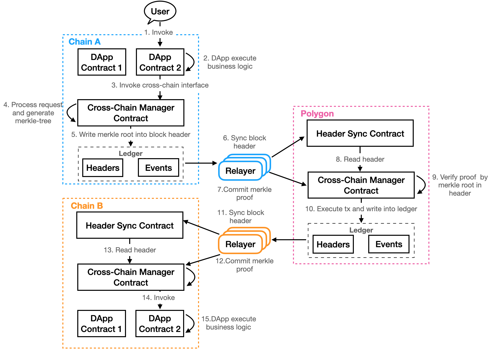

<h1 align="center">侧链接入跨链指南</h1>

## 概述

Polygon跨链是异构链跨链解决方案，任何区块链都可以加入，具备智能合约的链之间实现了跨链调用合约和资产互转，无智能合约的链仅能实现资产互转。想要加入Polygon跨链的区块链需要具备三个条件：

- 实现一系列的接口，这些接口既可以以智能合约的方式来实现，也可以在底层直接实现。
- 该链还需要提交其区块头格式，序列化和反序列话方式和签名验证方式，以便中继链可以解析并验证其区块头。
- 同时提交其账本或交易的merkle tree构造和验证方式，使中继链可以验证其链上发生的真实交易。

## 需实现的接口

要实现某条链的跨链，比如以太坊，需要实现以下两本合约：区块头同步合约和跨链管理合约。区块头同步合约会在该链维护中继链的区块头，用于验证跨链交易。每条链上有且仅有一本跨链管理合约，它负责构造跨链交易，在该链的所有跨链业务合约都需要和管理合约交互，比如在以太坊上，区块头同步合约和管理合约都通过以太智能合约实现。以下介绍每本合约需要实现的接口及其功能。

### 合约1：区块头同步合约：

| 接口名称              | 功能介绍                                                     |
| --------------------- | ------------------------------------------------------------ |
| **SyncGenesisHeader** | 同步中继链的创世区块头（或某个周期切换的区块头），在合约初始化时被调用，只能被调用一次。存储并解析创世区块，取得中继链此时的共识节点列表。可以参考相关[代码](https://github.com/siovanus/ontology/tree/master/smartcontract/service/native/cross_chain/header_sync)。 |
| **SyncBlockHeader**   | 持续同步中继链的区块头，主要包括周期切换的关键区块头和跨链交易发生的区块头。relayer通过该接口同步中继链区块头。存储并解析区块头，如果发现共识节点变更，则存储中继链此时的共识节点列表。可以参考相关[代码](https://github.com/siovanus/ontology/tree/master/smartcontract/service/native/cross_chain/header_sync)。 |

### 合约2：跨链管理合约：

| 接口名称                | 功能介绍                                                     |
| ----------------------- | ------------------------------------------------------------ |
| **CreateCrossChainTx**  | 创建跨链交易，该接口主要用于业务智能合约在需要跨链功能时调用。构造一笔跨链交易，此交易具有唯一的自增ID，并将交易参数写入merkle tree。可以参考相关[代码](https://github.com/siovanus/ontology/tree/master/smartcontract/service/native/cross_chain/cross_chain_manager)。 |
| **ProcessCrossChainTx** | 处理跨链交易，该接口用于该链接受来自其他链的跨链交易，由relayer同步跨链交易的merkle proof时调用。接口按照高度找到该跨链交易的merkle root（存在于区块头中），验证该跨链交易的真实性，验证通过则解析跨链参数，调用目标链上的业务合约。可以参考相关[代码](https://github.com/siovanus/ontology/tree/master/smartcontract/service/native/cross_chain/cross_chain_manager)。 |

## 侧链之间的跨链流程

<div align=center></div>

上图介绍了从A链跨链到链B的详细流程，用户在链A发起跨链请求，调用了DApp的跨链接口，最终会在B链的DApp合约得到用户想要的结果。A链和B链实现了上文的两本合约及其接口，任何人都可以围绕跨链管理合约建立稳定可用的跨链DApp，分别在A链和B链部署业务合约，这些合约会组成一个完整的跨链DApp。

- 用户调用A链的业务合约，合约会进一步调用跨链管理合约，传递用户的跨链参数，跨链管理合约会创建跨链交易，随着A链出块，交易落账；
- 由于链与链之间是不会主动交换信息的，所以需要一个Relayer去传递信息，Relayer会把A链的区块头同步到中继链的区块头同步合约，然后从A链的存储中取出跨链管理合约返回的事件，其中包含用户的跨链参数，再获取跨链交易的Merkle Proof，一并转发给中继链的跨链管理合约；
- 中继链的跨链管理合约会读取A链的区块头，验证跨链参数的Proof是否正确，验证通过后，会将B链需要的跨链信息以事件的形式返回；
- B链的Relayer会将中继链区块头同步到B链的区块头同步合约，然后从中继链的账本中获取到B链的跨链参数和其Merkle Proof，提交到B链的跨链管理合约；
- 链B的跨链管理合约验证跨链信息的正确性，然后调用信息里的目标合约，完成跨链合约的调用；

其中共有两个Merkle Proof，第一个证明了来自A链跨链信息确实存在于A链，第二个则证明了跨链信息确实存在于中继链，如此便建立了跨链的信任机制。这就是跨链DApp的运行流程，所有的侧链仅需和中继链生态交互即可。

## 需要提交到跨链理事会的内容

### 本链的创世区块头（或者中间某个关键区块头）

提交本链的创世区块头或者中间某个关键区块头，使中继链能够验证后来提交的其他区块头。

### 本链区块头的结构、验证和解析方式

提交本链区块头的结构、验证和解析方式，使得中继链能够验证和解析其区块头。

### 本链跨链交易merkle tree的构造和验证方式

提交本链跨链交易merkle tree的构造和验证方式，使得中继链能够验证其跨链交易。

## 注册本链到中继链

准备工作完成之后，就可以将本链注册到中继链上去了，注册接口如下：

方法名： "registerSideChain"

参数：
```go
type RegisterSideChainParam struct {
	Address      string    //注册该链所用的本体钱包地址，只有该地址有修改注册信息的权限
	ChainId      uint64    //该链的链ID
	Router       uint64    //该链的路由协议，目前已实现的协议有1:btc, 2:eth, 3:ont，同构链可以采用已有协议，异构链则需要根据上面提交的信息新增路由协议
	Name         string    //链的名称
	BlocksToWait uint64    //终局所需要的确认区块数
	CCMCAddress  []byte    //该链的跨链管理合约地址
}
```

如果本链是已有路由协议的同构链，则选择已有的路由协议，异构链则可以升级中继链新增路由协议，随着跨链生态越来越完善，路由协议将会覆盖越来越多的链。

注册完成之后等待跨链理事会审核即可成功加入。
